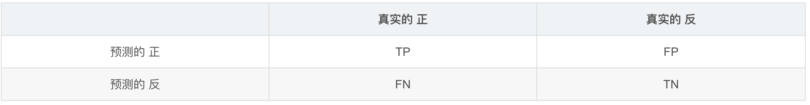
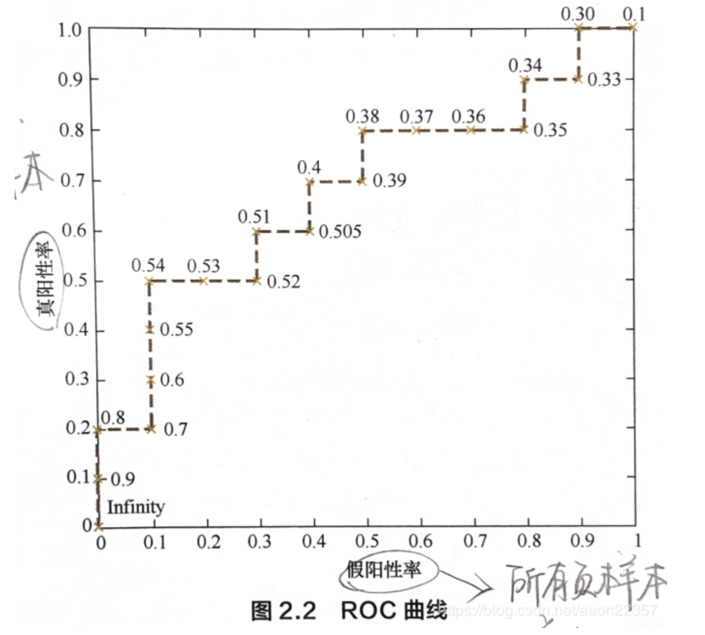
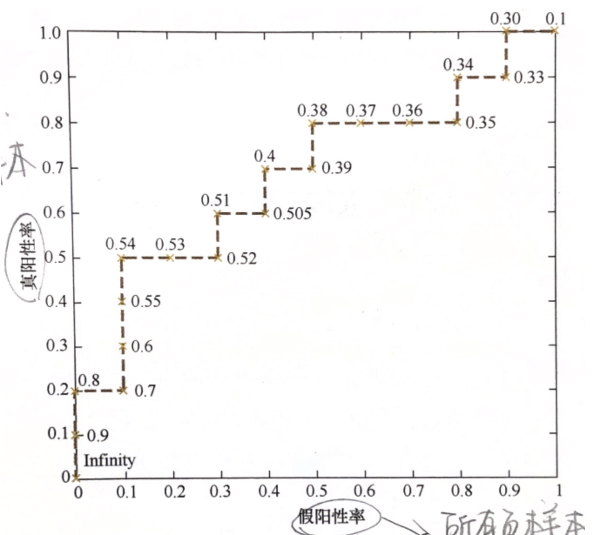

### PR

准确率 precision＝TP/(TP+FP)
召回率 recall=TP/(TP+FN)

### ROC

全名是“受试者工作特征曲线”，（纵轴：真正例率，横轴：假正例率）
真正例率(True Postive Rate)：（Sensitivity（灵敏度））
TPR = TP/(TP+FN), 代表真实的正类中，有多少预测对了（预测的也是正类）

假正例率(False Postive Rate)： （1-Specificity）
FPR = FP/(FP+TN)，代表 真正的负类中，有多少被预测成了正类

ROC曲线如果想要理解的话，要关注四点一线：
1. (0,1)点：FPR==0，TPR==1 -->代表最好的一种情况，即所有的正例都被正确预测了，并且，没有负例被错认为正例。 
2. (1,0)点：--> 代表最差的一种情况，所有的正例都看错了。
3. (0,0)点： --> 分类器将所有的样本都认为是负样本。
4. (1,1)点： --> 分类器将所有的样本都认为是正样本。
5. y=x曲线：  --> 随机猜测出来可得这样一个曲线。 
   
形象的理解一下：
- 商品推荐：重在覆盖度，所以更加注重True Positive的高，这个越高越好。False Positive这个不那么低也可以接受。
- 嫌犯预测：重在准确，更加注重False Positive的低。

绘制方式， 两种方法：

- 设置不同的阈值，对每个阈值分别求TPR和FPR，就可以得到该阈值对应的ROC曲线上的一点，然后绘成一条线，即可得到ROC曲线。
- 首先统计正负样本的数量，假设分别为P和N；接下来把横轴的时间刻度间隔设置为1/N,纵轴设为1/P，在根据模型的输出预测概率对样本进行降序；依次遍历样本，同时从零点开始绘制，每遇到一个正样本就沿纵轴绘制一个刻度间隔的曲线，遇到负样本就沿横轴绘制一个刻度，直到遍历完所有样本，最终曲线停在(1,1)点，ROC曲线绘制完成。

### AUC

AUC是ROC曲线下面积的大小，计算AUC值只需要沿着ROC横轴做积分即可，由于ROC一般处于y=x曲线上方（如果不是的话，只要把模型的预测概率反转成1-p就可以得到一个更好的分类器），所以AUC的取值一般在0.5~1之间。AUC越大，说明分类器越可能把真正的正样本排在前面，分类性能越好。

面试的时候，一句话说明AUC的本质和计算规则：
- AUC：一个正例，一个负例，预测为正的概率值比预测为负的概率值还要大的可能性。

所以根据定义：我们最直观的有两种计算AUC的方法：
1. 绘制ROC曲线，ROC曲线下面的面积就是AUC的值
2. 假设总共有（m+n）个样本，其中正样本m个，负样本n个，总共有m×n个样本对，计数，正样本预测为正样本的概率值大于负样本预测为正样本的概率值记为1，累加计数，然后除以（m*n）就是AUC的值

PS：百度百科，随机挑选一个正样本以及一个负样本，当前的分类算法根据计算得到的Score值将这个正样本排在负样本前面的概率就是AUC值。这里的score值就是预测为正的概率的值，排在前面表示的是正样本的预测为正的概率值大于负样本的预测为正的概率值

### 区别

PR曲线是准确率和召回率的点连成的线。

可以看到，左边的图是ROC曲线，右边的图是PR曲线。
ROC曲线，越左上凸越好; 因为这个ROC想要True Positive高，False Positive小。
PR曲线，越右上凸越好。 PR想要Recall和Precision同时高。

当样本分布极不均衡的时候，哪个曲线表现的更好呢？
先看两个公式：
1） TPR = TP / (TP + FN)；
2） FPR = FP / (FP + TN)
在ROC曲线中，这两个指标构成了最后的曲线。
如果，样本极不均衡。这里假设，正样本非常少，负样本非常多。
如果是这样的话，则TN会非常大，将FPR拉低，最后的曲线会表现的非常好。
 
这时候，再看看PR曲线，也许这个曲线就没有表现的那么好。
所以，有的时候，光看一个曲线是不能完全覆盖所有的情况的。

