### 激活函数是什么？

激活函数的主要作用是提供网络的非线性建模能力。如果没有激活函数，那么该网络仅能够表达线性映射，此时即便有再多的隐藏层，其整个网络跟单层神经网络也是等价的

### 激活函数有什么用？

引入非线性因素。　

在我们面对线性可分的数据集的时候，简单的用线性分类器即可解决分类问题。但是现实生活中的数据往往不是线性可分的，面对这样的数据，一般有两个方法：引入非线性函数、线性变换。

#### 线性变换

就是把当前特征空间通过一定的线性映射转换到另一个空间，让数据能够更好的被分类。

#### 激活函数

激活函数是如何引入非线性因素的呢？在神经网络中，为了避免单纯的线性组合，我们在每一层的输出后面都添加一个激活函数。

1. Sigmoid
   
   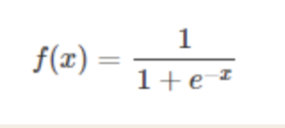

   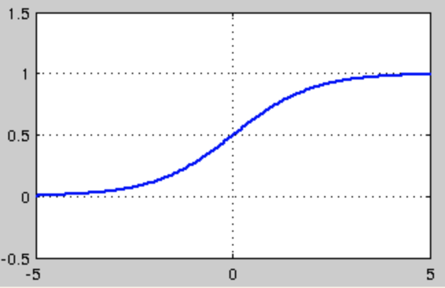

    优点：
    - sigmoid 是使用范围最广的一类激活函数，具有指数函数形状，它在物理意义上最为接近生物神经元。
    - 此外，(0, 1) 的输出还可以被表示作概率，或用于输入的归一化，代表性的如Sigmoid交叉熵损失函数。
    - sigmoid函数连续，光滑，严格单调，以(0,0.5)中心对称，是一个非常良好的阈值函数。
    - 当x趋近负无穷时，y趋近于0；趋近于正无穷时，y趋近于1；x=0时，y=0.5。当然，在x超出[-6,6]的范围后，函数值基本上没有变化.
    - Sigmoid函数的导数是其本身的函数，即f′(x)=f(x)(1−f(x))，计算非常方便，也非常节省计算时间。

    缺点：
    - 最明显的就是饱和性。从上图可以看到，其两侧导数逐渐趋近于0，网络参数很难得到有效训练，这种现象被称为梯度消失。
    - sigmoid函数的输出均大于0，使得输出不是0均值，这称为偏移现象，这会导致后一层的神经元将得到上一层输出的非0均值的信号作为输入。

2. tanh
   
    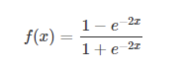

    

   tanh也是一种非常常见的激活函数。与sigmoid相比，它的输出均值是0，使得其收敛速度要比sigmoid快，减少迭代次数。然而，从途中可以看出，tanh一样具有软饱和性，从而造成梯度消失。

3. ReLU

    

    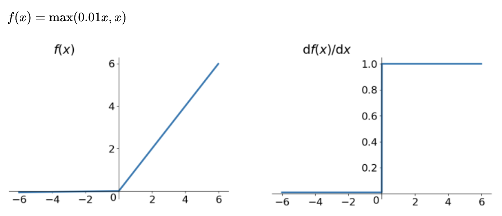

    当x<0时，ReLU硬饱和，而当x>0时，则不存在饱和问题。所以，ReLU 能够在x>0时保持梯度不衰减，从而缓解梯度消失问题。这让我们能够直接以监督的方式训练深度神经网络，而无需依赖无监督的逐层预训练。

4. Leaky-ReLU

    随着训练的推进，部分输入会落入硬饱和区，导致对应权重无法更新。这种现象被称为“神经元死亡”。与sigmoid类似，ReLU的输出均值也大于0，偏移现象和 神经元死亡会共同影响网络的收敛性。

    针对在x<0的硬饱和问题，我们对ReLU做出相应的改进

    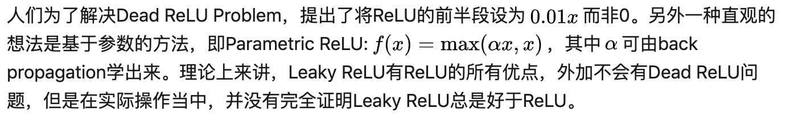

    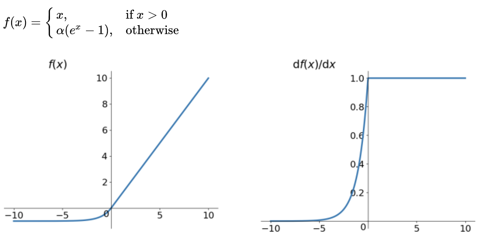

5. P-ReLU

    认为Leaky-ReLU中a也是可以学习的，如果a=0，那么 PReLU 退化为ReLU；如果 a是一个很小的固定值（如a=0.01），则 PReLU 退化为 Leaky ReLU（LReLU）。

6. ELU

    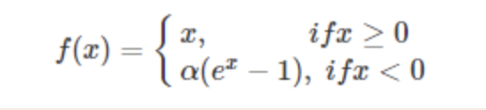

    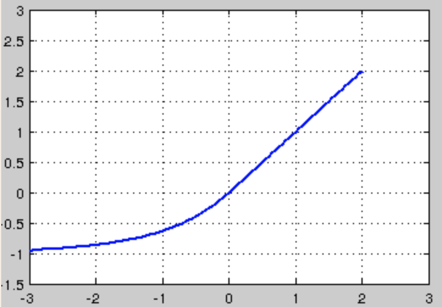

    融合了sigmoid和ReLU，左侧具有软饱和性，右侧无饱和性。右侧线性部分使得ELU能够缓解梯度消失，而左侧软饱能够让ELU对输入变化或噪声更鲁棒。
    
    ELU的输出均值接近于零，所以收敛速度更快。
    
    在 ImageNet上，不加 Batch Normalization 30 层以上的 ReLU 网络会无法收敛，PReLU网络在MSRA的Fan-in （caffe ）初始化下会发散，而 ELU 网络在Fan-in/Fan-out下都能收敛

7. Maxout

    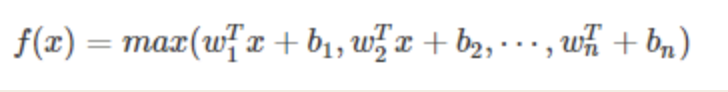

    Maxout模型实际上也是一种新型的激活函数，在前馈式神经网络中，Maxout的输出即取该层的最大值，在卷积神经网络中，一个Maxout feature map可以是由多个feature map取最值得到。 

    maxout的拟合能力是非常强的，它可以拟合任意的的凸函数。但是它同dropout一样需要人为设定一个k值。 
    
    为了便于理解，假设有一个在第i层有2个节点第（i+1）层有1个节点构成的神经网络。

    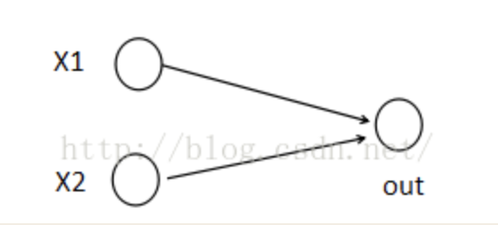

    激活值 out = f(W.X+b); f是激活函数。’.’在这里代表內积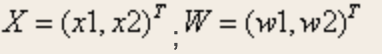
    
    那么当我们对（i+1）层使用maxout（设定k=5）然后再输出的时候，情况就发生了改变。

    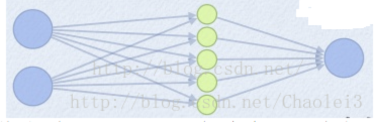

    此时网络形式上就变成上面的样子，用公式表现出来就是： 
    z1 = W1.X+b1; 
    z2 = W2.X+b2; 
    z3 = W3.X+b3; 
    z4 = W4.X+b4; 
    z5 = W4.X+b5; 
    out = max(z1,z2,z3,z4,z5); 
    也就是说第（i+1）层的激活值计算了5次，可我们明明只需要1个激活值，那么我们该怎么办？其实上面的叙述中已经给出了答案，取这5者的最大值来作为最终的结果。 
    总结一下，maxout明显增加了网络的计算量，使得应用maxout的层的参数个数成k倍增加，原本只需要1组就可以，采用maxout之后就需要k倍了。 
    再叙述一个稍微复杂点的应用maxout的网络，网络图如下： 
    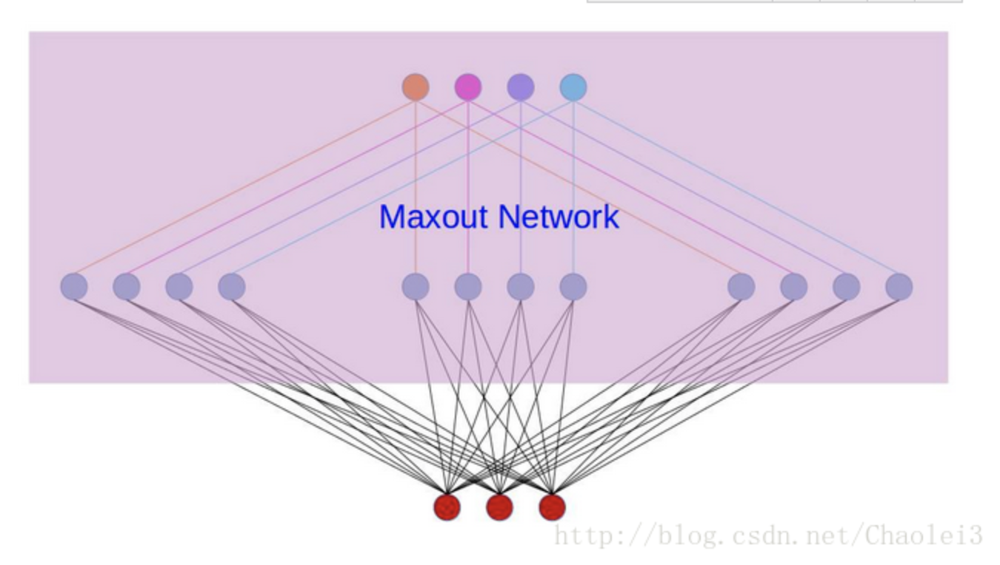

    对上图做个说明，第i层有3个节点，红点表示，而第（i+1）层有4个结点，用彩色点表示，此时在第（i+1）层采用maxout（k=3）。
    
    我们看到第（i+1）层的每个节点的激活值都有3个值，3次计算的最大值才是对应点的最终激活值。我举这个例子主要是为了说明，决定结点的激活值的时候并不是以层为单位，仍然以节点为单位。 

9. swish
    swish最早是在谷歌大脑2017的论文Searching for Activation functions所提出

    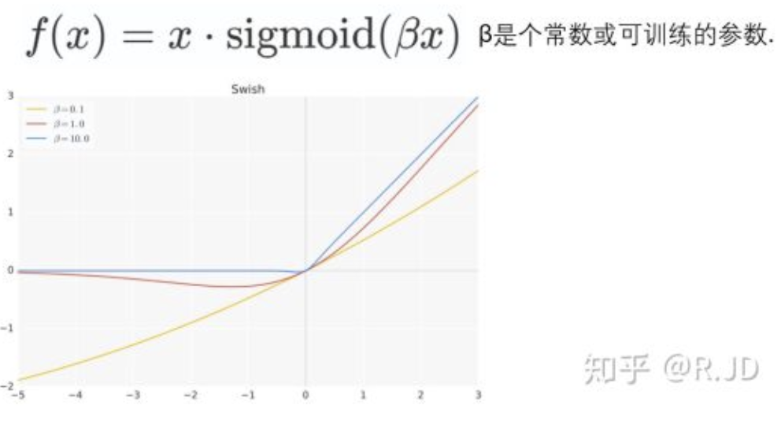

    swish论文的作者认为，Swish具备无上界有下界、平滑、非单调的特性。并且Swish在深层模型上的效果优于ReLU。仅仅使用Swish单元替换ReLU就能把MobileNet,NASNetA在 ImageNet上的top-1分类准确率提高0.9%，Inception-ResNet-v的分类准确率提高0.6%。

10. h-swish

    V3也利用swish当作为ReLU的替代时，它可以显著提高神经网络的精度。但是呢，作者认为这种非线性激活函数虽然提高了精度，但在嵌入式环境中，是有不少的成本的。原因就是在移动设备上计算sigmoid函数是非常明智的选择。所以提出了h-swish。

    可以用一个近似函数来逼急这个swish，让swish变得硬(hard)。作者选择的是基于ReLU6，作者认为几乎所有的软件和硬件框架上都可以使用ReLU6的优化实现。其次，它能在特定模式下消除了由于近似sigmoid的不同实现而带来的潜在的数值精度损失。

    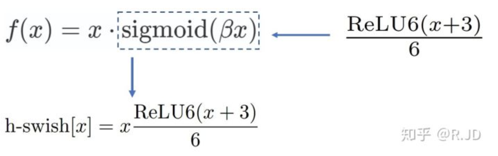

    下图是Sigmoid和swish的hard、soft形式：

    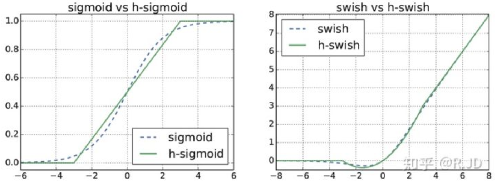

    我们可以简单的认为，hard形式是soft形式的低精度化。作者认为swish的表现和其他非线性相比，能够将过滤器的数量减少到16个的同时保持与使用ReLU或swish的32个过滤器相同的精度，这节省了3毫秒的时间和1000万MAdds的计算量。

    并且同时，作者认为随着网络的深入，应用非线性激活函数的成本会降低，能够更好的减少参数量。作者发现swish的大多数好处都是通过在更深的层中使用它们实现的。因此，在V3的架构中，只在模型的后半部分使用h-swish(HS)。

参考：
https://www.cnblogs.com/missidiot/p/9378079.html
