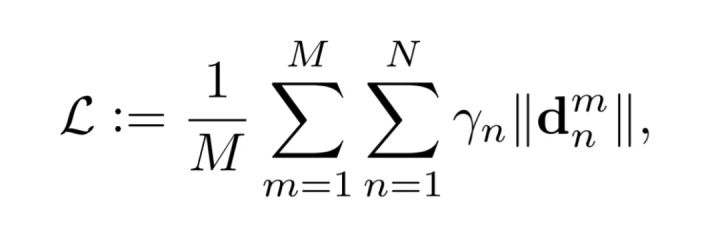
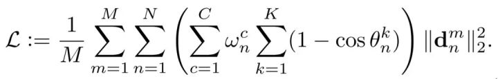
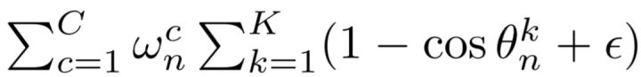

## PFLD

FPFLD 要实现三个目标：精度高、速度快、模型小！

### 算法思想

作者使用的网络结构如下：

黄色曲线包围的是主网络，用于预测特征点的位置；

绿色曲线包围的部分为辅网络，在训练时预测人脸姿态（有文献表明给网络加这个辅助任务可以提高定位精度，具体参考原论文），这部分在测试时不需要。

对于影响精度的挑战，修改loss函数在训练时关注那些稀有样本，而提高计算速度和减小模型size则是使用轻量级模型。

### Loss函数设计

Loss函数用于神经网络在每次训练时预测的形状和标注形状的误差。

考虑到样本的不平衡，作者希望能对那些稀有样本赋予更高的权重，这种加权的Loss函数被表达为：

M为样本个数，N为特征点个数，Yn为不同的权重，|| * ||为特征点的距离度量（L1或L2距离）。(以Y代替公式里的希腊字母)

进一步细化Yn:

其中

即为最终的样本权重。

K=3，这一项代表着人脸姿态的三个维度，即yaw, pitch, roll 角度，可见角度越高，权重越大。

C为不同的人脸类别数，作者将人脸分成多个类别，比如侧脸、正脸、抬头、低头、表情、遮挡等，w为与类别对应的给定权重，如果某类别样本少则给定权重大。

### 主网络

作者使用轻量级的MobileNet

