## 深度可分离卷积

MobileNetV1就是把VGG中的标准卷积层换成深度可分离卷积就可以了。

可分离卷积主要有两种类型：空间可分离卷积和深度可分离卷积。

### 空间可分离

顾名思义，空间可分离就是将一个大的卷积核变成两个小的卷积核，比如将一个3×3的核分成一个3×1和一个1×3的核：

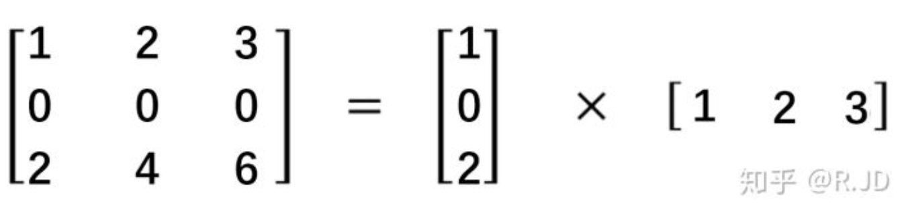

### 深度可分离卷积

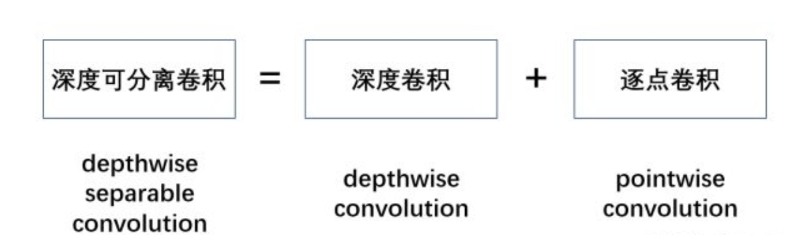

深度可分离卷积就是将普通卷积拆分成为一个深度卷积和一个逐点卷积。

我们先来看一下标准的卷积操作：

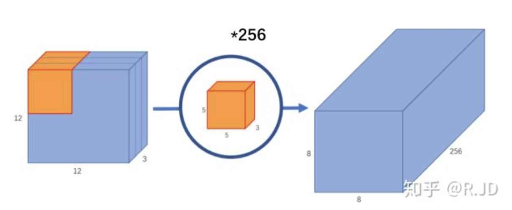

输入一个12×12×3的一个输入特征图，经过5×5×3的卷积核卷积得到一个8×8×1的输出特征图。如果此时我们有256个特征图，我们将会得到一个8×8×256的输出特征图。

以上就是标准卷积做干的活。那深度卷积和逐点卷积呢？

#### 深度卷积

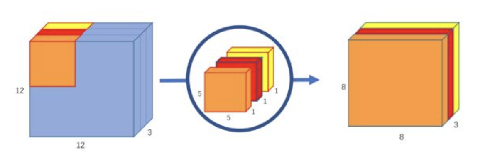

与标准卷积网络不一样的是，我们将卷积核拆分成为但单通道形式，在不改变输入特征图像的深度的情况下，对每一通道进行卷积操作，这样就得到了和输入特征图通道数一致的输出特征图。如上图：输入12×12×3的特征图，经过5×5×1×3的深度卷积之后，得到了8×8×3的输出特征图。输入个输出的维度是不变的3。这样就会有一个问题，通道数太少，特征图的维度太少，能获取到足够的有效信息吗？

#### 逐点卷积

逐点卷积就是1×1卷积。主要作用就是对特征图进行升维和降维，如下图：

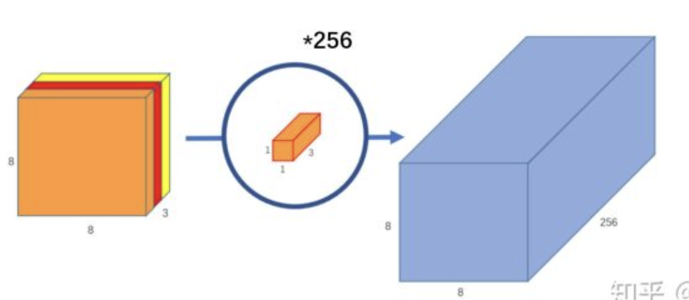

#### 标准卷积与深度可分离卷积的过程对比如下：

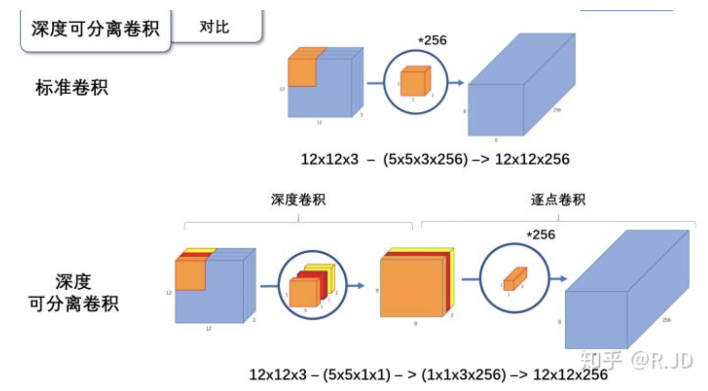

#### 为什么要深度可分离卷积？

这个问题很好回答，如果有一个方法能让你用更少的参数，更少的运算，但是能达到差的不是很多的结果，你会使用吗？

深度可分离卷积就是这样的一个方法。我们首先来计算一下标准卷积的参数量与计算量（只考虑MAdd）：

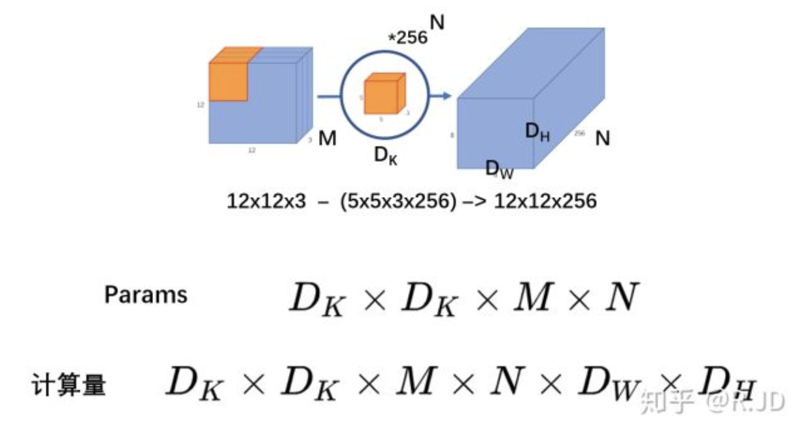

深度可分离卷积

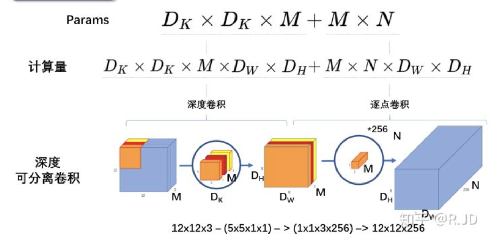

## MobileNetV1

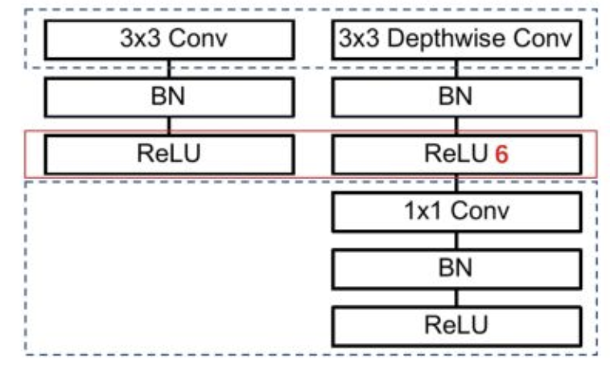

上图左边是标准卷积层，右边是V1的卷积层，虚线处是不相同点。V1的卷积层，首先使用3×3的深度卷积提取特征，接着是一个BN层，随后是一个ReLU层，在之后就会逐点卷积，最后就是BN和ReLU了。这也很符合深度可分离卷积，将左边的标准卷积拆分成右边的一个深度卷积和一个逐点卷积。

### ReLU 6

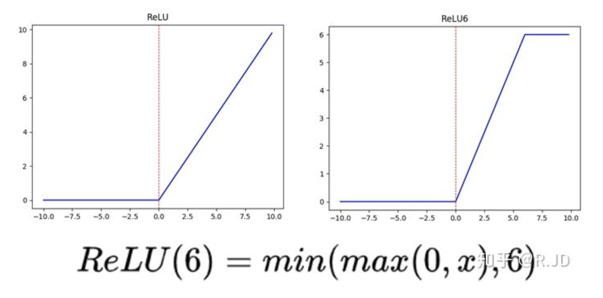

上图左边是普通的ReLU，对于大于0的值不进行处理，右边是ReLU6，当输入的值大于6的时候，返回6，relu6“具有一个边界”。作者认为ReLU6作为非线性激活函数，在低精度计算下具有更强的鲁棒性。（这里所说的“低精度”，我看到有人说不是指的float16，而是指的定点运算(fixed-point arithmetic)

## MobileNet V2

### ReLU的问题

在实际使用的时候， 发现深度卷积部分的卷积核比较容易训废掉：训完之后发现深度卷积训出来的卷积核有不少是空的：

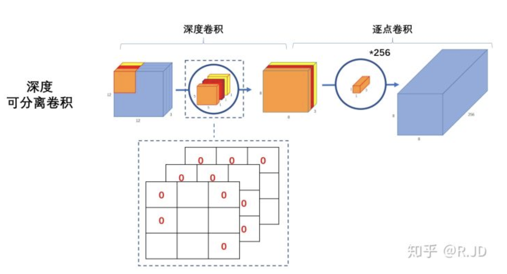

作者认为这是ReLU这个激活函数的问题

将低维流形的ReLU变换embedded到高维空间中

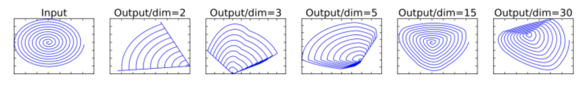

假设在2维空间有一组由m个点组成的螺旋线Xm数据(如input)，利用随机矩阵T映射到n维空间上并进行ReLU运算，即：

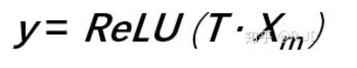

其中，Xm被随机矩阵T映射到了n维空间：

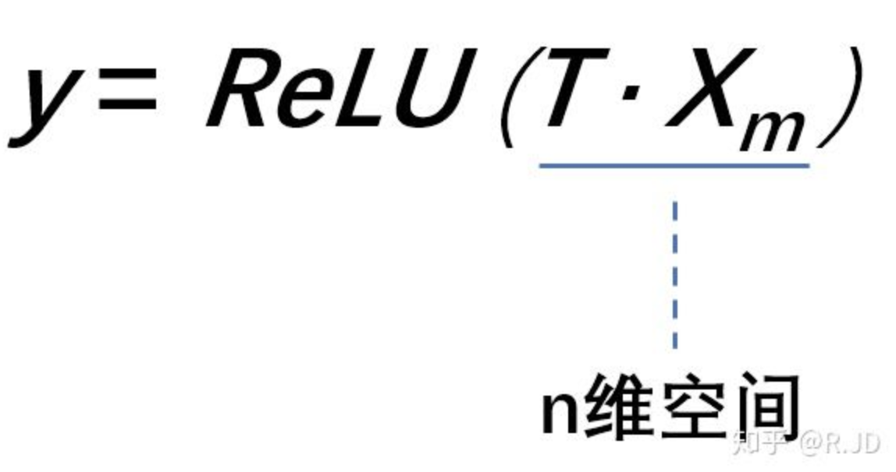

再利用随机矩阵T的逆矩阵T-1，将y映射回2维空间当中：

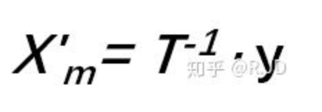

全过程如下表示：

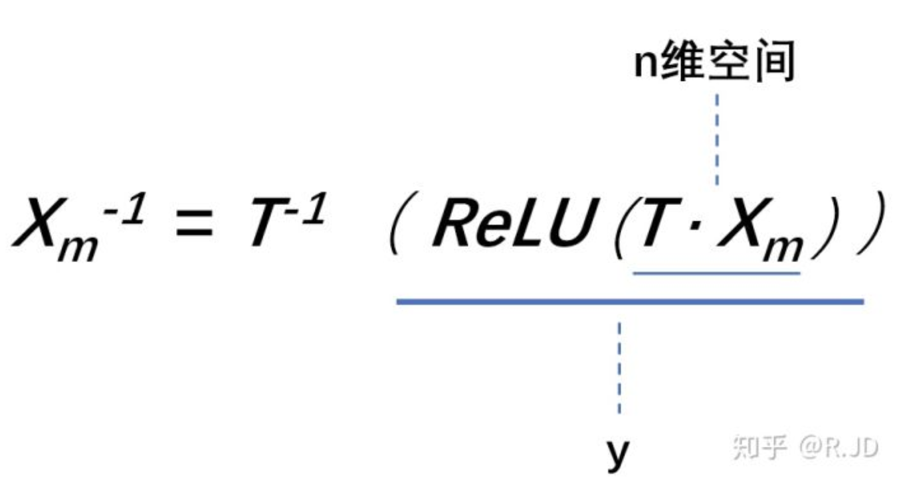

换句话说，就是对一个n维空间中的一个“东西”做ReLU运算，然后（利用T的逆矩阵T-1恢复）对比ReLU之后的结果与Input的结果相差有多大。

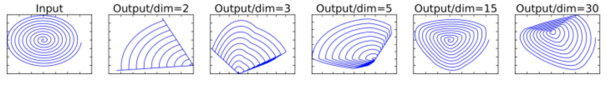

当n = 2,3时，与Input相比有很大一部分的信息已经丢失了。而当n = 15到30，还是有相当多的地方被保留了下来。

也就是说，对低维度做ReLU运算，很容易造成信息的丢失。而在高维度进行ReLU运算的话，信息的丢失则会很少。

这就解释了为什么深度卷积的卷积核有不少是空。发现了问题，我们就能更好地解决问题。针对这个问题，可以这样解决：既然是ReLU导致的信息损耗，将ReLU替换成线性激活函数。

### Linear bottleneck

我们当然不能把所有的激活层都换成线性的啊，所以我们就悄咪咪的把最后的那个ReLU6换成Linear

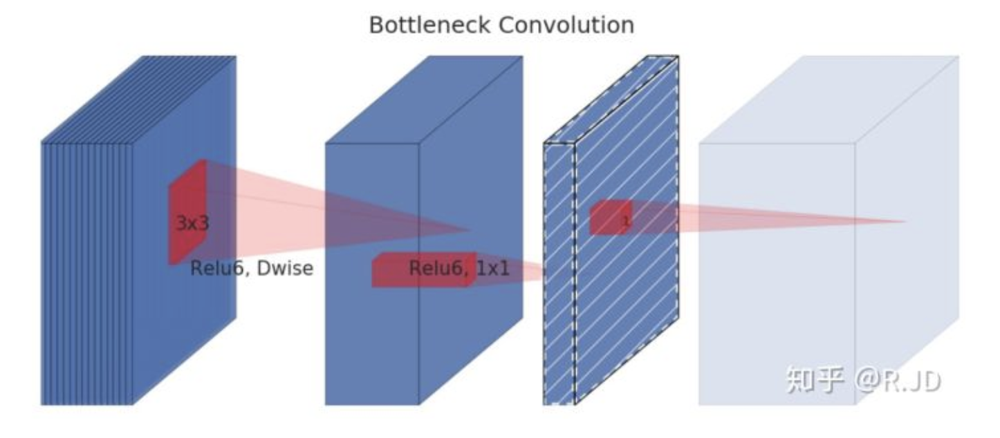

作者将这个部分称之为linear bottleneck。对，就是论文名中的那个linear bottleneck。

### Expansion layer

现在还有个问题是，深度卷积本身没有改变通道的能力，来的是多少通道输出就是多少通道。如果来的通道很少的话，DW深度卷积只能在低维度上工作，这样效果并不会很好，所以我们要“扩张”通道。既然我们已经知道PW逐点卷积也就是1×1卷积可以用来升维和降维，那就可以在DW深度卷积之前使用PW卷积进行升维（升维倍数为t，t=6），再在一个更高维的空间中进行卷积操作来提取特征：

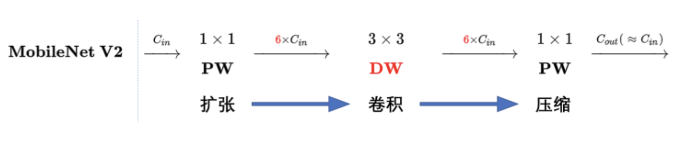

也就是说，不管输入通道数是多少，经过第一个PW逐点卷积升维之后，深度卷积都是在相对的更高6倍维度上进行工作。

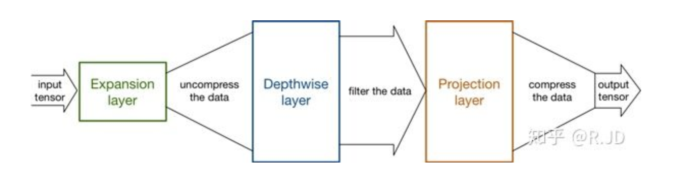

### Inverted residuals

回顾V1的网络结构，我们发现V1很像是一个直筒型的VGG网络。我们想像Resnet一样复用我们的特征，所以我们引入了shortcut结构，这样V2的block就是如下图形式：

对比一下ResNet：

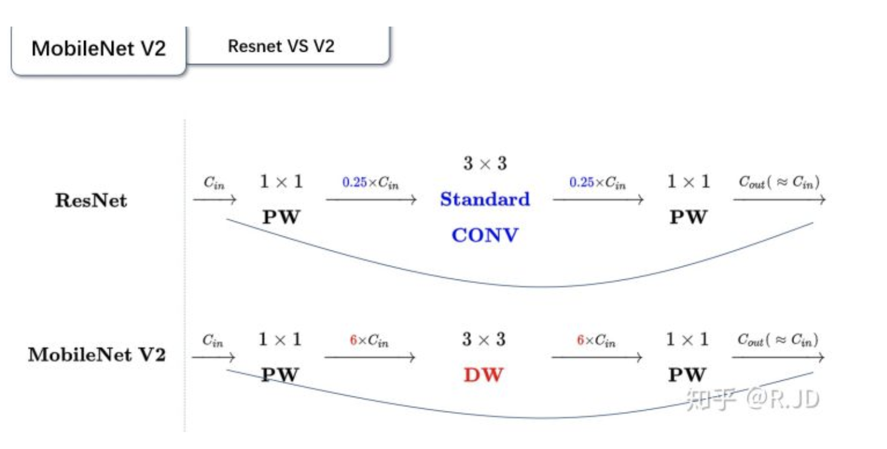

可以发现，都采用了 1×1 -> 3 ×3 -> 1 × 1 的模式，以及都使用Shortcut结构。但是不同点呢：
- ResNet 先降维 (0.25倍)、卷积、再升维。
- MobileNetV2 则是 先升维 (6倍)、卷积、再降维。

刚好V2的block刚好与Resnet的block相反，作者将其命名为Inverted residuals。就是论文名中的Inverted residuals。

回过头对比V1V2结构

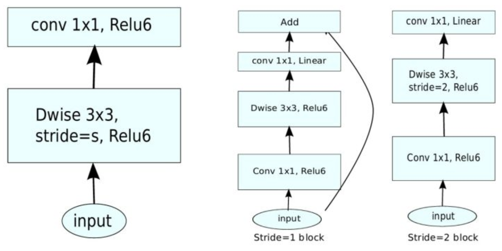

## MobileNet V3

用神经结构搜索（NAS）来完成V3

MobileNetV3的相关技术：
1. 网络的架构基于NAS实现的MnasNet（效果比MobileNetV2好）
2. 引入MobileNetV1的深度可分离卷积
3. 引入MobileNetV2的具有线性瓶颈的倒残差结构
4. 引入基于squeeze and excitation结构的轻量级注意力模型(SE)
5. 使用了一种新的激活函数h-swish(x)
6. 网络结构搜索中，结合两种技术：资源受限的NAS（platform-aware NAS）与NetAdapt
7. 修改了MobileNetV2网络端部最后阶段

### 对V2最后阶段的修改

作者认为，当前模型是基于V2模型中的倒残差结构和相应的变体（如下图）。使用1×1卷积来构建最后层，这样可以便于拓展到更高维的特征空间。这样做的好处是，在预测时，有更多更丰富的特征来满足预测，但是同时也引入了额外的计算成本与延时。

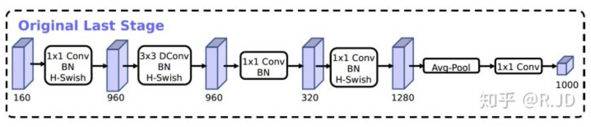

所以，需要改进的地方就是要保留高维特征的前提下减小延时。首先，还是将1×1层放在到最终平均池之后。这样的话最后一组特征现在不是7x7（下图V2结构红框），而是以1x1计算

这样的好处是，在计算和延迟方面，特征的计算几乎是免费的。最终，重新设计完的结构如下：

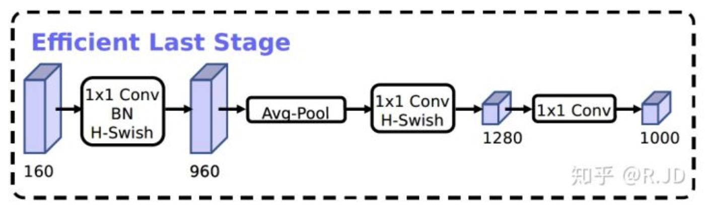

综合以上，V3的block结构如下所示：

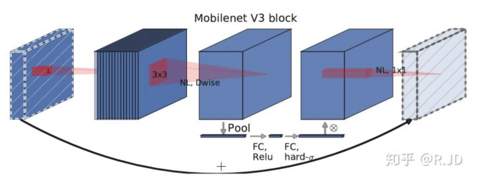
