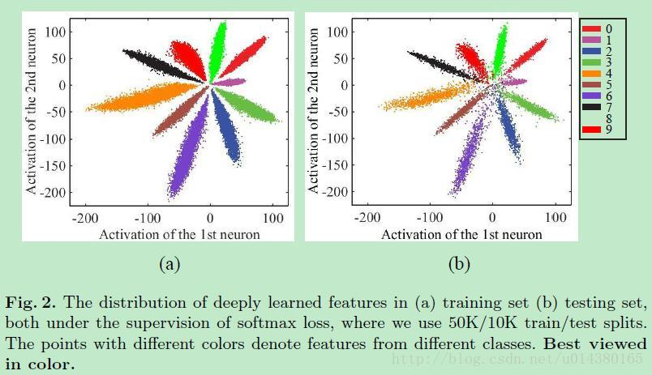
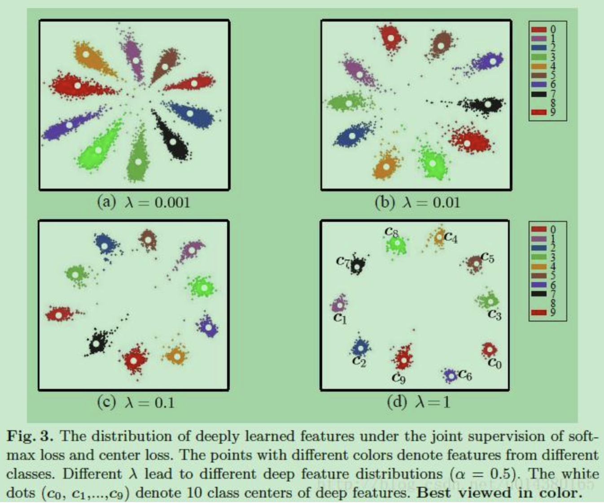
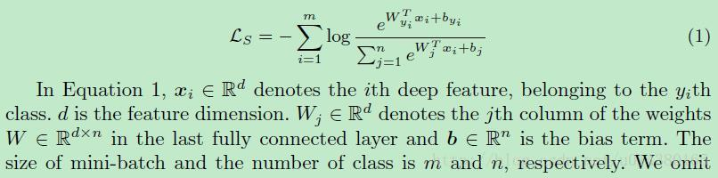
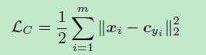
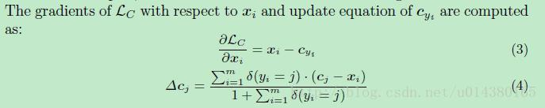
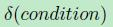
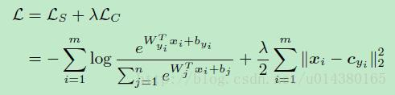
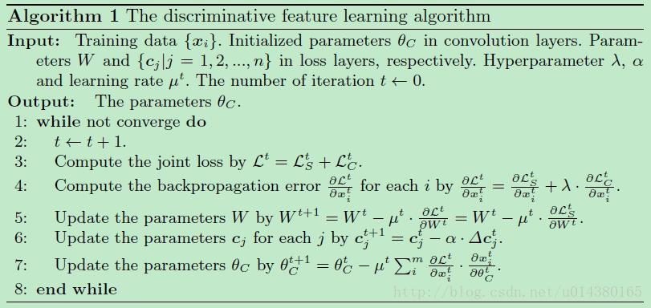

损失采用softmax loss，那么最后各个类别学出来的特征分布大概如下图：

如果采用softmax loss加上本文提出的center loss的损失，那么最后各个类别的特征分布大概如下图，类间距离变大了，类内距离减少了（主要变化在于类内距离：intra-class），这就是直观的结果。

下面公式1中log函数的输入就是softmax的结果（是概率），而Ls表示的是softmax loss的结果（是损失）。Wx+b是全连接层的输出，因此log的输入就表示xi属于类别yi的概率。

那么center loss到底是什么呢？先看看center loss的公式LC。cyi表示第yi个类别的特征中心，xi表示全连接层之前的特征。m表示mini-batch的大小。因此这个公式就是希望一个batch中的每个样本的feature离feature 的中心的距离的平方和要越小越好，也就是类内距离要越小越好。这就是center loss。

关于LC的梯度和cyi的更新公式如下：

这个公式里面有个条件表达式如下式，这里当condition满足的时候，下面这个式子等于1，当不满足的时候，下面这个式子等于0.

因此上面关于cyi的更新的公式中，当yi（表示yi类别）和cj的类别j不一样的时候，cj是不需要更新的，只有当yi和j一样才需要更新。

作者文中用的损失L的包含softmax loss和center loss，用参数${\lambda}$控制二者的比重，如下式所示。这里的m表示mini-batch的包含的样本数量，n表示类别数。

具体的算法描述可以看下面的Algorithm1：

参考：
https://blog.csdn.net/u014380165/article/details/76946339

