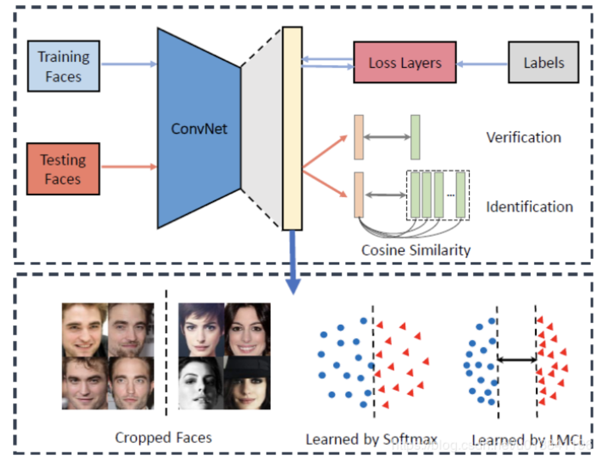
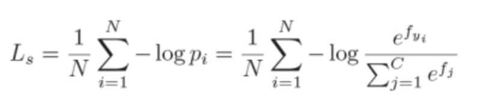
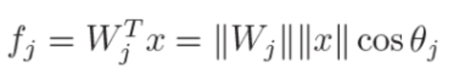
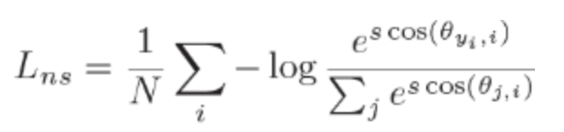
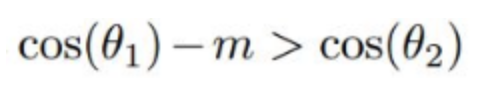
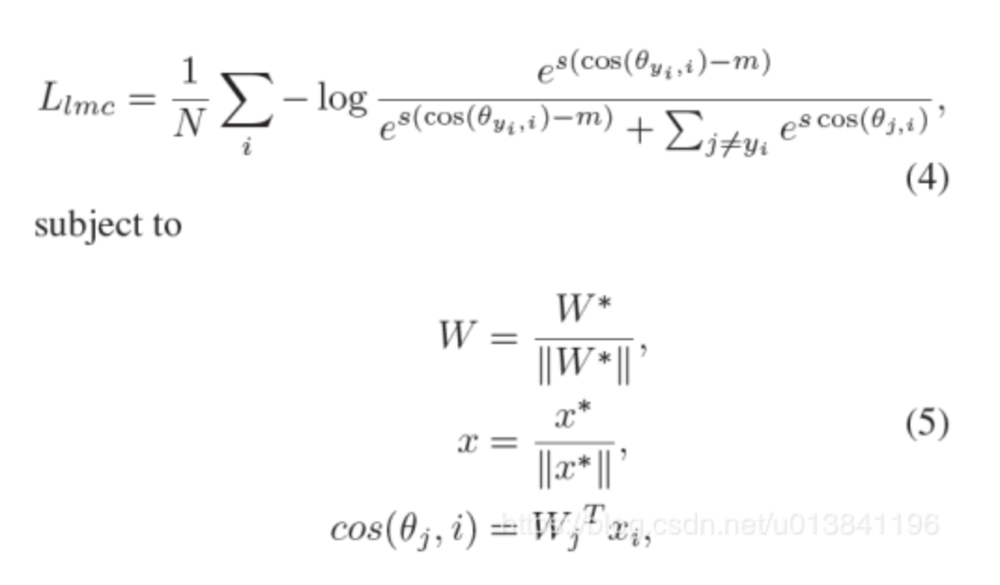

### CosFace:Large Margin Cosine Loss

所有基于softmax loss改进的损失都有相同的想法：最大化类间方差和最小化类内方差。

更具体地说，我们通过对特征向量和权重向量进行L2归一化以消除径向变化，将softmax loss表示为cosine loss。在此基础上，引入余弦间隔（margin），进一步最大化角空间中的间距（角间距）。

CosFace框架:

CosFace的思想和SphereFace的思想相近，其中主要做了一下两点的改进：
1. Loss的形式做了稍微的改变，将超参数m由乘法运算变成了减法运算。
2. 不仅对权重进行了正则化，还对特征进行了正则化。

首先，看一下原始的softmax loss：

其中,fj是当前的类别权重Wj 和feature x的乘积，bias和以前一样置0.

然后，分别对W和X做L2 Normalization,使其Norm为1，但是考虑到X的Norm太小会导致训练loss太大（softmax的值太小），进行一次缩放，固定为大小S，所以修改后的loss如下，也称为NSL，Normalized version of Softmax Loss：

到目前为止，模型只是转换了学习空间而已，由最开始的优化内积变成了现在的优化角度，但是学习到的feature仍然只是separable，还没到达我们的目标：discriminative features。

所以我们引入一个cosine margin来进行度量的约束，让当前样本所属的类别在减去一个m之后仍然属于这个类别，即：

所以此时的loss变为LMCL：

注意，margin的相减操作是针对cosine的，所以scale的缩放仍然放在最外层。

参考：

https://blog.csdn.net/u013841196/article/details/89921214