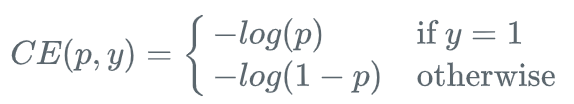
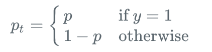
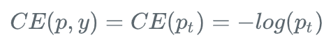
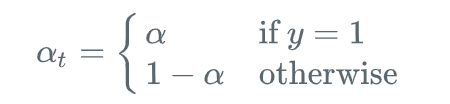
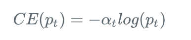
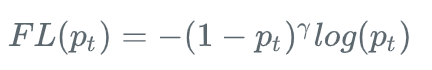
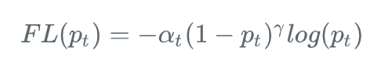

### 1. Focal Loss

作者提出focal loss的出发点也是希望one-stage detector可以达到two-stage detector的准确率，同时不影响原有的速度。

既然有了出发点，那么就要找one-stage detector的准确率不如two-stage detector的原因，作者认为原因是：样本的类别不均衡导致的。我们知道在object detection领域，一张图像可能生成成千上万的candidate locations，但是其中只有很少一部分是包含object的，这就带来了类别不均衡。那么类别不均衡会带来什么后果呢？

- 负样本数量太大，占总的loss的大部分，而且多是容易分类的，因此使得模型的优化方向并不是我们所希望的那样

OHEM算法虽然增加了错分类样本的权重，但是OHEM算法忽略了容易分类的样本。

因此针对类别不均衡问题，作者提出一种新的损失函数：focal loss，这个损失函数是在标准交叉熵损失基础上修改得到的。这个函数可以通过减少易分类样本的权重，使得模型在训练时更专注于难分类的样本。

Focal Loss 旨在解决 one-stage 目标检测器在训练过程中出现的极端前景背景类不均衡的问题(如，前景：背景 = 1:1000).

首先基于二值分类的交叉熵(cross entropy, CE) 引入 Focal Loss：

其中， y$\in${+1, -1}为groundtruth类别; p$\in$[0, 1]是模型对于类别y=1所得到的预测概率.

符号简介起见，定义pt：

则，

CE Loss一个显著特点是，对于简单易分的样本(pt >> 0.5)，其 loss 也是一致对待. 当累加了大量简单样本的 loss 后，具有很小 loss 值的可能淹没稀少的类(rare class).

#### 1.1 均衡交叉熵 Blanced CE

解决类别不均衡的一种常用方法是，对类别 +1 引入权重因子 $\alpha\in$[0, 1]，对于类别 -1 引入权重 1-$\alpha$.

符号简介起见，定义 $\alpha$t<\sub>：

则，$\alpha$-balanced CE loss 为：

#### 1.2 Focal Loss 定义

虽然$\alpha$能够平衡positive/negative样本的重要性，但不能区分 easy/had 样本.

对此，Focal Loss 提出将损失函数降低 easy 样本的权重，并关注于对 hard negatives 样本的训练.

添加调制因子(modulating factor) (1 - pt)$\gamma$到 CE loss，其中 $\gamma\geq$ 0为可调的 focusing 参数.

Focal Loss 定义为：

Focal Loss 的两个属性：

- 当样本被误分，且 pt 值很小时，调制因子接近于 1，loss 不受影响. 随着pt $\rightarrow$ 1 ，则调制因子接近于 0，则容易分类的样本的损失函数被降低权重.
- focusing 参数$\gamma$平滑地调整哪些 easy 样本会被降低权重的比率(rate). 当 $\gamma$ = 0的时候，FL=CE；随着 $\gamma$ 增加，调制因子的影响也会随之增加(实验中发现 $\gamma$ = 2 效果最佳.)

直观上，调制因子能够减少 easy 样本对于损失函数的贡献，并延伸了loss 值比较地的样本范围.

例如， $\gamma$ = 0.2时，被分类为 pt=0.9 的样本，与 CE 相比，会减少 100x 倍；

而且，被分类为 pt $\approx$ 0.968 的样本，与 CE 相比，会有少于 1000x 倍的 loss 值. 这就自然增加了将难分类样本的重要性(如 $\gamma$ = 2 且 pt$\leq$ 0.5 时，难分类样本的 loss 值会增加 4x 倍.)

实际上，论文采用了 Focal Loss 的 \alpha$ -balanced 变形：

参考：
https://www.aiuai.cn/aifarm636.html
https://blog.csdn.net/u014380165/article/details/77019084