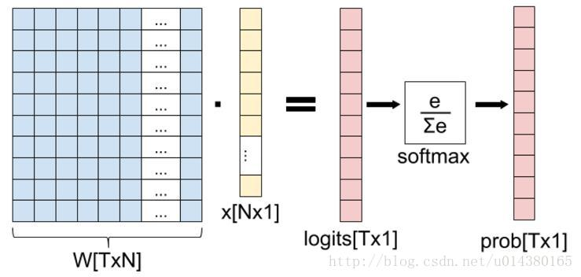
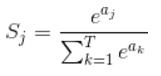
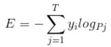
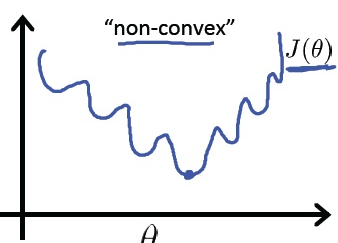

## SoftMax

这张图的等号左边部分就是全连接层做的事，

W是全连接层的参数，我们也称为权值，X是全连接层的输入，也就是特征。

从图上可以看出特征X是N*1的向量，这是怎么得到的呢？

这个特征就是由全连接层前面多个卷积层和池化层处理后得到的，假设全连接层前面连接的是一个卷积层，这个卷积层的输出是100个特征（也就是我们常说的feature map的channel为100），每个特征的大小是4*4，那么在将这些特征输入给全连接层之前会将这些特征flat成N*1的向量（这个时候N就是100*4*4=1600）。

解释完X，再来看W，W是全连接层的参数，是个T*N的矩阵，这个N和X的N对应，T表示类别数，比如你是7分类，那么T就是7。我们所说的训练一个网络，对于全连接层而言就是寻找最合适的W矩阵。

因此全连接层就是执行WX得到一个T*1的向量（也就是图中的logits[T*1]），这个向量里面的每个数都没有大小限制的，也就是从负无穷大到正无穷大。

然后如果你是多分类问题，一般会在全连接层后面接一个softmax层，这个softmax的输入是T*1的向量，输出也是T*1的向量（也就是图中的prob[T*1]，这个向量的每个值表示这个样本属于每个类的概率），只不过输出的向量的每个值的大小范围为0到1。

现在你知道softmax的输出向量是什么意思了，就是概率，该样本属于各个类的概率！

公式非常简单，前面说过softmax的输入是WX，假设模型的输入样本是I，讨论一个3分类问题（类别用1，2，3表示），样本I的真实类别是2，那么这个样本I经过网络所有层到达softmax层之前就得到了WX，也就是说WX是一个3 * 1的向量，那么上面公式中的aj就表示这个3 * 1的向量中的第j个值（最后会得到S1，S2，S3）；而分母中的ak则表示3*1的向量中的3个值，所以会有个求和符号（这里求和是k从1到T，T和上面图中的T是对应相等的，也就是类别数的意思，j的范围也是1到T）。

因为ex恒大于0，所以分子永远是正数，分母又是多个正数的和，所以分母也肯定是正数，因此Sj是正数，而且范围是(0,1)。如果现在不是在训练模型，而是在测试模型，那么当一个样本经过softmax层并输出一个T*1的向量时，就会取这个向量中值最大的那个数的index作为这个样本的预测标签。

因此我们训练全连接层的W的目标就是使得其输出的WX在经过softmax层计算后其对应于真实标签的预测概率要最高。

举个例子：假设你的WX=[1,2,3]，那么经过softmax层后就会得到[0.09,0.24,0.67]，这三个数字表示这个样本属于第1,2,3类的概率分别是0.09,0.24,0.67。

## softmax loss

softmax loss公式如下

首先L是损失。Sj是softmax的输出向量S的第j个值，前面已经介绍过了，表示的是这个样本属于第j个类别的概率。yj前面有个求和符号，j的范围也是1到类别数T，因此y是一个1*T的向量，里面的T个值，而且只有1个值是1，其他T-1个值都是0。那么哪个位置的值是1呢？答案是真实标签对应的位置的那个值是1，其他都是0。所以这个公式其实有一个更简单的形式：

当然此时要限定j是指向当前样本的真实标签。

来举个例子吧。假设一个5分类问题，然后一个样本I的标签y=[0,0,0,1,0]，也就是说样本I的真实标签是4，假设模型预测的结果概率（softmax的输出）p=[0.1,0.15,0.05,0.6,0.1]，可以看出这个预测是对的，那么对应的损失L=-log(0.6)，也就是当这个样本经过这样的网络参数产生这样的预测p时，它的损失是-log(0.6)。那么假设p=[0.15,0.2,0.4,0.1,0.15]，这个预测结果就很离谱了，因为真实标签是4，而你觉得这个样本是4的概率只有0.1（远不如其他概率高，如果是在测试阶段，那么模型就会预测该样本属于类别3），对应损失L=-log(0.1)。那么假设p=[0.05,0.15,0.4,0.3,0.1]，这个预测结果虽然也错了，但是没有前面那个那么离谱，对应的损失L=-log(0.3)。我们知道log函数在输入小于1的时候是个负数，而且log函数是递增函数，所以-log(0.6) < -log(0.3) < -log(0.1)。

简单讲就是你预测错比预测对的损失要大，预测错得离谱比预测错得轻微的损失要大。

## cross entropy

和softmax loss的公式很像。当cross entropy的输入P是softmax的输出时，cross entropy等于softmax loss。Pj是输入的概率向量P的第j个值，所以如果你的概率是通过softmax公式得到的，那么cross entropy就是softmax loss。

由于classification error 很难精确描述模型与理想模型之间的距离，所以需要cross entropy来衡量

## 为何不用 Mean Squared Error (平方和)

分类问题最后必须是 one hot 形式算出各 label 的概率， 然后通过 argmax 选出最终的分类。在计算各个 label 概率的时候，用的是 softmax 函数。

如果用 MSE 计算 loss， 通过 Softmax后 输出的曲线是波动的，有很多局部的极值点，即非凸优化问题 (non-convex)，如下图 [ MSE是凸函数，logits先经过Softmax，再经过MSE形成的为非凸函数

而用 Cross Entropy Loss 计算 loss，就还是一个凸优化问题，用梯度下降求解时，凸优化问题有很好的收敛特性。

分类问题用 One Hot Label + Cross Entropy Loss

Training 过程，分类问题用 Cross Entropy Loss，回归问题用 Mean Squared Error。

validation / testing 过程，使用 Classification Error更直观，也正是我们最为关注的指标。

#### 为什么回归问题用 MSE

Cross Entropy Loss 对于神经网络的分类问题可以很好的应用，但是对于回归问题 [请自行翻阅上面的Cross Entropy Loss 公式]，预测结果任意取一个值，比如 -1.5，就没法计算 log(-1.5)，所以一般不用交叉熵来优化回归问题。

为什么用欧式距离作为误差度量 （即 MSE）

1. 它简单。

2. 它提供了具有很好性质的相似度的度量。

    1）它是非负的;

    2）唯一确定性。只有 x=y 的时候，d(x,y)=0；

    3）它是对称的，即 d(x,y)=d(y,x)；

    4）符合三角性质。即 d(x,z)<=d(x,y)+d(y,z).

3. 物理性质明确，在不同的表示域变换后特性不变，例如帕萨瓦尔等式。

4. 便于计算。通常所推导得到的问题是凸问题，具有对称性，可导性。通常具有解析解，此外便于通过迭代的方式求解。

5. 和统计和估计理论具有关联。在某些假设下，统计意义上是最优的。

但 MSE 也有缺点

1. 信号的保真度和顺序无关。即，以同样的方法，改变两个待比较的信号本身的空间或时间排列，它们之间的误差不变。例如，[1 2 3], [3 4 5] 两组信号的 MSE 和 [3 2 1],[5 4 3] 的 MSE 一样。

2. 误差信号和原信号无关。只要误差信号不变，无论原信号如何，MSE 均不变。例如，对于固定误差 [1 1 1]，无论加在 [1 2 3] 产生 [2 3 4] 还是加在 [0 0 0] 产生 [1 1 1]，MSE 的计算结果不变。

3. 信号的保真度和误差的符号无关。即对于信号 [0 0 0]，与之相比较的两个信号 [1 2 3] 和[-1 -2 -3] 被认为和 [0 0 0] 具有同样的差别。

4. 信号的不同采样点对于信号的保真度具有同样的重要性。

参考：  
https://blog.csdn.net/xg123321123/article/details/80781611
https://blog.csdn.net/u014380165/article/details/77284921