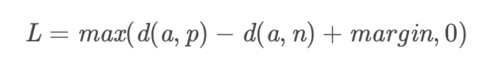
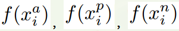
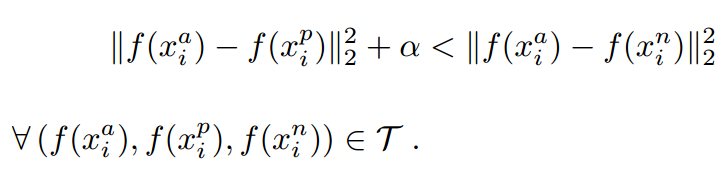
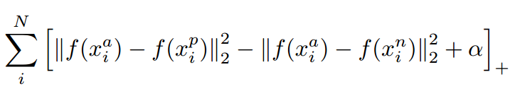
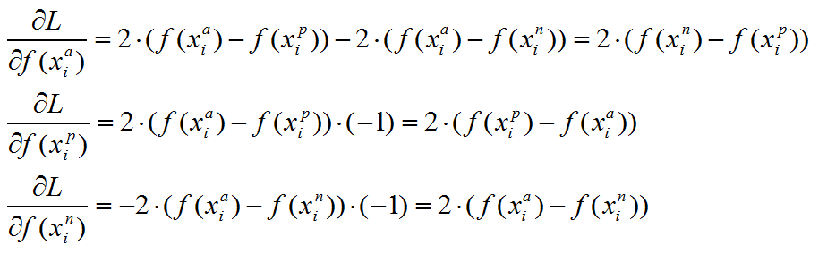

## Triplet-Loss

### 介绍
Triplet loss最初是在 FaceNet中提出的，可以学到较好的人脸的embedding

### 原理

为什么不适用 softmax函数呢，softmax最终的类别数是确定的，而Triplet loss学到的是一个好的embedding，相似的图像在embedding空间里是相近的，可以判断是否是同一个人脸。

输入是一个三元组 <a, p, n>
- a： anchor
- p： positive, 与 a 是同一类别的样本
- n： negative, 与 a 是不同类别的样本

公式是：

- 所以最终的优化目标是拉近 a, p 的距离， 拉远 a, n 的距离
- easy triplets: L=0 即 d(a,p) + margin < d(a,n)，这种情况不需要优化，天然a, p的距离很近， a, n的距离远
- hard triplets: d(a,n)<d(a,p), 即a, p的距离远
- semi-hard triplets: d(a,p)<d(a,n)<d(a,p)+margin, 即a, n的距离靠的很近，但是有一个margin

FaceNet 中是随机选取semi-hard triplets 进行训练的, （也可以选择 hard triplets 或者两者一起进行训练）

### 训练方法

#### offline

- 训练集所有数据经过计算得到对应的 embeddings, 可以得到 很多<i, j, k> 的三元组，然后再计算 triplet loss
- 效率不高，因为需要过一遍所有的数据得到三元组，然后训练反向更新网络

#### online

- 从训练集中抽取B个样本，然后计算 B 个embeddings，可以产生 B3个 triplets （当然其中有不合法的，因为需要的是<a, p, n>）
  

- 实际使用中采用此方法，又分为两种策略 （是在一篇行人重识别的论文中提到的 In Defense of the Triplet Loss for Person Re-Identification），假设 B=PK, 其中P个身份的人，每个身份的人K张图片（一般K 取 4）
 
  - Batch All: 计算batch_size中所有valid的的hard triplet 和 semi-hard triplet， 然后取平均得到Loss

    - 注意因为很多 easy triplets的情况，所以平均会导致Loss很小，所以是对除easy外所有 valid 的求平均
    - 可以产生 PK(K−1)(PK−K)个 triplets

      - PK个 anchor
      - K-1 个 positive
      - PK-K 个 negative

  - Batch Hard: 对于每一个anchor， 选择距离最大的d(a, p) 和 距离最小的 d(a, n)
  
    - 所以公有 PK 个 三元组triplets

### 推导

针对三元组中的每个元素（样本），训练一个参数共享或者不共享的网络，得到三个元素的特征表达，分别记为：

triplet loss的目的就是通过学习，让xa和xp特征表达之间的距离尽可能小，而xa和xn的特征表达之间的距离尽可能大，并且要让xa与xn之间的距离和xa与xp之间的距离之间有一个最小的间隔$\alpha$

公式化的表示就是：

对应的目标函数也就很清楚了：

这里距离用欧式距离度量，+表示[]内的值大于零的时候，取该值为损失，小于零的时候，损失为零。

由目标函数可以看出:

- 当xa与xn之间的距离小于xa与xp之间的距离加$\alpha$时，[]内的值大于零，就会产生损失。
- 当xa与xn之间的距离 >= xa与xp之间的距离加$\alpha$时，损失为零。

### triplet loss 梯度推导

上述目标函数记为L。则当第i个triplet损失大于零的时候，仅就上述公式而言，有：

参考：  
https://blog.csdn.net/u013082989/article/details/83537370  
https://omoindrot.github.io/triplet-loss#batch-hard-strategy
https://blog.csdn.net/tangwei2014/article/details/46788025  
https://zhuanlan.zhihu.com/p/101143469