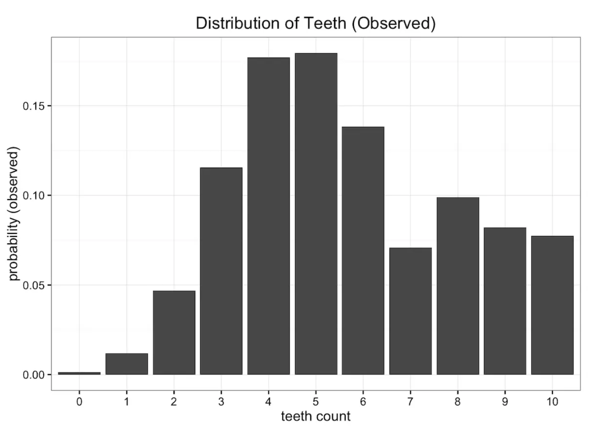
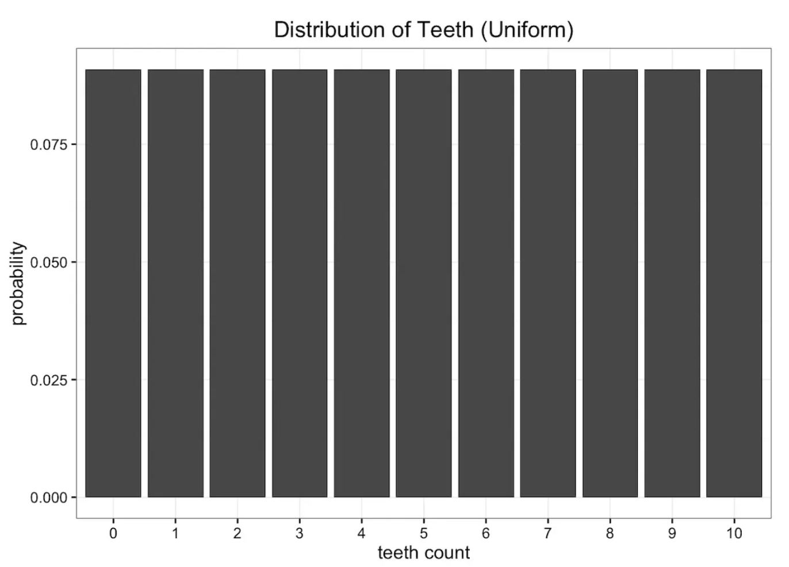
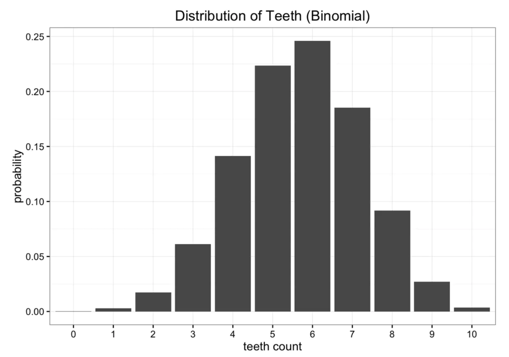
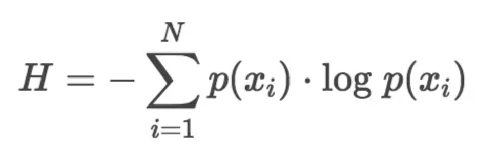
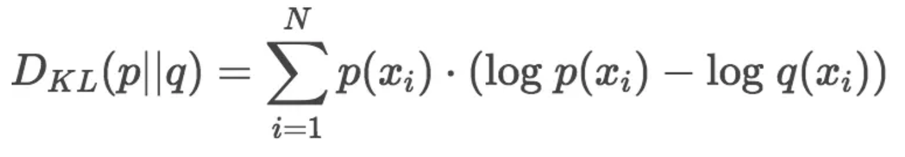
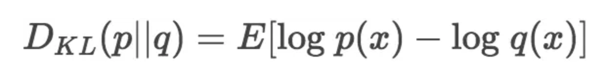
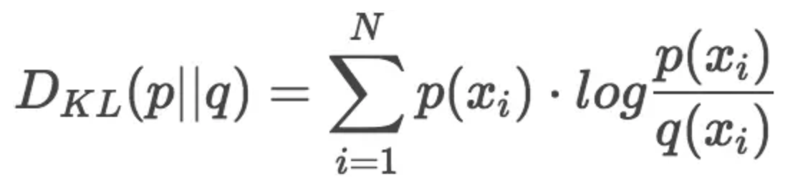
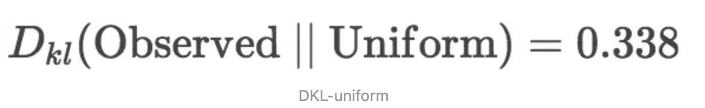
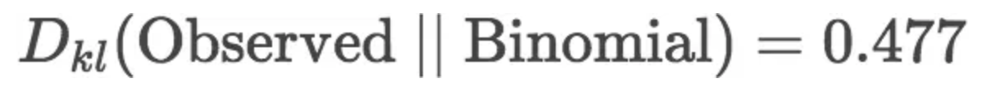

### KL-散度

Kullback-Leibler Divergence，即K-L散度，是一种量化两种概率分布P和Q之间差异的方式，又叫相对熵

在概率学和统计学上，我们经常会使用一种更简单的、近似的分布来替代观察数据或太复杂的分布。K-L散度能帮助我们度量使用一个分布来近似另一个分布时所损失的信息量。

我们从下面这个问题出发思考K-L散度。蠕虫生有10颗牙齿，许多蠕虫会掉牙。收集大量样本之后，我们得到关于蠕虫牙齿数量的经验分布，如下图所示

用一个只有一两个参数的简单模型来近似原始数据会减小数据传送量。最简单的近似模型是均分布，因为蠕虫牙齿不会超过10颗，所以有11个可能值，那蠕虫的牙齿数量概率都为 1/11。分布图如下

显然我们的原始数据并非均分布的，但也不是我们已知的分布，至少不是常见的分布。作为备选，我们想到的另一种简单模型是二项式分布binomial distribution。蠕虫嘴里面共有n=10个牙槽，每个牙槽出现牙齿与否为独立事件，且概率均为p。则蠕虫牙齿数量即为期望值E[x]=n*p，真实期望值即为观察数据的平均值，比如说5.7，则p=0.57，得到如下图所示的二项式分布：

对比一下原始数据，可以看出均分布和二项分布都不能完全描述原始分布。

可是，我们不禁要问，哪一种分布更加接近原始分布呢？
已经有许多度量误差的方式存在，但是我们所要考虑的是减小发送的信息量。上面讨论的均分布和二项式分布都把问题规约到只需要两个参数，牙齿数量和概率值（均分布只需要牙齿数量即可）。那么哪个分布保留了更多的原始数据分布的信息呢？这个时候就需要K-L散度登场了。

### 数据的熵

K-L散度源于信息论。信息论主要研究如何量化数据中的信息。最重要的信息度量单位是熵Entropy，一般用H表示。分布的熵的公式如下：

上面对数没有确定底数，可以是2、e或10，等等。如果我们使用以2为底的对数计算H值的话，可以把这个值看作是编码信息所需要的最少二进制位个数bits。上面空间蠕虫的例子中，信息指的是根据观察所得的经验分布给出的蠕虫牙齿数量。计算可以得到原始数据概率分布的熵值为3.12 bits。这个值只是告诉我们编码蠕虫牙齿数量概率的信息需要的二进制位bit的位数。

可是熵值并没有给出压缩数据到最小熵值的方法，即如何编码数据才能达到最优（存储空间最优）。优化信息编码是一个非常有意思的主题，但并不是理解K-L散度所必须的。熵的主要作用是告诉我们最优编码信息方案的理论下界（存储空间），以及度量数据的信息量的一种方式。理解了熵，我们就知道有多少信息蕴含在数据之中，现在我们就可以计算当我们用一个带参数的概率分布来近似替代原始数据分布的时候，到底损失了多少信息。

### K-L散度度量信息损失

只需要稍加修改熵H的计算公式就能得到K-L散度的计算公式。设p为观察得到的概率分布，q为另一分布来近似p，则p、q的K-L散度为：

显然，根据上面的公式，K-L散度其实是数据的原始分布p和近似分布q之间的对数差值的期望。如果继续用2为底的对数计算，则K-L散度值表示信息损失的二进制位数。下面公式以期望表达K-L散度：

一般，K-L散度以下面的书写方式更常见：

### 对比两种分布

首先是用均分布来近似原始分布的K-L散度：

接下来计算用二项式分布近似原始分布的K-L散度：

通过上面的计算可以看出，使用均分布近似原始分布的信息损失要比用二项式分布近似小。所以，如果要从均分布和二项式分布中选择一个的话，均分布更好些。

### 散度并非距离

很自然地，一些同学把K-L散度看作是不同分布之间距离的度量。这是不对的，因为从K-L散度的计算公式就可以看出它不符合对称性（距离度量应该满足对称性）。如果用我们上面观察的数据分布来近似二项式分布，得到如下结果：

所以，Dkl (Observed || Binomial) != Dkl (Binomial || Observed)。
也就是说，用p近似q和用q近似p，二者所损失的信息并不是一样的。

