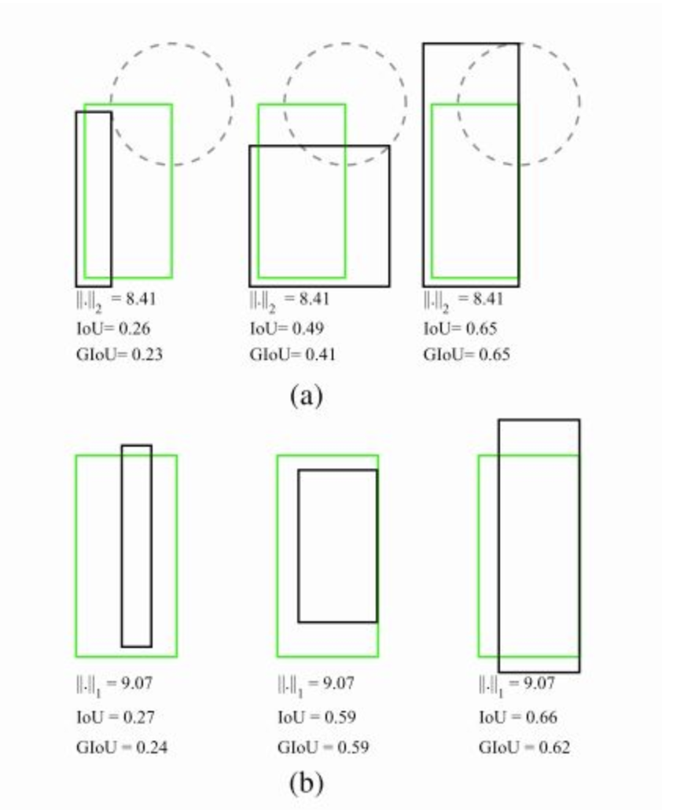
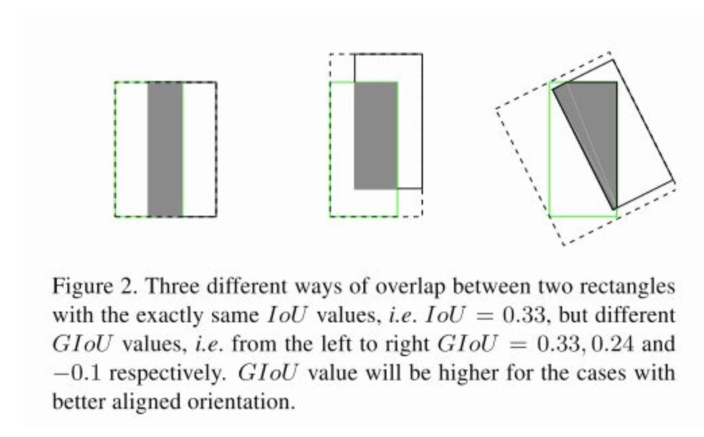
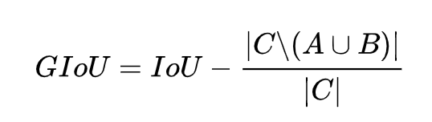

### GIoU

IoU是检测任务中最常用的指标，由于IoU是比值的概念，对目标物体的scale是不敏感的。然而检测任务中的BBox的回归损失(MSE loss, l1-smooth loss等）优化和IoU优化不是完全等价的（见下图）。而且ln范数对物体的scale也比较敏感

要将IoU设计为损失，主要需要解决两个问题：

- 预测值和Ground truth没有重叠的话，IoU始终为0且无法优化
- IoU无法辨别不同方式的对齐，比如方向不一致等。

### GIoU设计

假如现在有两个任意性质 A，B，我们找到一个最小的封闭形状C，让C可以把A，B包含在内，然后我们计算C中没有覆盖A和B的面积占C总面积的比值，然后用A与B的IoU减去这个比值：

GIoU有如下性质：

1. 与IoU类似，GIoU也可以作为一个距离，loss可以用$L_{GIoU} = 1 - GIoU$ 
2. 同原始IoU类似，GIoU对物体的大小不敏感
3. GIoU总是小于等于IoU，对于IoU, $0 \leq IoU \leq 1$, 而GIoU, $-1 \leq GIoU \leq 1$,在两个形状完全重合时，有GIoU = IoU = 1
4. 由于GIoU引入了包含A，B两个形状的C，所以当A，B不重合时，依然可以进行优化。

