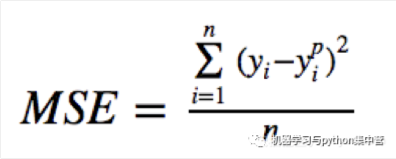
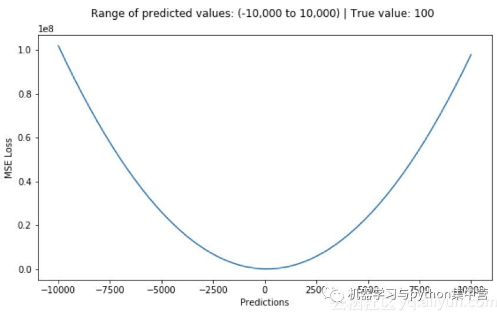
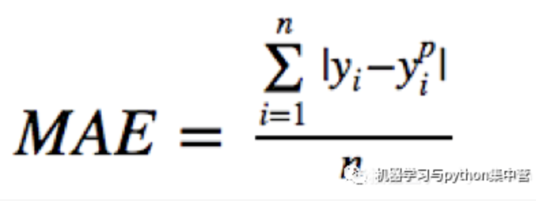
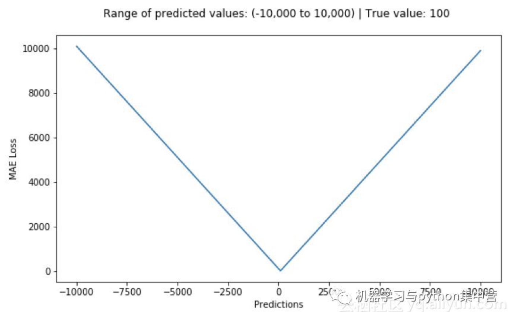
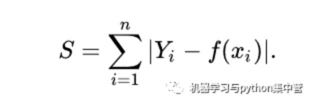
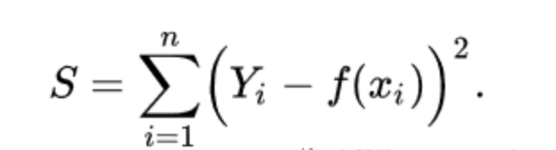
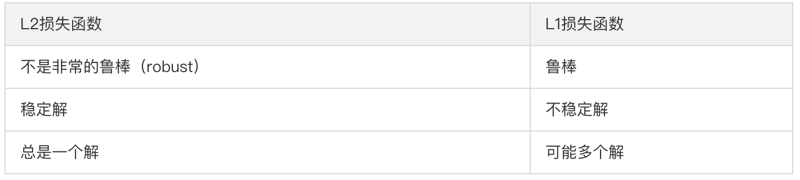
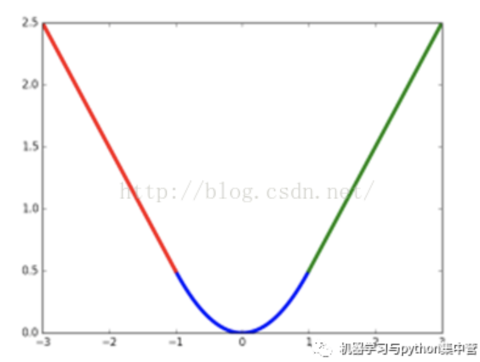

### MSE、MAE损失函数

1. MSE

均方误差（MSE）是回归损失函数中最常用的误差，它是预测值与目标值之间差值的平方和，其公式如下所示：

下图是均方根误差值的曲线分布，其中最小值为预测值为目标值的位置。我们可以看到随着误差的增加损失函数增加的更为迅猛。

优点：各点都连续光滑，方便求导，具有较为稳定的解

缺点：不是特别的稳健，为什么？因为当函数的输入值距离中心值较远的时候，使用梯度下降法求解的时候梯度很大，可能导致梯度爆炸

2. MAE
   
    平均绝对误差（MAE）是另一种常用的回归损失函数，它是目标值与预测值之差绝对值的和，表示了预测值的平均误差幅度，而不需要考虑误差的方向（注：平均偏差误差MBE则是考虑的方向的误差，是残差的和），范围是0到∞，其公式如下所示：

    

    

    优点：无论对于什么样的输入值，都有着稳定的梯度，不会导致梯度爆炸问题，具有较为稳健性的解

    缺点：在中心点是折点，不能求导，不方便求解

    备注：上面的两种损失函数也被很多资料或者是教材称之为
    L2损失和L1损失，但是本文还是将它们跟下面的L1损失和L2损失进行区分了的。

### L1_Loss和L2_Loss

1. L1_Loss和L2_Loss的公式

    L1范数损失函数，也被称为最小绝对值偏差（LAD），最小绝对值误差（LAE）。总的说来，它是把目标值（Yi)与估计值（f(xi))的绝对差值的总和（S)最小化：

    

    L2范数损失函数，也被称为最小平方误差（LSE）。总的来说，它是把目标值（Yi)与估计值（f(xi))的差值的平方和（S)最小化：

    

    L1范数与L2范数作为损失函数的区别能快速地总结如下：

    

    总结：实际上我们发现，其实所谓的L1_Loss与L2_Loss与前面说的MSE、MAE损失函数一个1/n的区别，所以他们的优点和缺点是互通的。

2. 几个关键的概念

    1. 鲁棒性
    
        因为与最小平方相比，最小绝对值偏差方法的鲁棒性更好，因此，它在许多场合都有应用。最小绝对值偏差之所以是鲁棒的，是因为它能处理数据中的异常值。这或许在那些异常值可能被安全地和有效地忽略的研究中很有用。如果需要考虑任一或全部的异常值，那么最小绝对值偏差是更好的选择。

        从直观上说，因为L2范数将误差平方化（如果误差大于1，则误差会放大很多），模型的误差会比L1范数来得大，因此模型会对这个样本更加敏感，这就需要调整模型来最小化误差。如果这个样本是一个异常值，模型就需要调整以适应单个的异常值，这会牺牲许多其它正常的样本，因为这些正常样本的误差比这单个的异常值的误差小。

    2. 稳定性

        最小绝对值偏差方法的不稳定性意味着，对于数据集的一个小的水平方向的波动，回归线也许会跳跃很大。在一些数据结构（data configurations）上，该方法有许多连续解；但是，对数据集的一个微小移动，就会跳过某个数据结构在一定区域内的许多连续解。

3. smooth L1损失函数

其实顾名思义，smooth L1说的是光滑之后的L1，前面说过了L1损失的缺点就是有折点，不光滑，那如何让其变得光滑呢？

smooth L1损失函数为：

smooth L1损失函数曲线如下图所示，作者这样设置的目的是想让loss对于离群点更加鲁棒，相比于L2损失函数，其对离群点（指的是距离中心较远的点）、异常值（outlier）不敏感，可控制梯度的量级使训练时不容易跑飞。

对于边框预测回归问题，通常也可以选择平方损失函数（L2损失），但L2范数的缺点是当存在离群点（outliers)的时候，这些点会占loss的主要组成部分。比如说真实值为1，预测10次，有一次预测值为1000，其余次的预测值为1左右，显然loss值主要由1000主宰。所以FastRCNN采用稍微缓和一点绝对损失函数（smooth L1损失），它是随着误差线性增长，而不是平方增长。

对于大多数CNN网络，我们一般是使用L2-loss而不是L1-loss，因为L2-loss的收敛速度要比L1-loss要快得多。

参考：

https://cloud.tencent.com/developer/article/1441560
https://zhuanlan.zhihu.com/p/48426076