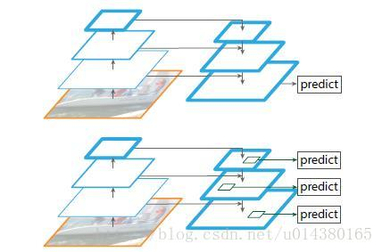
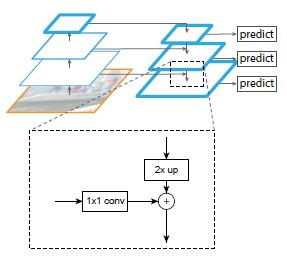
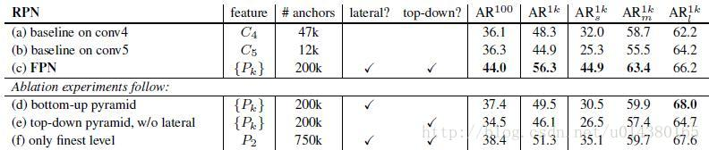

## FPN（feature pyramid networks）

### 概述

作者提出的多尺度的object detection算法：FPN（feature pyramid networks）。

原来多数的object detection算法都是只采用顶层特征做预测，但我们知道低层的特征语义信息比较少，但是目标位置准确；高层的特征语义信息比较丰富，但是目标位置比较粗略。另外虽然也有些算法采用多尺度特征融合的方式，但是一般是采用融合后的特征做预测，而本文不一样的地方在于预测是在不同特征层独立进行的。

### 详解

下图展示了4种利用特征的形式：
- （a）图像金字塔，即将图像做成不同的scale，然后不同scale的图像生成对应的不同scale的特征。这种方法的缺点在于增加了时间成本。有些算法会在测试时候采用图像金字塔。
- （b）像SPP net，Fast RCNN，Faster RCNN是采用这种方式，即仅采用网络最后一层的特征。
- （c）像SSD（Single Shot Detector）采用这种多尺度特征融合的方式，没有上采样过程，即从网络不同层抽取不同尺度的特征做预测，这种方式不会增加额外的计算量。作者认为SSD算法中没有用到足够低层的特征（在SSD中，最低层的特征是VGG网络的conv4_3），而在作者看来足够低层的特征对于检测小物体是很有帮助的。
- （d）本文作者是采用这种方式，顶层特征通过上采样和低层特征做融合，而且每层都是独立预测的。

如下图，上面一个带有skip connection的网络结构在预测的时候是在finest level（自顶向下的最后一层）进行的，简单讲就是经过多次上采样并融合特征到最后一步，拿最后一步生成的特征做预测。

而下面一个网络结构和上面的类似，区别在于预测是在每一层中独立进行的。后面有这两种结构的实验结果对比，非常有意思，因为之前只见过使用第一种特征融合的方式。

作者的算法大致结构如下图：一个自底向上的线路，一个自顶向下的线路，横向连接（lateral connection）。图中放大的区域就是横向连接，这里1*1的卷积核的主要作用是减少卷积核的个数，也就是减少了feature map的个数，并不改变feature map的尺寸大小。

#### 自底向上
其实就是网络的前向过程。在前向过程中，feature map的大小在经过某些层后会改变，而在经过其他一些层的时候不会改变，作者将不改变feature map大小的层归为一个stage，因此每次抽取的特征都是每个stage的最后一个层输出，这样就能构成特征金字塔。
#### 自顶向下
采用上采样（upsampling）进行，而横向连接则是将上采样的结果和自底向上生成的相同大小的feature map进行融合（merge）。在融合之后还会再采用3*3的卷积核对每个融合结果进行卷积，目的是消除上采样的混叠效应（aliasing effect）。

并假设生成的feature map结果是P2，P3，P4，P5，和原来自底向上的卷积结果C2，C3，C4，C5一一对应。

#### Anchors
作者一方面将FPN放在RPN网络中用于生成proposal，原来的RPN网络是以主网络的某个卷积层输出的feature map作为输入，简单讲就是只用这一个尺度的feature map。

但是现在要将FPN嵌在RPN网络中，生成不同尺度特征并融合作为RPN网络的输入。在每一个scale层，都定义了不同大小的anchor，对于P2，P3，P4，P5，P6这些层，定义anchor的大小为32^2,64^2,128^2,256^2，512^2，另外每个scale层都有3个长宽对比度：1:2，1:1，2:1。所以整个特征金字塔有15种anchor。

正负样本的界定和Faster RCNN差不多：如果某个anchor和一个给定的ground truth有最高的IOU或者和任意一个Ground truth的IOU都大于0.7，则是正样本。如果一个anchor和任意一个ground truth的IOU都小于0.3，则为负样本。

### 评价

- 从（a）（b）（c）的对比可以看出FRN的作用确实很明显。
- 另外（a）和（b）的对比可以看出高层特征并非比低一层的特征有效。
- （d）表示只有横向连接，而没有自顶向下的过程，也就是仅仅对自底向上（bottom-up）的每一层结果做一个1*1的横向连接和3*3的卷积得到最终的结果，有点像图一的（b）。从feature列可以看出预测还是分层独立的。作者推测（d）的结果并不好的原因在于在自底向上的不同层之间的semantic gaps比较大。
- （e）表示有自顶向下的过程，但是没有横向连接，即向下过程没有融合原来的特征。这样效果也不好的原因在于目标的location特征在经过多次降采样和上采样过程后变得更加不准确。
- （f）采用finest level层做预测（参考Fig2的上面那个结构），即经过多次特征上采样和融合到最后一步生成的特征用于预测，主要是证明金字塔分层独立预测的表达能力。显然finest level的效果不如FPN好，原因在于PRN网络是一个窗口大小固定的滑动窗口检测器，因此在金字塔的不同层滑动可以增加其对尺度变化的鲁棒性。另外（f）有更多的anchor，说明增加anchor的数量并不能有效提高准确率。

另一方面将FPN用于Fast R-CNN的检测部分。除了（a）以外，分类层和卷积层之前添加了2个1024维的全连接层。细节地方可以等代码出来后再研究。

### 总结

作者提出的FPN（Feature Pyramid Network）算法同时利用低层特征高分辨率和高层特征的高语义信息，通过融合这些不同层的特征达到预测的效果。并且预测是在每个融合后的特征层上单独进行的，这和常规的特征融合方式不同。
期待代码

参考：
https://blog.csdn.net/u014380165/article/details/72890275

