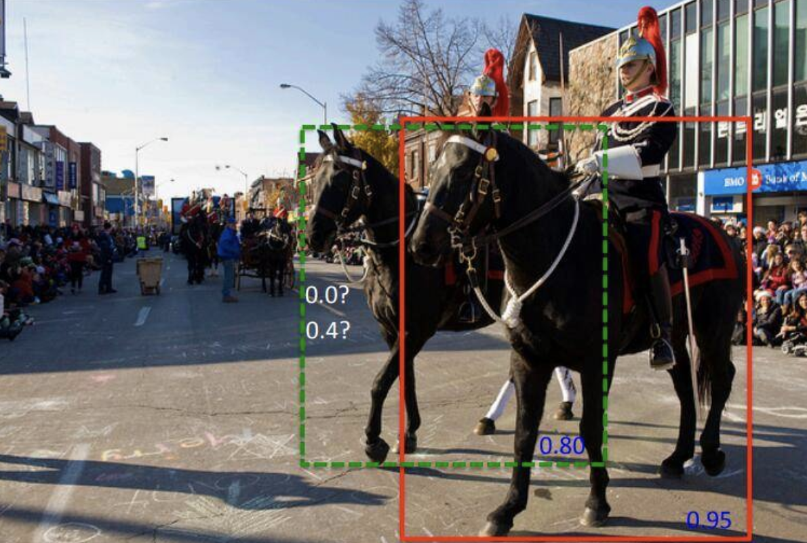
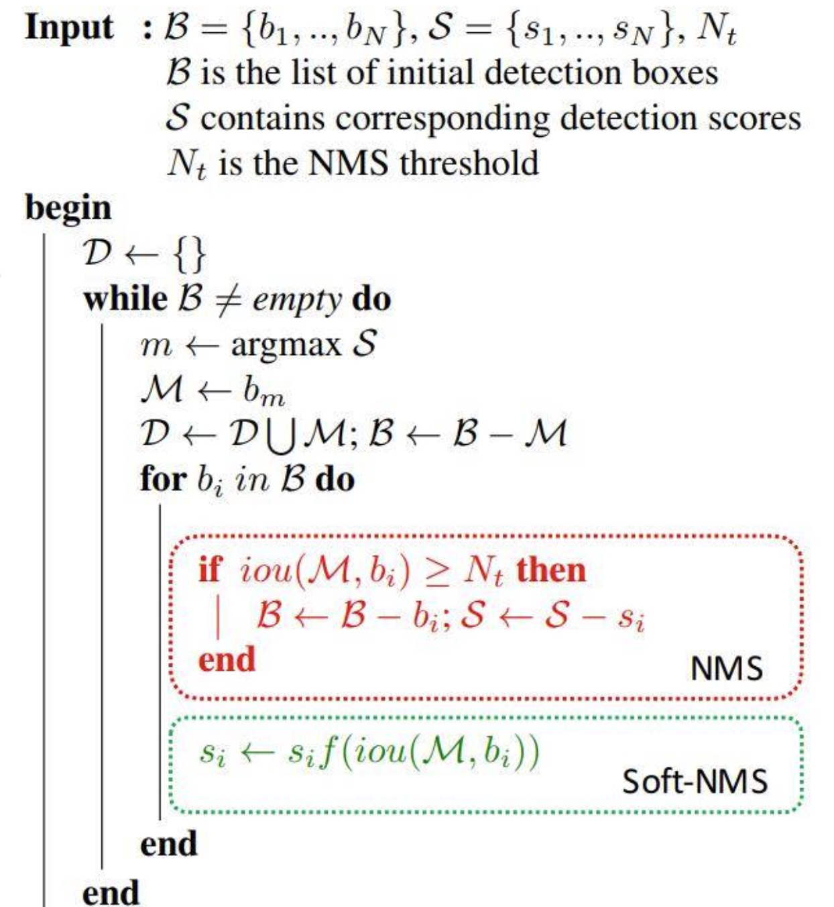
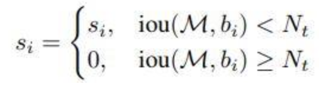
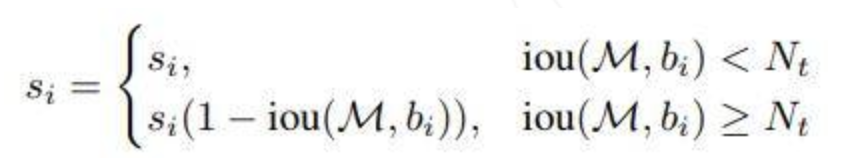
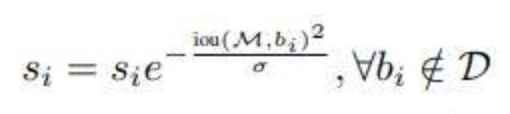

### NMS

非极大值抑制算法（Non-maximum suppression, NMS）是有anchor系列目标检测的标配，如今大部分的One-Stage和Two-Stage算法在推断(Inference)阶段都使用了NMS作为网络的最后一层，例如YOLOv3、SSD、Faster-RCNN等。

当然NMS在目前最新的anchor-free目标检测算法中(CornerNet、CenterNet等)并不是必须的，对这种检测算法提升的精度也有限

NMS的本质是搜索局部极大值，抑制非极大值元素，在目标检测中，我们经常将其用于消除多余的检测框(从左到右消除了重复的检测框，只保留当前最大confidence的检测框)：


NMS有很多种变体，这里介绍最为常见的Hard-NMS，我们通常所说的NMS就是指Hard-NMS，还有另外一种NMS叫做Soft-NMS，是Hard-NMS的变体，两者的代码几乎相同，只需要改动一个地方。

### Hard-NMS

上代码

```python

def hard_nms(box_scores, iou_threshold, top_k=-1, candidate_size=200):
    """
    Args:
        box_scores (N, 5): box的集合，N为框的数量，5即4(位置信息)+1(可能为物体的概率)
        iou_threshold: 我们用IOU标准去除多余检测框的阈值
        top_k: 保留多少个计算后留下来的候选框，如果为-1则全保留
        candidate_size: 参与计算的boxes数量
    Returns:
         picked: 经过nms计算后保留下来的box
    """
    scores = box_scores[:, -1]                # 首先我们取出box中的最后一个元素也就是当前box检测到物体的概率
    boxes = box_scores[:, :-1]                # 取出box中的四个坐标(左上、右下)
    picked = []  
    _, indexes = scores.sort(descending=True) # 按照降序排列所有的物体的概率，得到排序后在原数组中的索引信息 indexes
    indexes = indexes[:candidate_size]        # 只保留前 candidate_size 个 boxes 其余的不考虑了
    while len(indexes) > 0:
        current = indexes[0]                  # 每次取出当前在 indexes 中 检测到物体概率最大的一个 
        picked.append(current.item())         # 将这个最大的存在结果中
        if 0 < top_k == len(picked) or len(indexes) == 1:
            break
        current_box = boxes[current, :]       # 当前第一个也就是最高概率的box
        indexes = indexes[1:]                
        rest_boxes = boxes[indexes, :]        # 剩下其余的box
        iou = iou_of(                         # 将当前的box与剩下其余的boxes用IOU标准进行筛选
            rest_boxes,
            current_box.unsqueeze(0),
        )
        indexes = indexes[iou <= iou_threshold]# 保留与当前box的IOU小于一定阈值的boxes，

    return box_scores[picked, :]

```

看了上面的代码，我们可以知道大概的流程：

- 选取这类box中scores最大的那一个，记为current_box，并保留它(为什么保留它，因为它预测出当前位置有物体的概率最大啊，对于我们来说当前confidence越大说明当前box中包含物体的可能行就越大)
- 计算current_box与其余的box的IOU
- 如果其IOU大于我们设定的阈值，那么就舍弃这些boxes（由于可能这两个box表示同一目标，因此这两个box的IOU就比较大，会超过我们设定的阈值，所以就保留分数高的那一个）
- 从最后剩余的boxes中，再找出最大scores的那一个(之前那个大的已经保存到输出的数组中，这个是从剩下的里面再挑一个最大的)，如此循环往复

### Soft-NMS

MS是最常用的目标检测后处理算法，但是NMS对于密集目标的检测就有小问题了，因为NMS是对其他box的iou与当前最大confidence的box的iou进行比较，如果大于一定的阈值，就将当前这个confidence最大的box周围满足条件的box给去掉。

通常情况普通NMS是可行的，但是有些情况，比如在相似目标离的比较近的时候，使用NMS就会出现：



上图中，由于红框和绿框的IOU大于了一定的阈值(假如我们设定了0.4)，然后绿色框框的confidence没有红色框框的高，然后经过nms后，就没了…你会说我们可以改变阈值啊，比如从0.4改成0.5，要求高一点，但是这个阈值高了的话，可能就会导致误检了，这个阈值设置永远不可能完美。

也就是说，如果目标比较密集的话，这个时候就需要Soft-nms了：



那Soft-NMS和NMS的区别就在于改动了一个地方，在判断当前最高confidence的box和其余box的IOU的时候加了一个系数，这个系数可以让我们更好地选择要去掉的多余的box。

对于Hard-NMS来说，当最大confidence与其余box的IOU大于一定的阈值，这些多余的box就消失了：



而在Soft-NMS中，对于与最大confidence的box相比iou大于一定阈值的框乘以一个与IOU相关的系数，最终得到更新后的iou值：



或者是这种形式：



``` python

def soft_nms(box_scores, score_threshold, sigma=0.5, top_k=-1):
    """Soft NMS implementation.

    References:
        https://arxiv.org/abs/1704.04503
        https://github.com/facebookresearch/Detectron/blob/master/detectron/utils/cython_nms.pyx

    Args:
        box_scores (N, 5): boxes in corner-form and probabilities.
        score_threshold: boxes with scores less than value are not considered.
        sigma: the parameter in score re-computation.
            scores[i] = scores[i] * exp(-(iou_i)^2 / simga)
        top_k: keep top_k results. If k <= 0, keep all the results.
    Returns:
         picked_box_scores (K, 5): results of NMS.
    """
    picked_box_scores = []
    while box_scores.size(0) > 0:
        max_score_index = torch.argmax(box_scores[:, 4])
        cur_box_prob = torch.tensor(box_scores[max_score_index, :])
        picked_box_scores.append(cur_box_prob)
        if len(picked_box_scores) == top_k > 0 or box_scores.size(0) == 1:
            break
        cur_box = cur_box_prob[:-1]
        box_scores[max_score_index, :] = box_scores[-1, :]
        box_scores = box_scores[:-1, :]
        ious = iou_of(cur_box.unsqueeze(0), box_scores[:, :-1])

        # 以下这句是新加的，如果没有这句就是Hard-NMS了
        box_scores[:, -1] = box_scores[:, -1] * torch.exp(-(ious * ious) / sigma) 

        box_scores = box_scores[box_scores[:, -1] > score_threshold, :]
    if len(picked_box_scores) > 0:
        return torch.stack(picked_box_scores)
    else:
        return torch.tensor([])

``` 