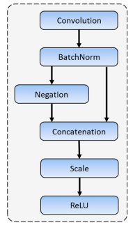
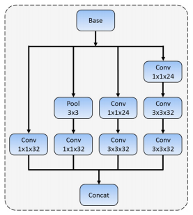
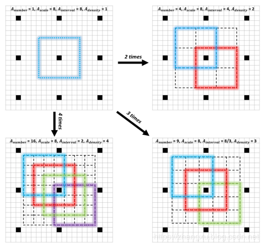

### 简介
FaceBoxes是一个足够轻量的人脸检测器，由中国科学院自动化研究所和中国科学院大学的研究者提出，旨在实现CPU下的实时人脸检测
### 设计理念
FaceBoxes针对模型的效率和检测的效果做了很多设计，效率方面希望检测器足够快，检测效果方面希望有更高的召回率，尤其是针对小脸的情况，基于此：

1. 一个下采样足够快的backbone，被命名为Rapidly Digested Convolutional Layers(RDCL)；快速消化网络
2. 在用于检测的层和backbone中都引入多层分支的设计，被命名为Multiple Scale Convolutional Layers(MSCL)；
3. 使用一种更密集的Anchor策略，提升模型的召回率；

## 网络结构

上图是FaceBoxes的整体结构图，在图中有标明Rapidly Digested Convolutional Layers(RDCL)和Multiple Scale Convolutional Layers(MSCL)，其实就是backbone的前后两部分。

- Rapidly Digested Convolutional Layers(RDCL)
  
  所谓的快速消融卷积层，本质上就是计算量要小，下采样要快。对于一个目标检测或人脸检测模型来说，计算量高的很大一部分原因是输入图像尺寸大，图像分类任务中224是一个常用尺寸，而这个尺寸去做检测是几乎不可能的。所以FaceBoxes为了足够快，就要在前几层尽快的完成下采样，把特征图的宽高降下来。
  
  在上图RDCL的部分，一共只有四层，两层卷积个两层全连接，但是实现了$4×2×2×2=32$倍的下采样，而主干网络最后也只下采样128倍，绝大部分都在前几层完成了。
  此外，RDCL中的卷积层并且由于是前两层卷积，可以使用CReLU，就像下图这样。

  

  这让前两层卷积输出通道数可以更小，分别是24和64。也正是因为快速消融卷积层的存在，FaceBoxes把输入图像尺寸设置成了1024×1024。这个尺寸即便对于目标检测任务来说，都是不算小的。

- Multiple Scale Convolutional Layers(MSCL)
    MSCL就是backbone的后半部分，它有两个意思：

    1. 主干模型中使用了多层卷积，增加模型的宽度，丰富模型的感受野。这其实就是用了inception模块，在结构图上也能看出来，分别是inception1，inception2和inception3。inception模块的细节如下图。
    
    inception3之后，FaceBoxes主干网络还有四层卷积，分别是Conv3_1，Conv3_2，Conv4_1和Conv4_2，卷积核1×1和3×3交替使用，完成最后两次下采样。
    1. 检测中使用了多层分支，这个就像SSD一样，多层分支已经是检测模型的标配了，FaceBoxes一共拉取了三层分支。分别在inception3，Conv3_2和Conv4_2的后面，在1024×1024输入的情况下，这三层的宽高也可以算出来，分别是32×32，16×16和8×8，再使用3×3的核进行卷积，没有做下采样，最后通道数量分别控制为(4+2)×21，(4+2)×1，(4+2)×1。
    我们先说下(4+2)是什么，FaceBoxes的2是在预测是不是人脸。剩下的4边界框的四个值了。
    然后还剩下21,1,1三个数，这个和FaceBoxes选取Anchor的策略有关，我们放到下一个部分一起说明。
   
### Anchor选择

FaceBoxes的Anchor选择没有多种比例，因为人脸差不多都接近一个正方形，所以每一层的Archor都是1:1的。

尺度上每一层预设不同，在第一层分支上预设了三个尺寸，分别是32×32，64×64和128×128，负责预测图中的小目标。后两层各一个尺度，分别是256×256和512×512。

除此之外，FaceBoxes提出了一种Archor密集程度的概念，它通过下面的公式计算：

$A_{density} = \frac{A_{scale}}{A_{interval}}​​$ 

什么意思呢？密集程度是就是$A_{density}$, $A_{scale}$是Anchor的尺寸，$A_{interval}$​是Anchor间隔。尺寸上面提到过了，而间隔的意思就是说，在当前的特征图上向原图映射，那么特征图上一个点对应原图的区域是多少？

比如inception3这一层的输出特征图，它下采样了32倍了，所以$A_{interval}=32$。那么用尺寸与间隔的比值能反映出这个Anchor的密集程度。

比如第一层分支上尺寸为32×32的预设Anchor，此时的间隔也是32，在特征图上每一个点生成32×32Anchor，这样Anchor永远是不会有重叠的，计算得到的$A_{density}=1$。

按照这个公式，把五个尺寸的$A_{density}$​都算出来，分别是1,2,4,4,4。这样就会发现前两个尺寸的Anchor密集程度太低了。而前两个Anchor主要就是做小目标预测的，这样不可避免的会影响小目标的召回率。怎么办？

文中提出了一种让Anchor变得密集的策略，其实就是生成一个Anchor之后，根据需要的数量，平移出来。平移的本质这个Anchor的中心点不再是特征图的那个对应像素点了，就像上图中画出来的那样。

最后为了补齐这个密集度，第一个尺寸的Anchor会变成4倍，第二个尺寸的Anchor会变成2倍，第三、四、五个尺寸Anchor不变，这样一来，上面我们提到的21,1,1这三个数就出来了。1,1就对应第四个和第五个尺寸的Anchor，而21=(4+2+1)×3。

### 损失函数

FaceBoxes的损失函数和RPN是完全一致的，交叉熵+SmoothL1，这个不再重复了。

### 训练

数据增强策略。每个训练图像按以下数据增强策略顺序处理：
1. 颜色失真：应用一些照片度量失真。
2. 随机裁剪：我们从原始图像中随机裁剪五个方形补丁：一个是最大的方形补丁，其他的大小介于原始图像尺寸的[0.3,1]之间。 然后我们随意选择一个补丁用于后续操作。
3. 缩放变换：随机裁剪后，所选方形拼贴的大小调整为1024×1024。
4. 水平翻转：调整大小的图像以0.5的概率水平翻转。
5. 人脸bbox过滤器：如果人脸bbox的中心位于上面处理的图像中，我们会保留bbox的重叠部分，然后过滤掉这些高度或宽度小于20像素的bbox。

