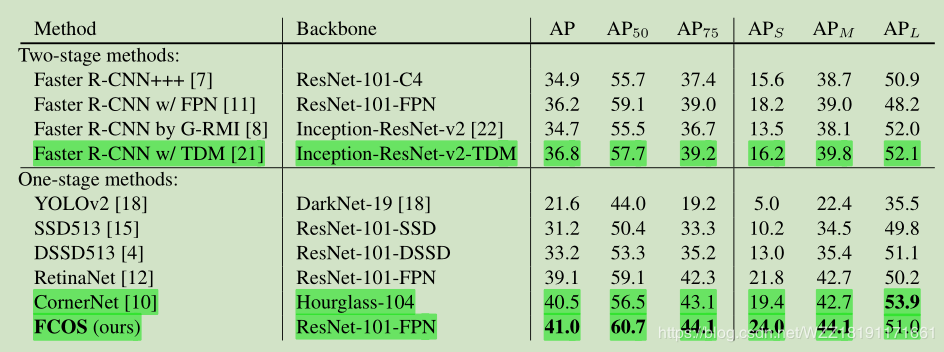
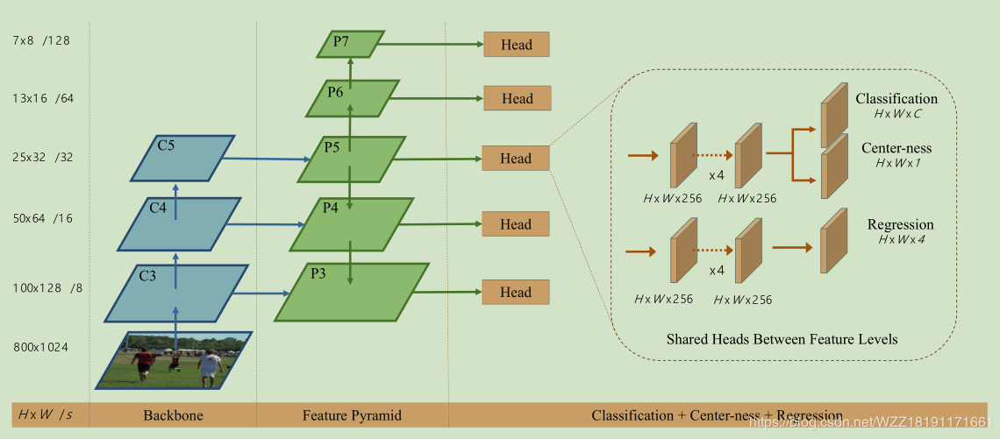
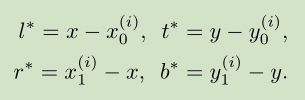
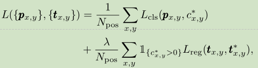
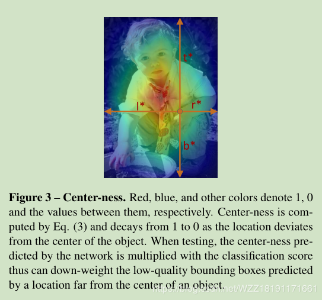
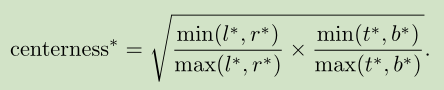
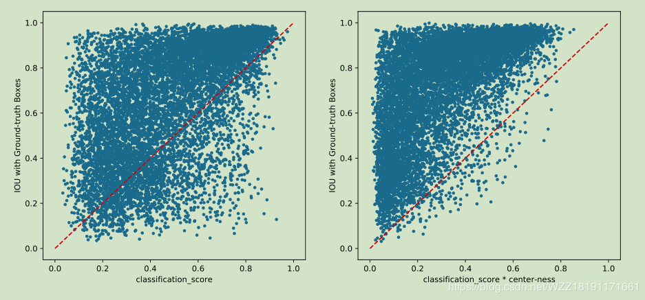

## FCOS

FCOS是一个基于anchor-free的单阶段目标检测算法,代表性的算法包括CornerNet和FCOS

### 为什么会这么火

- 尽管是一个单阶段的目标检测算法，但是检测的精度却得到的极大的提升，远远超过了Faster-rcnn；
- 该算法是基于anchor-free的，即敢于去挑战权威，在目标检测领域中，很多人可能都形成了一个定势思路，为了处理尺度和不同比率问题，anchors是必须使用的模块，而本文的作者敢于脱离这个思路提出一个较新的视角，使得人们眼前一亮；
- 其实在检测领域中自从Faster-rcnn出现之后，已经很久没有什么特别的检测算法啦，大家基本都是小改小动；除此之外，FCOS算法的宣传力度比较大，开源工作也做的比较好，这些都是一些关键的因素。

### FCOS的优势

#### 提出fcos原因：
- anchor会引入很多需要优化的超参数， 比如anchor number、anchor size、anchor ratio等；
- 为了保证算法效果，需要很多的anchors，存在正负样本类别不均衡问题；
- 在训练的时候，需要计算所有anchor box同ground truth boxes的IoU，计算量较大；

#### anchor-free派系中算SOTA
- 因为输出是pixel-based预测，所以可以复用semantic segmentation方向的相关tricks；
- 可以修改FCOS的输出分支，用于解决instance segmentation和keypoint detection任务；

### FCOS算法整体框架

FPN特征金字塔在提出之后，已经得到了广泛的使用，在多个领域中都可以看到它的身影，如语义分割、细粒度分类等等，它的主要思路是结合了网络的浅层特征和深层特征，然后在多个分支同时输出不同大下的目标。

充分的使用了网络的浅层特征和深层特征，浅层特征更关注一些细节信息，适合用来定位；而深层特征更关注于语义信息，适合用来分类等。

整个算法的实现步骤如下所示：
- 对输入的图片进行预处理操作；
- 搭建如图所示的网络架构，将输入数据送入backbone网络中获取输入数据的feature_map，在feature_map的每一点上面进行回归操作，进行网络训练获取网络模型；
- 将预训练的网络模型应用到测试图片中，从特征金字塔的多个Head中获得预测的结果；
- 使用NMS等后处理操作获得最终的结果。

### FCOS算法实现细节详解

#### FCOS算法和基于anchors的区别

对于基于anchors的目标检测算法而言，我们将输入的图片送入backbone网络之后，会获得最终的feature_map，比如说是17x17x256；然后我们会在该feature_map上的每一位置上使用预先定义好的anchors。而FCOS的改动点就在这里，它是直接在feature_map上的每一点进行回归操作。具体的实施思路如下所示：

1. 我们可以将feature_map中的每一个点(x,y)映射回原始的输入图片中；
2. 如果这个映射回原始输入的点在相应的GT的BB范围之内，而且类别标签对应，我们将其作为训练的正样本块，否则将其作为负样本块；
3. 我们回归的目标是(l,t,r,b)，即中心点做BB的left、top、right和bottom之间的距离，具体如下图所示：

   

4. 如果一个位置在多个BB的内部的话，我们将其看做一个模糊样本，针对这样的样本， 文中采样的方法是直接选择GT面积最小的边界框作为其回归目标。由于网络中FPN的存在，导致这样的模糊样本的数量大大减少。
5. 如果这个位置(x,y)和一个BB关联的话，该位置处的训练回归目标可制定为:其中(x1,y1)和(x2,y2)分别表示BB的左上角和右下角坐标值。

      

6. 由于FCOS可以通过这样方式获得很多正样本块，然后使用这样正样本块进行回归操作，因此获得了比较好的性能提升；而原始的基于anchor的算法需要通过计算预设的anchor和对应的GT之间的IOU值，当该IOU值大于设定的阈值 时才将其看做正样本块。

#### Loss函数详解

   

该loss函数如上图所示，同样包含两部分，Lcls表示分类loss，本文使用的是Focal_loss；Lreg表示回归loss，本文使用的是IOU loss。其实这两个loss应当是当前最好的配置啦。

#### FPN带来的优势

1. 对CNN中的feature_map而言，大的stride通常会导致低的BPR，而BPR对于检测任务而言却至关重要。而本文的实验发现，添加了FPN的FCOS算法即使是使用较大额stride，仍然能够获得较高的BPR值，甚至超过RetinaNet。主要的原因可能是FPN在不同的特征映射上面检测不同大小的目标，本文使用的网络最终能够在不同的特征映射上面获得大小分别为16、32、64和128的stride，即比较丰富，针对不同的情况它都能很好的处理。
2. GT中的BB重叠可能导致训练期间难以解决的模糊性。即特征映射中的某一个位置(x,y)同时在多个BB中时应该采用那个进行回归的问题。而实验结果表明FPN能够很好的解决该问题。
3. FPN中不同的feature_map level需要回归不同大小范围的BB，针对特征级Pi,使用带有可训练的标量Si的exp(Six)来代替标准的exp(x)，其中Si是一个可训练的参数，用来自适用的调整不同level。

#### FCOS中的Center-ness

作者观察到FCOS会引入一些低质量的BB，即远离目标中心的BB，而Center-ness的作用就是用来很好的抑制这些低质量的BB的产生，它的优点是比较简单。不需要引入其它的超参数。它的位置是在Head网络的分类网络分支下面。对于给定的一个位置的回归目标的l、t、r、b而言，center-ness目标的定义如下所示：

其范围在[0, 1]之间，使用BCE损失函数来训练，它可以用来降低距离对象中心很远的边界框分数的权重，它可以被看做是一个软阈值，可以在网络训练的过程中学习得到，不需要进行调节。除此之外，由于NMS的存在可以在一定程度上过滤点这些低质量的BB。

这张图证明了center-ness有用，同时也说明了center-ness的使用方式是和Head分支预测的分类得分进行相乘

