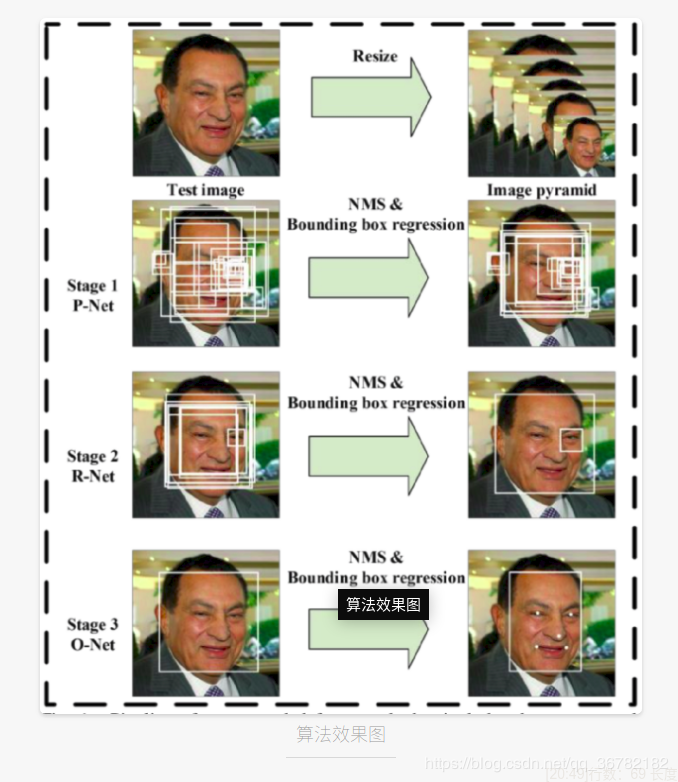
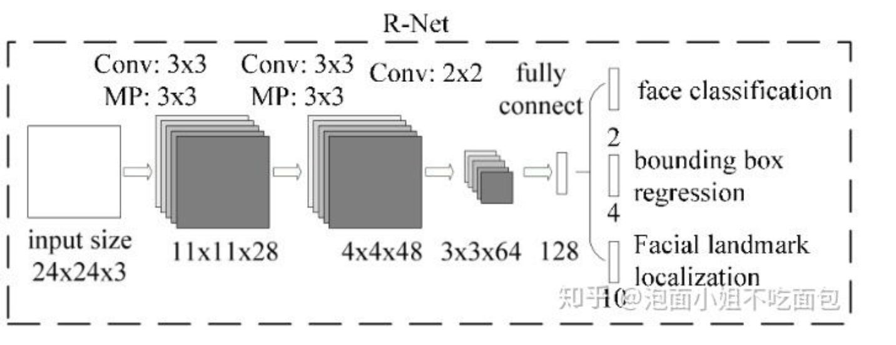
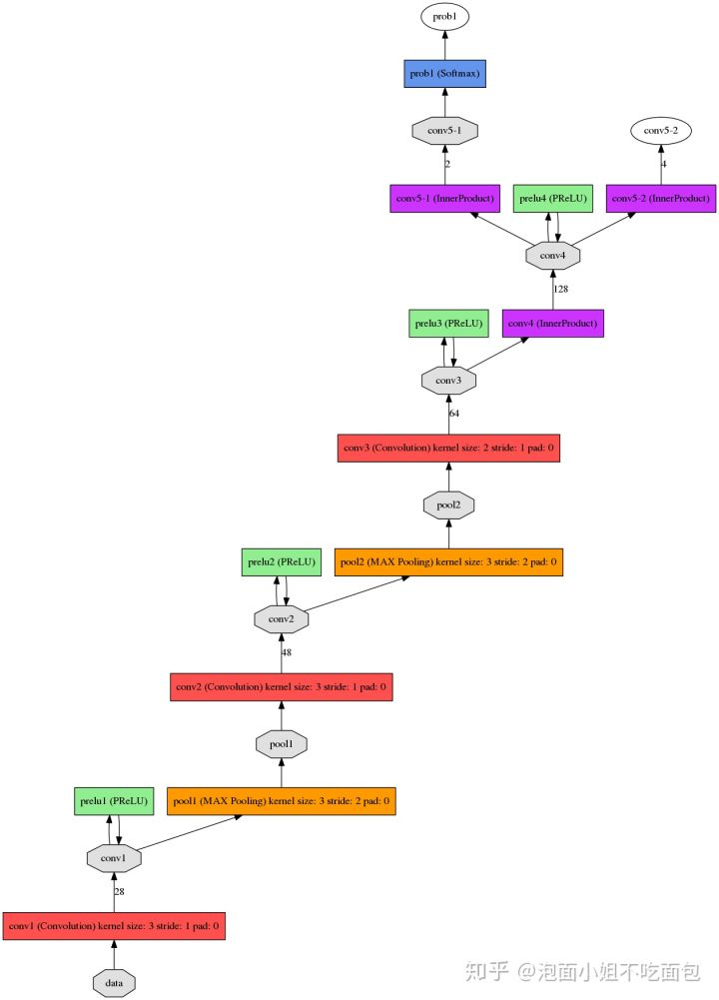
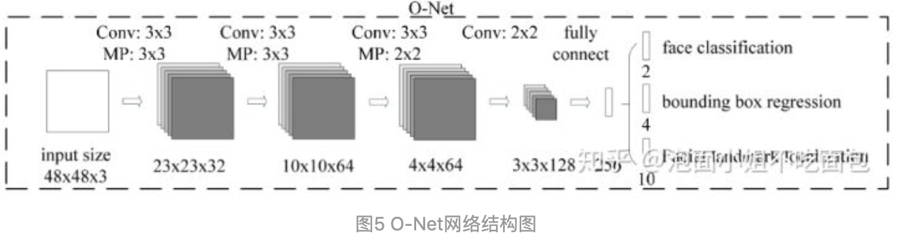
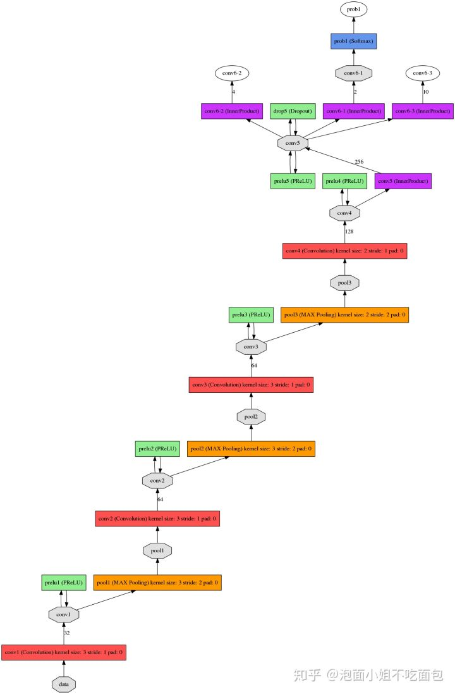
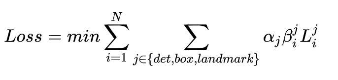
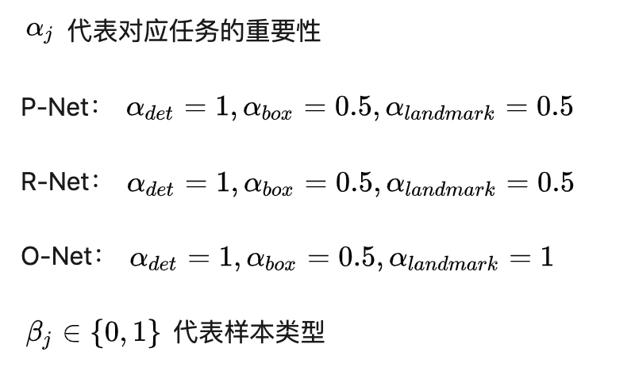

## MTCNN（Multi-task Cascaded Convolutional Networks）

该模型利用多级联的结构，从粗到细预测人脸以及相应特征坐标位置，能够适用于各种自然条件下复杂的人脸场景检测，可以实现人脸检测和5个特征点的标定。

主要包括三个网络子结构：P-Net（proposal networks）、R-Net（refine networks）、O-Net（output networks）。

### 模型流程

该算法模型流程包括四部分（图像金字塔、P-Net、R-Net、O-Net）

### 思想

MTCNN为了兼顾性能和准确率，避免滑动窗口加分类器等传统思路带来的巨大的性能消耗，先使用小模型生成有一定可能性的目标区域候选框，然后在使用更复杂的模型进行细分类和更高精度的区域框回归，并且让这一步递归执行，以此思想构成三层网络，分别为P-Net、R-Net、O-Net，实现快速高效的人脸检测。

在输入层使用图像金字塔进行初始图像的尺度变换，并使用P-Net生成大量的候选目标区域框，之后使用R-Net对这些目标区域框进行第一次精选和边框回归，排除大部分的负例，然后再用更复杂的、精度更高的网络O-Net对剩余的目标区域框进行判别和区域边框回归。

### 图像金字塔

为了检测到不同size的人脸，在进入P-Net之前，我们应该对图像进行金字塔操作。

首先，根据设定的min_face_size尺寸，将img按照一定的尺寸缩小，每次将img缩小到前级img面积的一半，形成scales列表，直至边长小于min_face_size，此时得到不同尺寸的输入图像。

### P-Net（proposal network）

根据上述步骤得到的不同尺寸的图像，输入到P-Net网络中。如图所示为P-Net网络结构：

由图1可知，该层网络anchor大小为12 * 12（可更改），代表12 * 12区域，经过P-Net全卷积层后，变成1（输入不同，则输出也不同。假设输出为w*h，则输出的每个点都对应原img中一个12 * 12的区域）

1. 将不同尺寸的金字塔图像输入到p-net中，最终得到prob1与conv4-2。prob1中包含是否是人脸，conv4-2中包含box位置信息及其置信度，box的回归系数信息、landmark。
2. 利用1中的prob1与conv4-2生成box，设置阈值为0.6（初筛，阈值应偏小），得到一系列点，影射回原img，以此点为左上角，向右向下各扩展12pixel，得到12 * 12的矩形框。
3. 接下来对一帧图像上检测到的所有12*12矩形框进行nms运算。
4. 最后得到的所有box会放置在一个number*9的数组里，number表示box的数量，9代表box的坐标信息、score、坐标回归信息[x1、y1、x2、y2、score、reg_x1、reg_y1、reg_x2、reg_y2]，利用reg*系列（对应坐标的线性回归参数）可对box进行坐标修正，修正过程可表示为：
   
    new_x1 = x1 + reg_x1 * width_of_box   
    new_y1 = y1 + reg_y1 * height_of_box   
    new_x2 = x2 + reg_x2 * width_of_box   
    new_y2 = y2 + reg_y2 * height_of_box  

5. 目标框修正之后，先rec2square、再pad。rec2square是将修正后不规则的框调整为正方形，pad的目标是将超出原img范围的部分填充为0，大小比例不变。

注：上述过程可看成 12 * 12的anchor在不同尺寸的图像上按照stride=1滑动，根据face classification结果判定是否为人脸，小于-->Drop，大于留下，利用回归系数信息进行精修；-->nms-->rec2square-->pad，生成一系列候选框。

### R-Net（refine network）

相对于第一层的P-Net来说，增加了一个全连接层，因此对于输入数据的筛选会更加严格

在图片经过P-Net后，会留下许多预测窗口，我们将所有的预测窗口送入R-Net，这个网络会滤除大量效果比较差的候选框，最后对选定的候选框进行Bounding-Box Regression和NMS进一步优化预测结果。

将P-Net最后输出的所有box，resize到24*24后输入R-Net。经过R-Net后，输出与P-Net类似，prob1：box坐标信息与置信度与conv5-2的回归系数信息。根据所得的置信度信息与该层阈值对比，小于阈值的直接drop掉，大于阈值的留下，经过nms、再利用回归系数信息进行精修、rec2square、pad。

### O-Net（output network）

全称为Output Network，基本结构是一个较为复杂的卷积神经网络，相对于R-Net来说多了一个卷积层。O-Net的效果与R-Net的区别在于这一层结构会通过更多的监督来识别面部的区域，而且会对人的面部特征点进行回归，最终输出五个人脸面部特征点。

将R-Net最后输出的所有box，resize到48*48后输入O-Net。经过O-Net后，输出prob1：box坐标信息与置信度、conv6-2的回归系数信息、以及conv6-3的关键点坐标信息。

conv6-3是number*10的二维数组，number代表box的数量，10则包含了5个关键点信息的x、y坐标信息：[Rx1,Rx2, Rx3, Rx4, Rx5, Ry1, Ry2, Ry3, Ry4, Ry5]，此时的坐标为目标框内部的比例，最后影射回原img得到真实的坐标。

根据prob1置信度信息与该层阈值对比，小于阈值的直接drop掉，大于阈值的留下，再利用回归系数信息进行精修，最后再进行一次nms。

最后，输出一副包含人脸框与人脸关键点的检测图像。

### Loss

训练中需要最小化的损失函数来自3方面：

face/non-face classification + bounding box regression + facial landmark localization，综合在一起，表示如下：

边训练边选择出hard sample,只有hard samples才进反向传播，其他样本不进行反向传播。具体做法：对每个小批量里所有样本计算loss,对loss进行降序，前70%samples 做为hard samples进行反向传播。

参考：   
https://zhuanlan.zhihu.com/p/49525374
https://blog.csdn.net/qq_36782182/article/details/83624357