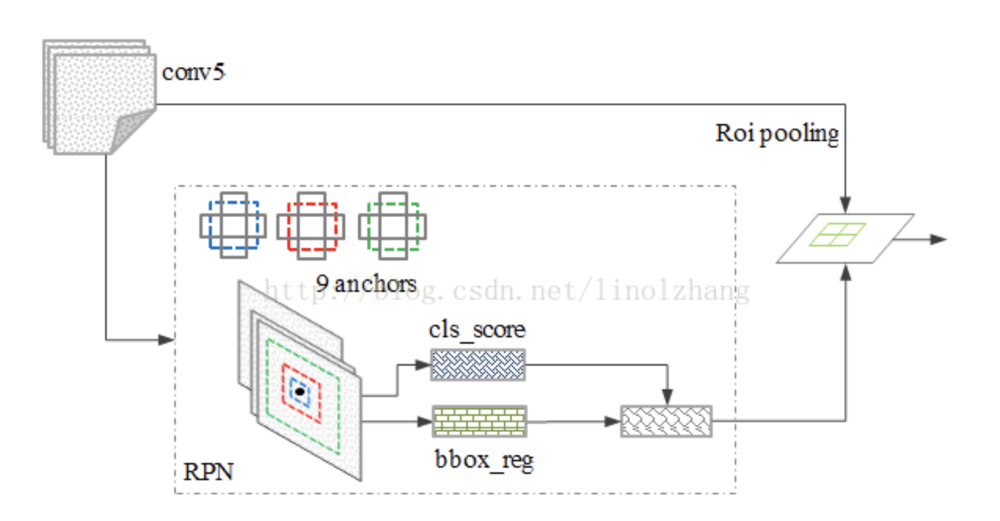
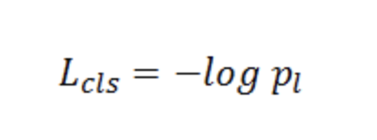
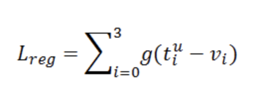
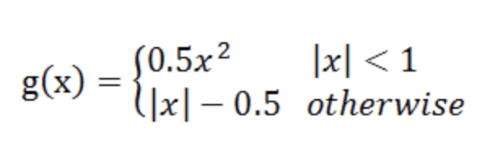
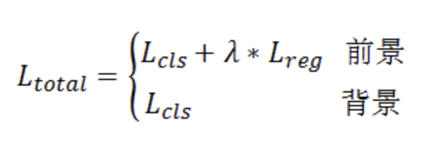
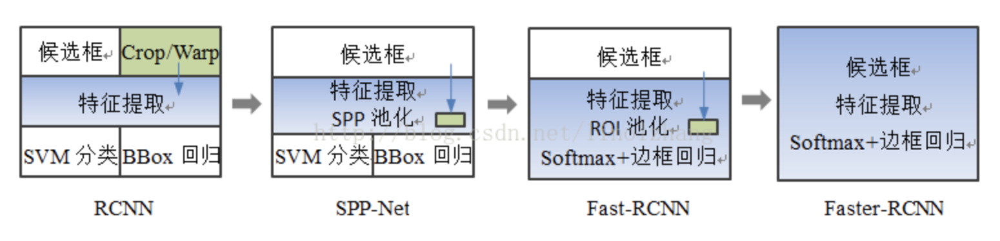
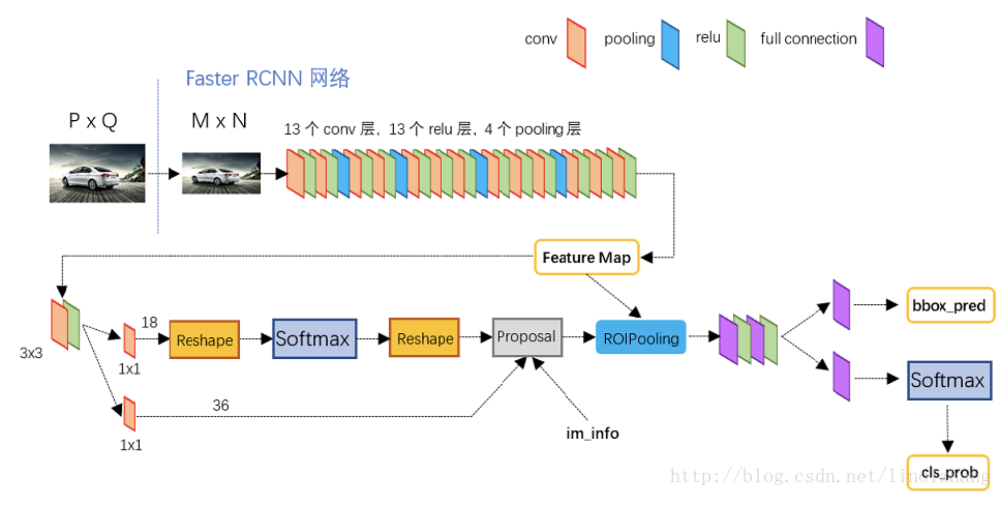
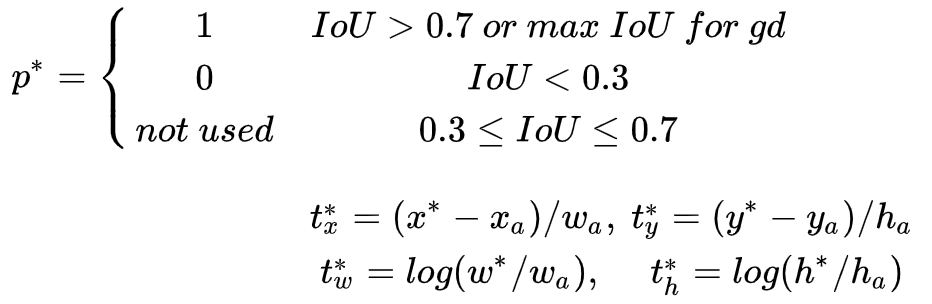
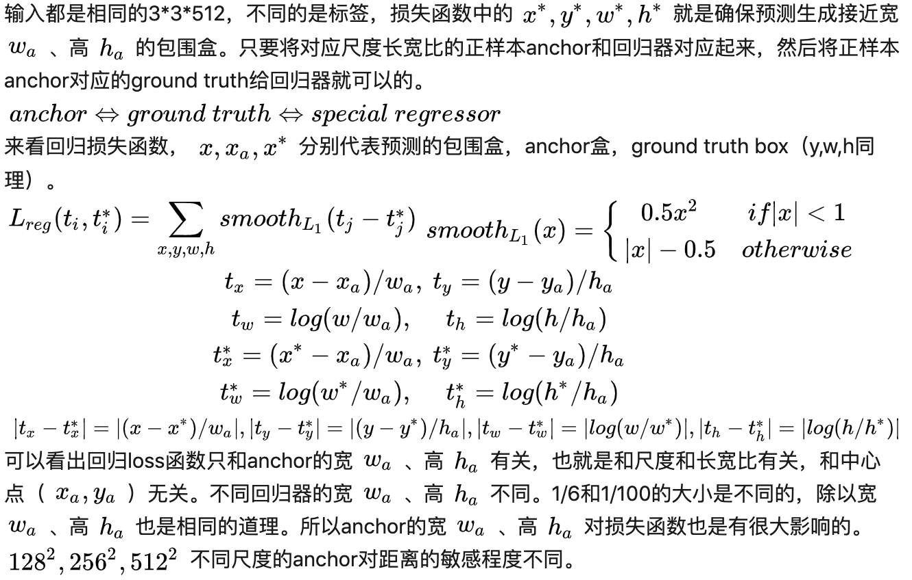

## RCNN

RCNN的过程分4个阶段：

- 候选区域提出阶段（Proposal）：采用selective-search方法，从一幅图像生成1K~2K个候选区域；
- 特征提取：对每个候选区域，使用CNN进行特征提取；
- 分类：每个候选区域的特征放入分类器SVM，得到该候选区域的分类结果；
- 回归：候选区域的特征放入回归器，得到bbox的修正量。

### 候选区域提出阶段所产生的结果尺寸不同

由于RCNN特征提取阶段采用的是AlexNet，其最后两层是全连接层fc6和fc7，所以必须保证输入的图片尺寸相同。

而候选区域所产生的结果尺寸是不相同的。为此，论文中作者采用了多种方式对图片进行放缩（各向同性、各向异性、加padding），最后经过对比实验确定各向异性加padding的放缩方式效果最好。

### 分类器SVM

论文中，单个SVM实现的是二分类，分类器阶段由多个SVM组合而成。比如总共有20种不同的物体（加1种背景），那么分类阶段必须要有21个SVM：第1个SVM的输出是该候选区域属于分类1的概率；第2个SVM的输出是该候选区域属于分类2的概率；……；第21个SVM的输出是该候选区域属于背景的概率。

对21个SVM的输出结果进行排序，哪个输出最大，候选区域就属于哪一类。比如，对于某个候选区域，第21个SVM的输出最大，那么就将该候选区域标为背景。

### 分类器的输入是？回归器的输入是？

分类器的输入是特征提取器AlexNet的fc6的输出结果，回归器的输入是特征提取器AlexNet的pool5的输出结果。

之所以这样取输入，是因为，分类器不依赖坐标信息，所以取fc6全连接层的结果是没有问题的。但是回归器依赖坐标信息（要输出坐标的修正量），必须取坐标信息还没有丢失前的层。而fc6全连接层已经丢失了坐标信息。

### 正负样本的选择

正负样本是必须要考虑的问题。论文的做法是每个batch所采样的正负样本比为1：3。当然这个比例是可以变化的，这个系列的后续改进就把正负样本比变为了1：1。

如果之前没有接触过类似问题的话，是比较容易想当然地认为训练特征提取器、分类器、回归器时，就是把候选区域生成阶段的所有候选区域都放入训练。这样的思路是错的。一张图片中，背景占了绝大多数地方，这样就导致训练用的正样本远远少于负样本，对训练不利。

正确的做法是对所有候选区域进行随机采样，要求采样的结果中正样本有x张，负样本y张，且保证x与y在数值上相近。（对于一些问题，不大容易做到x:y = 1:1，但至少x与y应该在同一数量级下）

### 训练

前面提到RCNN分为4个阶段：Proposal阶段、特征提取阶段、分类阶段、回归阶段。这4个阶段都是相互独立训练的。

首先，特征提取器是AlexNet，将它的最后一层fc7进行改造，使得fc7能够输出分类结果。Proposal阶段对每张图片产生了1k~2k个候选区域，把这些图片依照正负样本比例喂给特征提取器，特征提取器fc7输出的分类结果与标签结果进行比对，完成特征提取器的训练。特征提取器的训练完成后，fc7层的使命也完成了，后面的分类器和回归器只会用到fc6、pool5的输出。

然后，Proposal和特征提取器已经训练完毕了。把它们的结果fc6，输入到分类器SVM中，SVM输出与标签结果比对，完成SVM的训练。

最后，回归器的训练也和SVM类似，只不过回归器取的是pool5的结果。

为什么不能同时进行上面3步的训练？因为特征提取器是CNN，分类器是SVM，回归器是脊回归器，不属于同一体系，无法共同训练。甚至在测试时，也需要把每一阶段的结果先保存到磁盘，再喂入下一阶段。这是非常麻烦的一件事。

这里顺便提一下脊回归器，脊回归器又称岭回归器（Ridge Regression），表示该回归器加了L2正则化。

###  Proposal的每个候选区域单独提取特征很慢

Proposal阶段会产生1k~2k个候选区域，每个候选区域都独立提取特征的话，那相当于每幅图片都要进行1k~2k次CNN。

## SPP Net

它的特点有:

- 1.结合空间金字塔方法实现CNNs的多尺度输入。
  
    一般CNN后接全连接层或者分类器，他们都需要固定的输入尺寸，因此不得不对输入数据进行crop或者warp，这些预处理会造成数据的丢失或几何的失真。SPP Net的第一个贡献就是将金字塔思想加入到CNN，实现了数据的多尺度输入。

    如下图所示，在卷积层和全连接层之间加入了SPP layer。此时网络的输入可以是任意尺度的，在SPP layer中每一个pooling的filter会根据输入调整大小，而SPP的输出尺度始终是固定的。

    

- 2.只对原图提取一次卷积特征
在R-CNN中，每个候选框先resize到统一大小，然后分别作为CNN的输入，这样是很低效的。
所以SPP Net根据这个缺点做了优化：只对原图进行一次卷积得到整张图的feature map，然后找到每个候选框在feature map上的映射patch，将此patch作为每个候选框的卷积特征输入到SPP layer和之后的层。节省了大量的计算时间，比R-CNN有一百倍左右的提速。

## Fast-RCNN

Fast-RCNN将特征提取器、分类器、回归器合在了一起，都用CNN实现。

其次，Fast-RCNN对整张图片进行特征提取，再根据候选区域在原图中的位置挑选特征。针对特征数目不同的问题，Fast-RCNN加入了ROI层，使得经过ROI层后，特征的数目相同。

### Fast 

将特征提取器、分类器、回归器合并，使得训练过程不需要再将每阶段结果保存磁盘单独训练，可以一次性完成训练，加快了训练速度。这是Fast之一。

对整张图片进行特征提取，用ROI层处理候选区域的特征，使得原本每一个候选区域都要做一次特征提取，变为了现在一整张图片做一次特征提取。训练速度（8.8倍）和测试速度（146倍）都大大加快，这是Fast之二。

1. 借鉴SPP思路，提出简化版的ROI池化层（注意，没用金字塔），同时加入了候选框映射功能，使得网络能够反向传播，解决了SPP的整体网络训练问题；
2. 多任务Loss层
    - SoftmaxLoss代替了SVM，证明了softmax比SVM更好的效果；
    - SmoothL1Loss取代Bouding box回归。
3. 全连接层通过SVD加速

### ROI

提出了一个可以看做单层sppnet的网络层，叫做ROI Pooling，这个网络层可以把不同大小的输入映射到一个固定尺度的特征向量，而我们知道，conv、pooling、relu等操作都不需要固定size的输入，因此，在原始图片上执行这些操作后，虽然输入图片size不同导致得到的feature map尺寸也不同，不能直接接到一个全连接层进行分类，但是可以加入这个神奇的ROI Pooling层，对每个region都提取一个固定维度的特征表示，再通过正常的softmax进行类型识别。

另外，之前RCNN的处理流程是先提proposal，然后CNN提取特征，之后用SVM分类器，最后再做bbox regression，而在Fast-RCNN中，作者巧妙的把bbox regression放进了神经网络内部，与region分类和并成为了一个multi-task模型，实际实验也证明，这两个任务能够共享卷积特征，并相互促进。

### 分类器和回归器的实现细节

分类器应该都能想到，用的softmax代替SVM。

回归器求出（x,y,w,h）4个量，分别代表定位框左上角的坐标xy、宽度w、高度h，损失函数用的是Smooth-L1。

### Proposal阶段看上去有点违和

发展到Fast-RCNN，后续3个阶段都是CNN完成的了，只剩下Proposal阶段还没有用CNN方式解决。Proposal阶段的结果还是需要先保存到磁盘，再喂入后续阶段，有点违和。

## Faster-RCNN

Fast R-CNN存在的问题：存在瓶颈：选择性搜索，找出所有的候选框，这个也非常耗时。那我们能不能找出一个更加高效的方法来求出这些候选框呢？
解决：加入一个提取边缘的神经网络，也就说找到候选框的工作也交给神经网络来做了。
做这样的任务的神经网络叫做Region Proposal Network(RPN)。

### RPN网络是如何工作的？

整张图片经过特征提取，得到FeatureMap；将FeatureMap中的每一点按照视野域找到原图中对应的位置，称为Anchor；每个Anchor生成不同大小不同长宽比的多个候选区域。

回忆下selective-search的候选区域生成方式，它是按照颜色和纹理不断合并得到候选区域的，候选区域的产生没有规律，而RPN是每个Anchor都有对应的固定数量的候选区域，规律很明显。

理论上说，selective-search生成候选区域的方式更符合我们的直觉，而实验结果，在Faster-RCNN中RPN并不比selective-search差

训练过程中，涉及到的候选框选取，选取依据：

1. 丢弃跨越边界的anchor；
2. 与样本重叠区域大于0.7的anchor标记为前景，重叠区域小于0.3的标定为背景；

对于每一个位置，通过两个全连接层（目标分类+边框回归）对每个候选框（anchor）进行判断，并且结合概率值进行舍弃（仅保留约300个anchor），没有显式地提取任何候选窗口，完全使用网络自身完成判断和修正。

从模型训练的角度来看，通过使用共享特征交替训练的方式，达到接近实时的性能，交替训练方式描述为：

1. 根据现有网络初始化权值w，训练RPN；
2. 用RPN提取训练集上的候选区域，用候选区域训练FastRCNN，更新权值w；
3. 重复1、2，直到收敛。

### LOSS
多任务Loss层（全连接层）是第二个核心思路，如上图所示，其中cls_score用于判断分类，bbox_reg计算边框回归，label为训练样本标记。

其中Lcls为分类误差：

 px 为对应Softmax分类概率，pl 即为label所对应概率（正确分类的概率），pl = 1时，计算结果Loss为0， 越小，Loss值越大（0.01对应Loss为2）。

Lreg为边框回归误差：

即在正确分类的情况下，回归框与Label框之间的误差（Smooth L1）， 对应描述边框的4个参数（上下左右or平移缩放），g对应单个参数的差异，|x|>1 时，变换为线性以降低离群噪声：

Ltotal为加权目标函数（背景不考虑回归Loss）：

因为Faster-RCNN，这种基于CNN的real-time 的目标检测方法看到了希望，在这个方向上有了进一步的研究思路。至此，我们来看一下RCNN网络的演进，如下图所示：

Faster RCNN的网络结构（基于VGG16）：

### RPN 具体做法

- 将RPN放在最后一个卷积层的后面
- RPN直接训练得到候选区域

### RPN简介

- 在feature map上滑动窗口
- 建一个神经网络用于物体分类+框位置的回归
- 滑动窗口的位置提供了物体的大体位置信息
- 框的回归提供了框更精确的位置

一种网络，四个损失函数;
- RPN calssification(anchor good.bad)
- RPN regression(anchor->propoasal)
- Fast R-CNN classification(over classes)
- Fast R-CNN regression(proposal ->box)

### 为什么是Faster

容现在RPN网络可以与其他3个阶段共用同一个特征提取结果了，省掉了selective-search的时间。而事实上，selective-search是非常慢的，所以叫Faster。

## Mask-RCNN

### 为什么叫mask

Faster-RCNN网络的最后分别是分类网络和回归网络两条路并行，Mask-RCNN则是再加一条Mask网络与它们并行。

Mask网络的实现是FCN网络，这也是语义分割领域中非常经典的网络结构。

由于Mask网络的加入，Mask-RCNN不仅能处理物体检测问题，还能处理语义分割问题。

### 还有哪些细节上的变化？

首先是ROI层变为了ROIAlign，目的是一样的。那为什么要加入ROIAlign呢？这是因为ROI层会有对齐问题，对齐问题在分类和框选时影响不大，但在语义分割需要严格依赖每个像素点的坐标时，影响会很大。ROIAlign能够解决对齐问题。

然后是特征提取网络改为了ResNet101+FPN

### 常见问题

1. 注意：RPN输出的回归层是9个单独的回归器 的集合，就是说这9个包围盒回归器不共享权重，每个回归器负责一种尺度和长宽比（和相应的anchor比例基本相同）。假设有anchor（大小为 128，256， 512 ​，长宽比为1:1,1:2,2:1），则可能包围盒回归器  ​负责预测  ​，一个回归器对应一种anchor，其余每个回归器各负责一种尺度和长宽比。对卷积特征图使用3*3的滑窗，然后经过卷积输出512维的向量，接着输出二分类的分数和9个回归器的值（每个回归器4个值）
2. 在原图生成anchor的目的是什么？

    要知道，训练RPN网络是有监督训练，需要有数据、还要有相应的类标签，输入小网络的是512个通道的3 * 3滑窗，类标签没有给定，没有类标签就无法计算Loss损失函数，无法训练网络。以3*3滑窗中心对应原图的位置作为中心点，在原图生成9个不同尺度长宽比的anchor，然后每个anchor都会被分配到相应的类标签，有正样本(1)、负样本(0)，也有不参与训练的框（not used），对正样本计算  ​，就是回归的类标签，负样本不计算回归loss。0,1是二分类的标签。所以在原图生成anchor的目的之一是得到类标签。这里只得到了分类的标签（0，1），还有正样本的回归标签需要确定，该正样本的回归标签是其对应的ground truth计算出来的 。负样本不计算回归损失没有回归标签。

    

3. anchor是怎么解决多尺度和长宽比的问题？
   
    一个回归器对应一种anchor，每个正样本anchor对应的ground truth，打上回归的标签，交给该anchor对应的回归器预测。anchor生成好以后，回归器对应的正样本标签就确定好的。anchor的大小为​ ​，长宽比为1:1,1:2,2:1，对一个3*3的滑动窗口，其中心在原图的位置生成9个anchor，每个anchor都根据IoU划分正、负、不参与训练的标签，anchor G（）被划分为正样本的时候有对应的ground truth G，那么这个anchor G（）和ground truth G就联系在一起。9个回归器中负责预测的回归器就负责预测ground truth G。也就是说  ​用于负责预测的回归器计算回归Loss。如果一个mini-batch中所有的ground truth对应的正样本anchor是  、  、  ，没有其余的尺寸。那么9个回归器中只有3个起作用，其余6个回归器的损失值为0。计算回归loss的时候只计算起作用的3个。就是说不是所有的anchor都有作用（看检测的物体）。正样本anchor对应的ground truth，由和anchor相同大小长宽比的回归器预测该ground truth

4. 在原图怎么生成anchor？
    
    3*3滑窗的中心点对应原图的位置就是anchor的中心点，两者的中心点重合，然后就可以推导出原图中9个不同尺度和长宽比锚的坐标。

5. anchor起作用的地方：

    3*3的滑窗生成对应原图的9个anchor，然后对9个anchor计算IoU，分配标签，正样本的anchor还要和对应的ground truth联系起来，对每个正样本anchor对应的ground truth，打上标签，交给该anchor对应的回归器预测。正样本anchor的大小长宽比被用来确定预测相应ground truth用哪个回归器。9个回归器并不是都起作用的（看检测的物体）。由于回归器和锚一一对应，就是说不是所有的anchor都有作用。

6. 如何确保不同回归器生成不同尺寸长宽比的预测包围盒？损失函数ground truth
    
    
7. 分类损失如何计算？
   
   分类损失是二分类交叉熵损失函数，只有正样本的anchor作为对应回归器的标签，同时也有分类器的标签（二分类），负样本的anchor不计算回归损失，只有分类器的标签，对于那些被忽略的anchor，既不计算回归损失，也不计算分类损失。其loss=0。
8. 不论3 * 3滑窗对应的9个锚中有几个正样本，几个负样本，还有几个被忽略的样本，RPN的3 * 3滑窗输出一定是（4+2）* 9维。如果检测的目标只有一类，而且在图片中的大小基本相同，那么9个回归器可能只有其中1个被训练好。由于锚和回归器一一对应，只要数据够多，检测的目标尺寸和长宽比足够丰富，每个回归器都能被训练好。

### RPN训练

1. 假设输入的图片是576 * 960，经过VGG16生成卷积特征图，缩放16倍，得到36 * 60 *512的特征图，512是通道数
2. 使用3 * 3 * 512的滑窗在特征图滑动（stride=1，padding=2），找到每个三维滑窗的中心在原图对应的像素位置，然后在原图上生成9个anchor，这9个anchor的中心重合且和三维滑窗对应的中心相同。共有36 * 60个滑窗，则共有36 * 60 * 9个原图上的锚  ​。3 * 3 * 512的三维滑窗足够表达228 pixels区域的特征。
3. 生成anchor的同时根据ground truth的IoU值确定每个anchor是正样本还是负样本（是否是类）。为两种anchor分配正样本标签：
   1. 和一个ground truth的IoU值最大的那些anchor；
   2. 和任意一个ground truth的IoU大于或等于0.7的anchor。注意到单个ground truth可能分配正样本标签给多个anchor。
   3. 第（2）个条件足以确定正样本，仍然使用第（1）个条件的原因是存在在第（2）个条件下没有正样本的情况。不是正样本的anchor中，那些和所有ground truth的IoU值小于0.3的被分配为负样本，其余那些既不是正样本也不是负样本的anchor，不作为训练样本，被忽略掉的。这样对于一个滑窗，原图产生的9个anchor，anchor可能被分配到正样本、负样本、被忽略样本的标签。然后对每个正样本anchor对应的ground truth，打上回归的标签，交给该anchor对应的回归器预测。anchor生成好以后，回归器对应的正样本回归标签 就确定好的。
4. 从一张图片当中随机采样256个anchor，正负样本anchor的比例是1:1，如果一张图片中正样本anchor的数量少于128个，就减少负样本anchor的数量和正样本anchor数量相同。需要注意的是，这256个anchor中来自不同的3 * 3滑窗。5、接着看网络的流程，mini-batch中的每个样本anchor对应的3 * 3 * 512的三维滑窗经过卷积（卷积核 3 * 3 * 512）生成512维的向量，这512维的向量进入分类层、9个独立的回归层，输出一定是（4+2）* 9维，然后对正样本anchor对应的ground truth的回归层输出，使用  计算回归损失loss，然后还要计算其分类损失，负样本也要计算分类损失。被忽略的锚对应的输出loss=0。

参考：
https://imlogm.github.io/%E6%B7%B1%E5%BA%A6%E5%AD%A6%E4%B9%A0/rcnn/?nsukey=swqWwCDrxywXS9f2xKtw%2FgRnan0bFvzi51Auv4JWEO%2FZw0%2BRpBRrmUi65RLZ5lYjfR%2F36mrEc4zCmMxzRb7068ZvJqToRGaawFMZteBeSyYV55mB6cQvxjIJMe0BWx%2F7dmA4l0ZyNbkhi308kUJ7s90f9bTm845u8nFozTaLEUiYFpq2Y0ri658gLvdkYB2POP01DyUZG2yl6dSoeeh9pw%3D%3D
https://www.cnblogs.com/skyfsm/p/6806246.html
https://blog.csdn.net/linolzhang/article/details/54344350
https://blog.csdn.net/linolzhang/article/details/54344350
https://blog.csdn.net/auto1993/article/details/78514071
https://www.zhihu.com/question/42205480