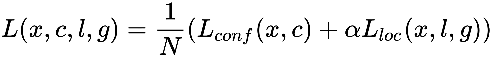
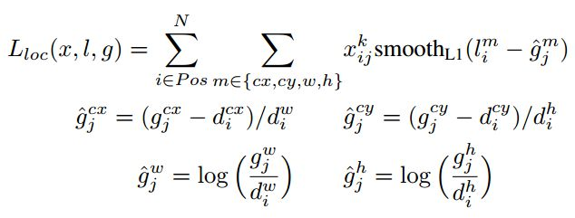
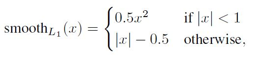
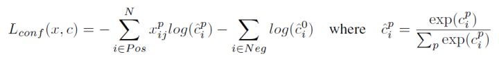

## SSD

### 前言

目标检测近年来已经取得了很重要的进展，主流的算法主要分为两个类型（参考RefineDet）：
- （1）two-stage方法，如R-CNN系算法，其主要思路是先通过启发式方法（selective search）或者CNN网络（RPN)产生一系列稀疏的候选框，然后对这些候选框进行分类与回归，two-stage方法的优势是准确度高；
- （2）one-stage方法，如Yolo和SSD，其主要思路是均匀地在图片的不同位置进行密集抽样，抽样时可以采用不同尺度和长宽比，然后利用CNN提取特征后直接进行分类与回归，整个过程只需要一步，所以其优势是速度快，但是均匀的密集采样的一个重要缺点是训练比较困难，这主要是因为正样本与负样本（背景）极其不均衡（参见Focal Loss），导致模型准确度稍低。

对于Faster R-CNN，其先通过CNN得到候选框，然后再进行分类与回归，而Yolo与SSD可以一步到位完成检测。

相比Yolo，SSD采用CNN来直接进行检测，而不是像Yolo那样在全连接层之后做检测。其实采用卷积直接做检测只是SSD相比Yolo的其中一个不同点，另外还有两个重要的改变，
- 一是SSD提取了不同尺度的特征图来做检测，大尺度特征图（较靠前的特征图）可以用来检测小物体，而小尺度特征图（较靠后的特征图）用来检测大物体；
- 二是SSD采用了不同尺度和长宽比的先验框（Prior boxes, Default boxes，在Faster R-CNN中叫做锚，Anchors）。

Yolo算法缺点是难以检测小目标，而且定位不准，但是这几点重要改进使得SSD在一定程度上克服这些缺点。

###  设计理念

SSD和Yolo一样都是采用一个CNN网络来进行检测，但是却采用了多尺度的特征图，其基本架构如图所示。下面将SSD核心设计理念总结为以下三点：

1. 采用多尺度特征图用于检测
   所谓多尺度采用大小不同的特征图，CNN网络一般前面的特征图比较大，后面会逐渐采用stride=2的卷积或者pool来降低特征图大小，这正如图3所示，一个比较大的特征图和一个比较小的特征图，它们都用来做检测。这样做的好处是比较大的特征图来用来检测相对较小的目标，而小的特征图负责检测大目标，如图4所示，8x8的特征图可以划分更多的单元，但是其每个单元的先验框尺度比较小。

   

2. 采用卷积进行检测
   与Yolo最后采用全连接层不同，SSD直接采用卷积对不同的特征图来进行提取检测结果。对于形状为 m * n * p 的特征图，只需要采用 3 * 3 * p 这样比较小的卷积核得到检测值。

3. 设置先验框
   在Yolo中，每个单元预测多个边界框，但是其都是相对这个单元本身（正方块），但是真实目标的形状是多变的，Yolo需要在训练过程中自适应目标的形状。而SSD借鉴了Faster R-CNN中anchor的理念，每个单元设置尺度或者长宽比不同的先验框，预测的边界框是以这些先验框为基准的，在一定程度上减少训练难度。一般情况下，每个单元会设置多个先验框，其尺度和长宽比存在差异，如下图所示，可以看到每个单元使用了4个不同的先验框，图片中猫和狗分别采用最适合它们形状的先验框来进行训练，后面会详细讲解训练过程中的先验框匹配原则。

   

### 训练过程

#### 先验框匹配

在训练过程中，首先要确定训练图片中的gt与哪个先验框来进行匹配，与之匹配的先验框所对应的边界框将负责预测它。在Yolo中，gt的中心落在哪个单元格，该单元格中与其IOU最大的边界框负责预测它。

但是在SSD中却完全不一样，SSD的先验框与gt的匹配原则主要有两点。
- 首先，对于图片中每个gt，找到与其IOU最大的先验框，该先验框与其匹配，这样，可以保证每个gt一定与某个先验框匹配。通常称与gt匹配的先验框为正样本；反之，若一个先验框没有与任何gt进行匹配，那么该先验框只能与背景匹配，就是负样本。一个图片中gt是非常少的， 而先验框却很多，如果仅按第一个原则匹配，很多先验框会是负样本，正负样本极其不平衡
- 第二个原则是：对于剩余的未匹配先验框，若某个gt的iou 大于某个阈值（一般是0.5），那么该先验框也与这个gt进行匹配。这意味着某个gt可能与多个先验框匹配，这是可以的。但是反过来却不可以，因为一个先验框只能匹配一个gt，如果多个gt与某个先验框iou大于阈值，那么先验框只与IOU最大的那个先验框进行匹配。第二个原则一定在第一个原则之后进行.

尽管一个gt可以与多个先验框匹配，但是gt相对先验框还是太少了，所以负样本相对正样本会很多。为了保证正负样本尽量平衡，SSD采用了hard negative mining，就是对负样本进行抽样，抽样时按照置信度误差（预测背景的置信度越小，误差越大）进行降序排列，选取误差的较大的top-k作为训练的负样本，以保证正负样本比例接近1:3。

#### 损失函数

训练样本确定了，然后就是损失函数了。损失函数定义为位置误差与置信度误差的加权和：

其中N是先验框的正样本数量，这里skij $\in${0, 1}为一个指示参数，当skij  = 1时表示第i个先验框与第j个ground truth匹配，并且ground truth的类别为k。 c为类别置信度预测值。 l为先验框的所对应边界框的位置预测值，而 g是ground truth的位置参数。对于位置误差，其采用Smooth L1 loss，定义如下：

由于skij的存在，所以位置误差仅针对正样本进行计算。

对于置信度误差，其采用softmax loss:

权重系数${\alpha}$通过交叉验证设置为1。

#### 数据扩增

采用数据扩增可以提升SSD的性能，主要采用的技术有水平翻转，随机裁剪加颜色扭曲，随机采集块域.

#### 预测过程

预测过程比较简单，对于每个预测框，首先根据类别置信度确定其类别（置信度最大者）与置信度值，并过滤掉属于背景的预测框。然后根据置信度阈值（如0.5）过滤掉阈值较低的预测框。

对于留下的预测框进行解码，根据先验框得到其真实的位置参数（解码后一般还需要做clip，防止预测框位置超出图片）。解码之后，一般需要根据置信度进行降序排列，然后仅保留top-k（如400）个预测框。最后就是进行NMS算法，过滤掉那些重叠度较大的预测框。最后剩余的预测框就是检测结果了。

### 小结

SSD在Yolo的基础上主要改进了三点：
- 多尺度特征图
- 利用卷积进行检测
- 设置先验框

参考：

https://zhuanlan.zhihu.com/p/33544892