### SGD

此处的SGD指mini-batch gradient descent，关于batch gradient descent, stochastic gradient descent, 以及 mini-batch gradient descent的具体区别就不细说了。现在的SGD一般都指mini-batch gradient descent。

SGD就是每一次迭代计算mini-batch的梯度，然后对参数进行更新，是最常见的优化方法了。即：

$g_t$ = $\Delta_{\theta_{t-1}}f(\theta_{t-1})$

$\Delta_{\theta_{t-1}} = -\eta * g_t$

其中，$\eta$是学习率，$g_t$是梯度 SGD完全依赖于当前batch的梯度，所以$\eta$可理解为允许当前batch的梯度多大程度影响参数更新

#### 缺点：

- 选择合适的learning rate比较困难： 对所有的参数更新使用同样的learning rate。对于稀疏数据或者特征，有时我们可能想更新快一些对于不经常出现的特征，对于常出现的特征更新慢一些，这时候SGD就不太能满足要求了

- SGD容易收敛到局部最优，并且在某些情况下可能被困在鞍点

### Momentum

momentum是模拟物理里动量的概念，积累之前的动量来替代真正的梯度。公式如下

其中，$\eta$是动量因子

#### 特点

- 下降初期时，使用上一次参数更新，下降方向一致，乘上较大的$\mu$能够进行很好的加速
- 下降中后期时，在局部最小值来回震荡的时候，gradient -> 0，使得更新幅度增大，跳出陷阱
- 在梯度改变方向的时候，$\eta$能够减少更新 总而言之，momentum项能够在相关方向加速SGD，抑制振荡，从而加快收敛

### Nesterov

nesterov项在梯度更新时做一个校正，避免前进太快，同时提高灵敏度。 将上一节中的公式展开可得：

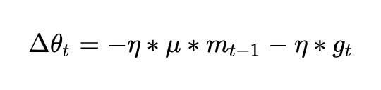

可以看出，$m_{t-1}$并没有直接改变当前梯度$g_t$，所以Nesterov的改进就是让之前的动量直接影响当前的动量。即：

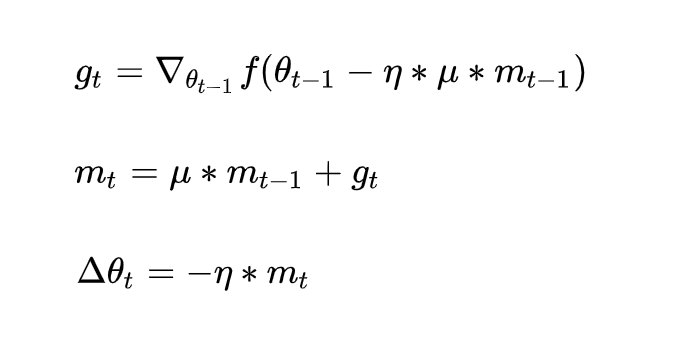

所以，加上nesterov项后，梯度在大的跳跃后，进行计算对当前梯度进行校正。如下图：

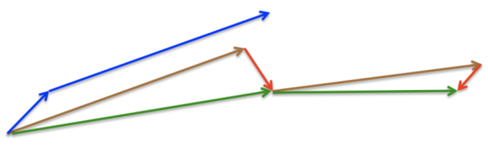

momentum首先计算一个梯度(短的蓝色向量)，然后在加速更新梯度的方向进行一个大的跳跃(长的蓝色向量)，nesterov项首先在之前加速的梯度方向进行一个大的跳跃(棕色向量)，计算梯度然后进行校正(绿色梯向量)

其实，momentum项和nesterov项都是为了使梯度更新更加灵活，对不同情况有针对性。但是，人工设置一些学习率总还是有些生硬，接下来介绍几种自适应学习率的方法

### Adagrad

Adagrad其实是对学习率进行了一个约束。即：

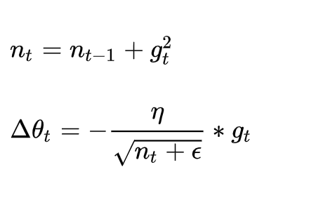

此处，对$g_t$从1到t进行一个递推形成一个约束项regularizer,$\epsilon$用来保证分母非0

特点：

- 前期$g_t$较小的时候， regularizer较大，能够放大梯度
- 后期$g_t$较大的时候，regularizer较小，能够约束梯度
- 适合处理稀疏梯度

缺点：
- 由公式可以看出，仍依赖于人工设置一个全局学习率
- $\eta$设置过大的话，会使regularizer过于敏感，对梯度的调节太大
- 中后期，分母上梯度平方的累加将会越来越大，使gradient -> 0，使得训练提前结束

### Adadelta

Adadelta是对Adagrad的扩展，最初方案依然是对学习率进行自适应约束，但是进行了计算上的简化。 Adagrad会累加之前所有的梯度平方，而Adadelta只累加固定大小的项，并且也不直接存储这些项，仅仅是近似计算对应的平均值。即：

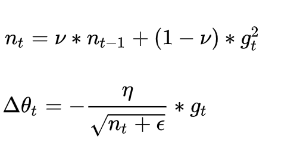

在此处Adadelta其实还是依赖于全局学习率的，但是作者做了一定处理，经过近似牛顿迭代法之后：

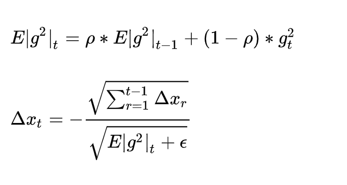

其中，E代表求期望。

此时，可以看出Adadelta已经不用依赖于全局学习率了。

特点：
- 训练初中期，加速效果不错，很快
- 训练后期，反复在局部最小值附近抖动

### RMSprop

RMSprop可以算作Adadelta的一个特例：

当$\rho$时，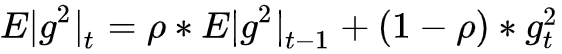就变为了求梯度平方和的平均数。

如果再求根的话，就变成了RMS(均方根)：

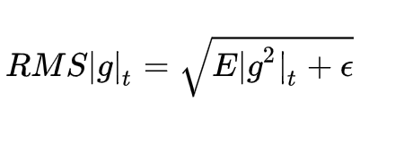

此时，这个RMS就可以作为学习率[公式]的一个约束：

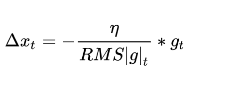

特点：
- 其实RMSprop依然依赖于全局学习率
- RMSprop算是Adagrad的一种发展，和Adadelta的变体，效果趋于二者之间
- 适合处理非平稳目标 - 对于RNN效果很好

### Adam

Adam(Adaptive Moment Estimation)本质上是带有动量项的RMSprop，它利用梯度的一阶矩估计和二阶矩估计动态调整每个参数的学习率。Adam的优点主要在于经过偏置校正后，每一次迭代学习率都有个确定范围，使得参数比较平稳。公式如下：

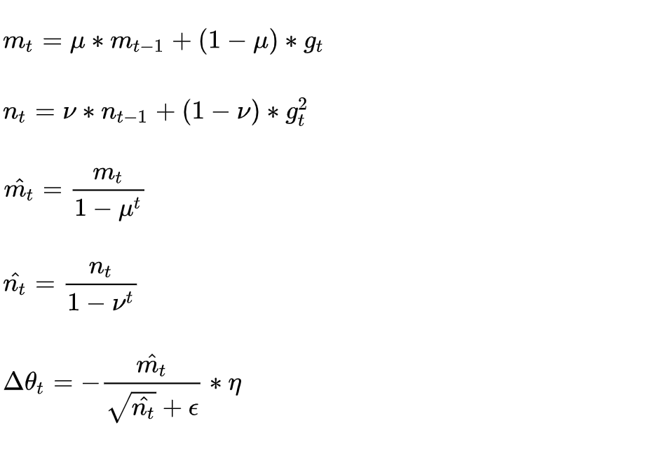

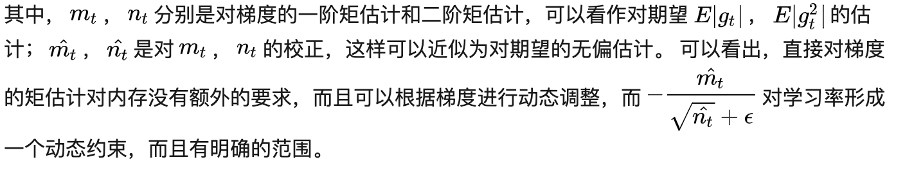

特点：

结合了Adagrad善于处理稀疏梯度和RMSprop善于处理非平稳目标的优点
对内存需求较小
为不同的参数计算不同的自适应学习率
也适用于大多非凸优化 - 适用于大数据集和高维空间