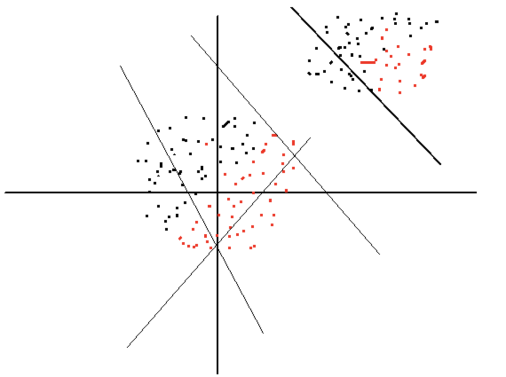
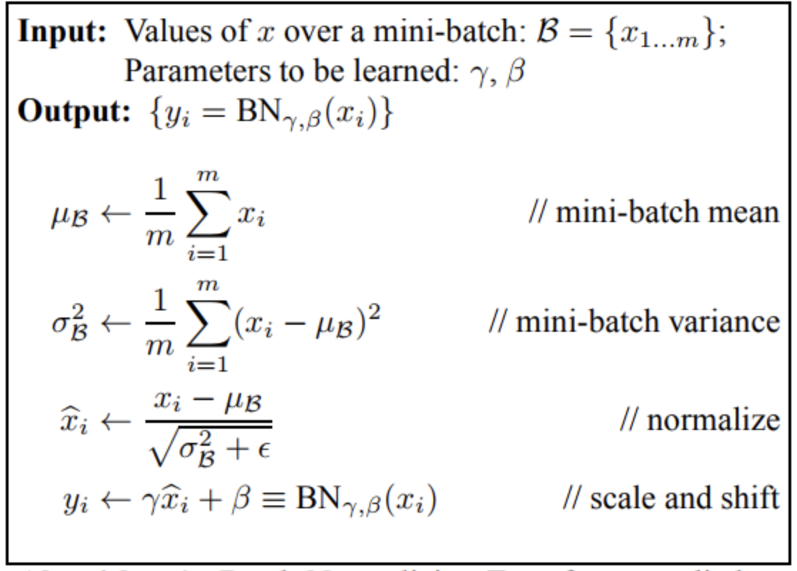
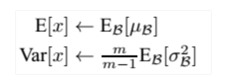
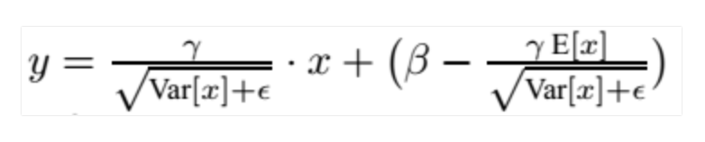

## 梯度消失
是指在深度神经网络的反向传播过程中，随着越向回传播，权重的梯度变得越来越小，越靠前的层训练的越慢，导致结果收敛的很慢，损失函数的优化很慢，有的甚至会终止网络的训练。

靠近输出层的hidden layer 梯度大，参数更新快，所以很快就会收敛；

而靠近输入层的hidden layer 梯度小，参数更新慢，几乎就和初始状态一样，随机分布。

#### 影响：

会使得网络前几层的参数不再更新，最终导致模型的性能很差

#### 解决方案有：

- BN
- 激活函数

#### 如何判断

- 前几层的网络参数不更新
- 梯度很接近0

## 梯度爆炸
和梯度消失相反，例如当你有很大的权重，和很小的激活函数值时，这样的权重沿着神经网络一层一层的乘起来，会使损失有很大的改变，梯度也变得很大，也就是 W 的变化（W - ⍺* dW）会是很大的一步，这可能导致在最小值周围一直振荡，一次一次地越过最佳值，模型可能一直也学不到最佳。爆炸梯度还有一个影响是可能发生数值溢出，导致计算不正确，出现 NaN，loss 也出现 NaN 的结果。

#### 影响：

梯度爆炸 会使得某层的参数w过大，造成网络不稳定，极端情况下，数据数据乘以一个大w发生溢出，得到NAN值

#### 解决方案有：

- 用梯度截断方法，即当梯度超过一个阈值时，让他变小点
- 权重正则化方法
- 从rnn ->lstm
- 使用relu激活函数，梯度为1

#### 如何判断

- 模型不稳定，训练损失显著变化
- 模型损失变成NAN
- 梯度快速增大
- 每个节点的和层的误差梯度都超过1


Batch Normalization:

在网络中间层中使用 Batch Normalization 层一定程度上能够减缓对较好的网络参数初始化的依赖，使用方差较小的参数分布即可.

## 欠拟合

欠拟合就是模型没有很好地捕捉到数据特征，不能够很好地拟合数据

#### 出现原因

1. 模型复杂度过低
2. 特征量过少

#### 解决办法

1. 添加其他特征项，有时候我们模型出现欠拟合的时候是因为特征项不够导致的，可以添加其他特征项来很好地解决。例如，“组合”、“泛化”、“相关性”三类特征是特征添加的重要手段，无论在什么场景，都可以照葫芦画瓢，总会得到意想不到的效果。除上面的特征之外，“上下文特征”、“平台特征”等等，都可以作为特征添加的首选项。
2. 添加多项式特征，这个在机器学习算法里面用的很普遍，例如将线性模型通过添加二次项或者三次项使模型泛化能力更强。例如上面的图片的例子。
3. 减少正则化参数，正则化的目的是用来防止过拟合的，但是现在模型出现了欠拟合，则需要减少正则化参数。
4. 使用非线性模型，比如核SVM 、决策树、深度学习等模型
5. 调整模型的容量(capacity)，通俗地，模型的容量是指其拟合各种函数的能力容量低的模型可能很难拟合训练集；
6. 使用集成学习方法，如Bagging ,将多个弱学习器Bagging


## 过拟合

过拟合就是模型把数据学习的太彻底，以至于把噪声数据的特征也学习到了，这样就会导致在后期测试的时候不能够很好地识别数据，即不能正确的分类，模型泛化能力太差。

#### 出现原因

1. 建模样本选取有误，如样本数量太少，选样方法错误，样本标签错误等，导致选取的样本数据不足以代表预定的分类规则
2. 样本噪音干扰过大，使得机器将部分噪音认为是特征从而扰乱了预设的分类规则
3. 假设的模型无法合理存在，或者说是假设成立的条件实际并不成立
4. 参数太多，模型复杂度过高
5. 对于决策树模型，如果我们对于其生长没有合理的限制，其自由生长有可能使节点只包含单纯的事件数据(event)或非事件数据(no event)，使其虽然可以完美匹配（拟合）训练数据，但是无法适应其他数据集
6. 对于神经网络模型：
   1. 对样本数据可能存在分类决策面不唯一，随着学习的进行,，BP算法使权值可能收敛过于复杂的决策面；
   2. 权值学习迭代次数足够多(Overtraining)，拟合了训练数据中的噪声和训练样例中没有代表性的特征

#### 解决办法

1. 重新清洗数据，导致过拟合的一个原因也有可能是数据不纯导致的，如果出现了过拟合就需要我们重新清洗数据。
2. 增大数据的训练量，还有一个原因就是我们用于训练的数据量太小导致的，训练数据占总数据的比例过小。
3. 数据增强
4. 采用正则化方法。正则化方法包括L0正则、L1正则和L2正则，而正则一般是在目标函数之后加上对于的范数。但是在机器学习中一般使用L2正则，下面看具体的原因。

    L0范数是指向量中非0的元素的个数。L1范数是指向量中各个元素绝对值之和，也叫“稀疏规则算子”（Lasso regularization）。两者都可以实现稀疏性，既然L0可以实现稀疏，为什么不用L0，而要用L1呢？个人理解一是因为L0范数很难优化求解（NP难问题），二是L1范数是L0范数的最优凸近似，而且它比L0范数要容易优化求解。所以大家才把目光和万千宠爱转于L1范数。

    L2范数是指向量各元素的平方和然后求平方根。可以使得W的每个元素都很小，都接近于0，但与L1范数不同，它不会让它等于0，而是接近于0。L2正则项起到使得参数w变小加剧的效果，但是为什么可以防止过拟合呢？一个通俗的理解便是：更小的参数值w意味着模型的复杂度更低，对训练数据的拟合刚刚好（奥卡姆剃刀），不会过分拟合训练数据，从而使得不会过拟合，以提高模型的泛化能力。

5. 采用dropout方法。这个方法在神经网络里面很常用。dropout方法是ImageNet中提出的一种方法，通俗一点讲就是dropout方法在训练的时候让神经元以一定的概率不工作。
6. Early stopping

## BN

#### 白化训练数据能够加速训练进程

如下图，训练数据如果分布在右上角，我们在初始化网络参数w和b的时候，可能得到的分界面是左下角那些线，需要经过训练不断调整才能得到穿过数据点的分界面，这个就使训练过程变慢了；如果我们将数据白化后，均值为0，方差为1，各个维度数据去相关，得到的数据点就是坐标上的一个圆形分布，如下图中间的数据点，这时候随便初始化一个w，b设置为0，得到的分界面已经穿过数据了，因此训练调整，训练进程会加快



#### BN层可以加速网络收敛速度

原理如上面2类似，BN层的计算图如下面所示，x是输入数据，到xhat均值方差归一化，也就是类似2中白化的加速的原理，后面xhat到y其实就是普通的一个线性变换，类似全连接但是没有交叉，将这个线性变换和后面的网络看成一体的，是不是就跟2中情况一样了？如果没有BN层，x直接输入后面的网络，训练过程中x分布的变换必然导致后面的网络去调整学习以来适应x的均值和方差，映入了BN层，xhat是一个归一化的数据，代价就是网络中多了一个线性层y，但是前者带来的性能更加大，因此加速了。



#### BN层一般用在线性层和卷积层后面，而不是放在非线性单元后

因为非线性单元的输出分布形状会在训练过程中变化，归一化无法消除他的方差偏移，相反的，全连接和卷积层的输出一般是一个对称,非稀疏的一个分布，更加类似高斯分布，对他们进行归一化会产生更加稳定的分布。其实想想也是的，像relu这样的激活函数，如果你输入的数据是一个高斯分布，经过他变换出来的数据能是一个什么形状？小于0的被抑制了，也就是分布小于0的部分直接变成0了，这样不是很高斯了。

BN在求均值去方差过程中，每个通道需要分开计算

#### BN作用

1. 可以选择较大的学习率，使得训练速度增长很快，具有快速收敛性。
2. 可以不去理会Dropout，L2正则项参数的选择，如果选择使用BN，甚至可以去掉这两项。
3. 去掉局部响应归一化层。（AlexNet中使用的方法，BN层出来之后这个就不再用了）
4. 可以把训练数据打乱，防止每批训练的时候，某一个样本被经常挑选到。

#### BN使用

一旦网络训练结束，就没有了batch这个概念了，测试阶段的时候我们一般只输入一个样本来看一下预测结果。因此测试样本前向传导的时候，上面式子里的均值和标准差从哪里来？其实网络一旦训练完毕，参数都是固定的，这个时候即便是训练数据进来一个batch，BN层计算的均值和标准差都是基本不变的（网络趋于稳定），我们可以采用这些数值作为测试样本所需要的均值和标准差，于是最后测试阶段的均值和标准差为：



上面简单理解就是：对于均值来说直接计算所有batch u值的平均值；然后对于标准偏差采用每个batch σB的无偏估计。最后测试阶段，BN的使用公式就是



BN可以用于一个神经网络的任何一个神经元上，文献中主要是把BN变换放在激活函数层的前面，所以前向传导的计算公式应该是：z=g(BN(Wu+b))，因为偏置参数经过BN层其实是不起作用的，因为也会被均值归一化（平移），所以这个参数就可以不要了，可以写成：z=g(BN(Wu))

#### Batch Normalization在CNN中的使用

通过上面的学习，我们知道BN层是对于每个神经元做归一化处理，甚至只需要对某一个神经元进行归一化，而不是对一整层网络的神经元进行归一化。既然BN是对单个神经元的运算，那么在CNN中卷积层上要怎么搞？假如某一层卷积层有6个特征图，每个特征图的大小是100*100，这样就相当于这一层网络有6*100*100个神经元，如果采用BN，就会有6*100*100个参数γ、β，这样岂不是太恐怖了。因此卷积层上的BN使用，其实也是使用了类似权值共享的策略，把一整张特征图当做一个神经元进行处理。

参考：

## IOU

```python
# encoding: utf-8
def compute_IOU(rec1,rec2):

    left_column_max  = max(rec1[0],rec2[0])
    right_column_min = min(rec1[2],rec2[2])
    up_row_max = max(rec1[1],rec2[1])
    down_row_min = min(rec1[3],rec2[3])
    #两矩形无相交区域的情况
    if left_column_max>=right_column_min or down_row_min<=up_row_max:
        return 0
    # 两矩形有相交区域的情况
    else:
        S1 = (rec1[2]-rec1[0])*(rec1[3]-rec1[1])
        S2 = (rec2[2]-rec2[0])*(rec2[3]-rec2[1])
        S_cross = (down_row_min-up_row_max)*(right_column_min-left_column_max)
        return S_cross/(S1+S2-S_cross)

```

https://www.cnblogs.com/yangmang/p/7477802.html
https://cloud.tencent.com/developer/article/1327280
https://blog.csdn.net/hjimce/article/details/50866313