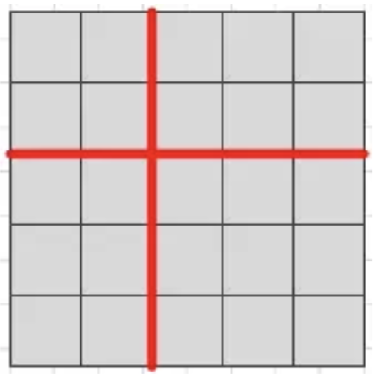
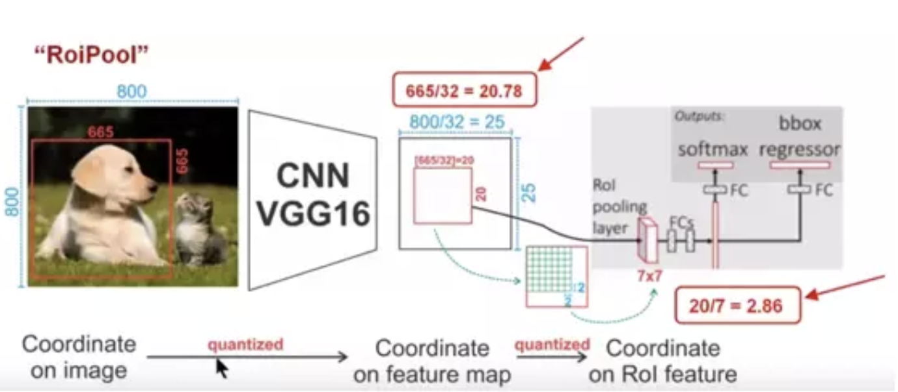
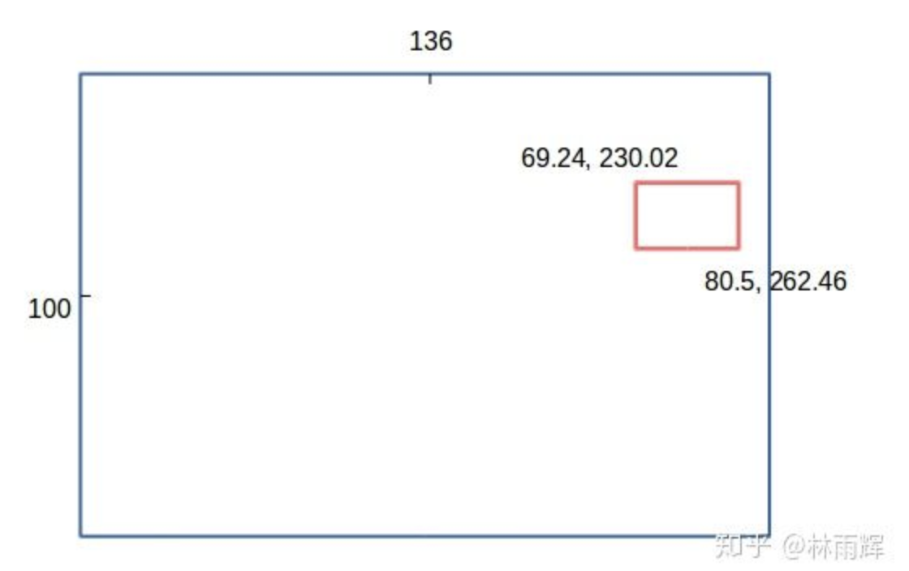
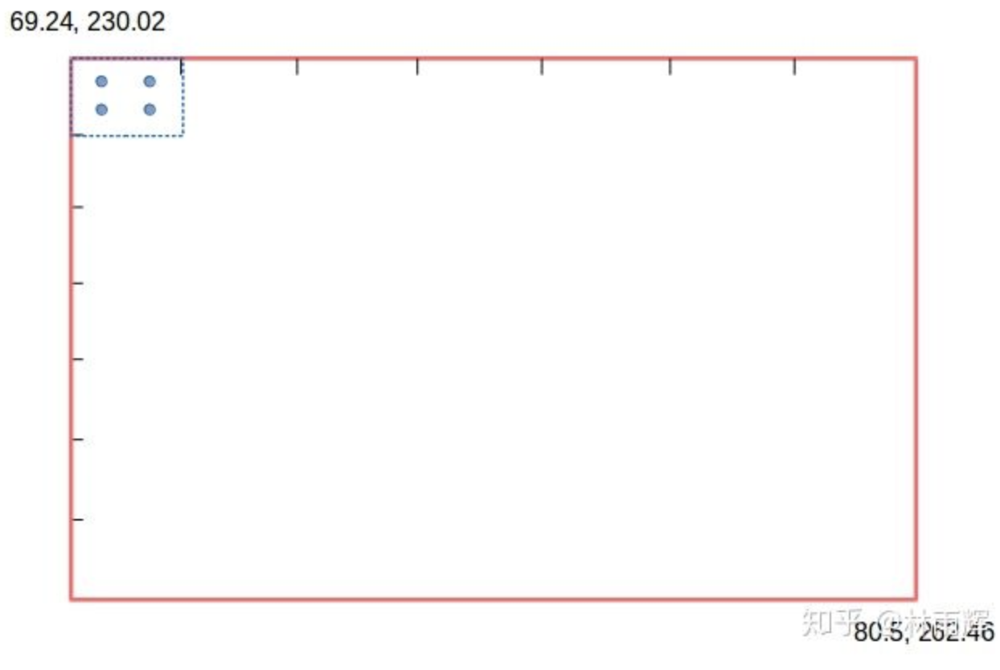
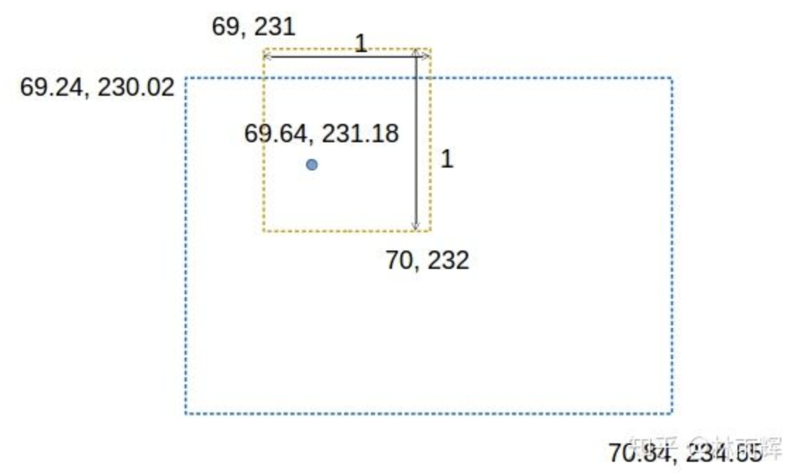
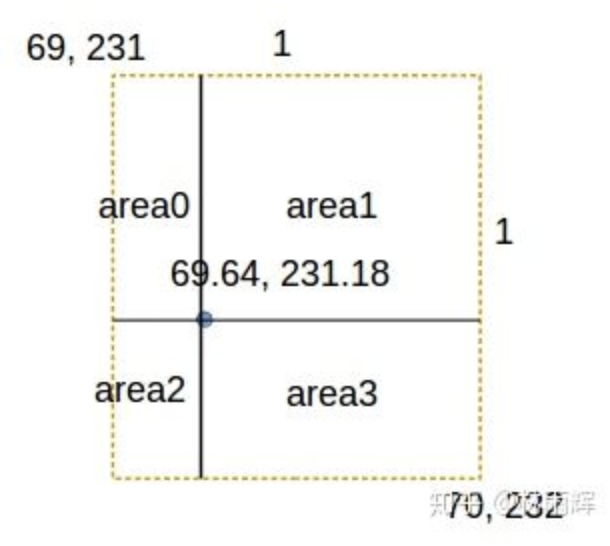
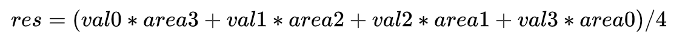
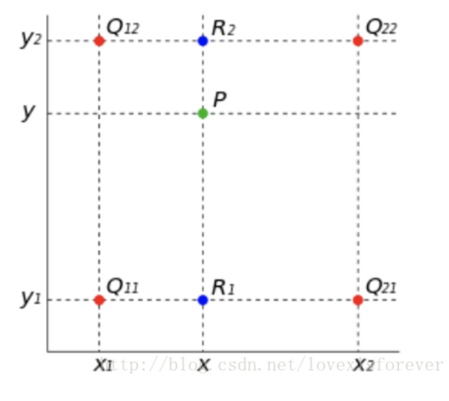
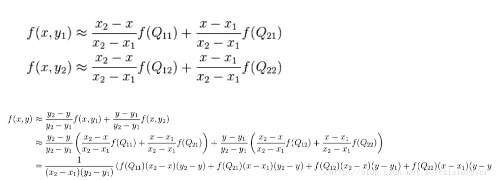

### ROI Pooling

1. 首先根据后面网络要求的输入尺寸求网格大小，如输入特征图尺寸为5*5，而网络输入尺寸为2*2，那么网格的划分结果为

    

2. 对于每个小网格，求最大值作为该网格最大池化之后的值。

在这个过程中会有两次量化操作。对于一个region proposal，首先从原图经过全卷积网络到特征图，得到的候选框位置可能存在浮点数，进行取整操作从而出现第一次量化；其次，在ROI Pooling求取每个小网格的位置时也同样存在浮点数取整的情况。这两次量化的结果都使得候选框的位置会出现偏差，在论文里，作者把它总结为“不匹配问题（misalignment）。如下图所示，假设图片经过主干网络提取特征后，特征图缩放步长（stride）为32，则该层特征图上0.1个像素的偏差，缩放到原图就是3.2个像素。

### ROI Align

为了解决ROI Pooling的上述缺点，作者提出了ROI Align这一改进的方法。ROI Align的思路很简单：取消量化操作，使用双线性内插的方法获得坐标为浮点数的像素点上的图像数值,从而将整个特征聚集过程转化为一个连续的操作

#### 计算过程

假设特征图大小是1x256x200x272，rois大小是715x5（5列分别是：对应的图片id（这里只有一张图片，所以第一列全为0）、对应roi左上角的x，y坐标、roi右下角的x，y坐标），roi align后的输出大小为715x256x7x7。

对于每一个roi (1个channel)：

把roi的坐标调整到合适的scale，这里假设特征图大小是原图的1/4，那么要将roi的坐标乘以1/4。例如，当前roi为[0, 920.11, 276.99, 1049.87, 322.0]，将坐标乘以1/4后得到[0, 230.02, 69.24, 262.46, 80.5]（not round），将其绘制在特征图上（不考虑通道的话）就是：

所以这个roi的宽度是，262.46-230.02=32.44，roi的高度是80.5-69.24=11.26。由于输出的长宽大小为7，因此这个roi要被分成7x7的小块，每个小块的高度是11.26/7=1.60，宽度是32.44/7=4.63。假设我们的采样率为2，那么在每个小块内，要采样2x2=4个点。

对于每一个小块：

计算4个采样点的坐标。第一个采样点，y坐标为69.24+0 * 1.60+(0.5 * 1.60 / 2)=69.64，也就是在第一个小块的1/4的高度的位置进行采样，x坐标为230.02+0 * 4.63+(0.5 * 4.63 / 2)=231.18，也就是在第一个小块的1/4的宽度的位置进行采样；第二个采样点，y坐标与第一个采样点相同，x坐标为230.02+0 * 4.63+(1.5 * 4.63 / 2)=233.49，也就是在第一个小块的3/4的宽度的位置进行采样；第三个采样点在小块的3/4高度，1/4的宽度的位置进行采样；第四个采样点在小块的3/4高度，3/4的宽度的位置进行采样。我们得到：

对每一个采样点：

第一个采样点，也就是(69.64,231.18)，我们对其构建一个1x1的小框，小框的左上角y坐标是69，也就是对69.64取floor，x坐标是231，也就是对231.18取floor，小框的右下角的y坐标是69+1=70，x坐标是231+1=232。得到：

我们可以算出这个采样点到上下左右的距离分别是，0.64,0.36,0.18,0.82，然后我们从采样点位置将这个小框分成4个部分，并计算出每一部分的面积，左上部分面积为0.64*0.18=0.11，右上部分面积为0.53，左下部分面积为0.06，右下部分面积为0.29。到现在，我们得到了小框的4个顶点的坐标，以及4个部分的面积(area0,area1,area2,area3)，我们还可以知道在特征图（对应channel）中，对应这4个顶点坐标上的值(设为val0, val1,val2,val3)。

我们可以通过(bilinear interpolate)计算这个roi的roi align结果的对应channel里，每一个小块的值：

上图公式就是图像上线性插值的计算公式，按照以上步骤，我们可以得到所有roi的roi align的结果。

### 双线性插值

参考：

https://www.jianshu.com/p/2a5ffca8b861
https://blog.csdn.net/lovexlsforever/article/details/79508602   
https://zhuanlan.zhihu.com/p/61317964