## V1

两个问题要处理：
1. 重复池化和下采样导致分辨率大幅下降，位置信息丢失难以恢复
2. 空间不变性导致细节信息丢失

处理方案：
1. 空洞卷积
2. Fully-connected Conditional Random Field (CRF)

优势
1. 速度很快，DCNN 8fps，CRF需要0.5秒
2. 准确率高，当时在PASCAL的语义分割集上效果最好
3. 结构简单，DCNN和CRF的组合

### 网络结构—DCNN

#### 整体pipeline

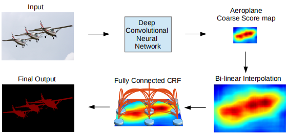

#### 空洞卷机
一维空洞卷积，kernel size=3，Input stride=2，stride=1。

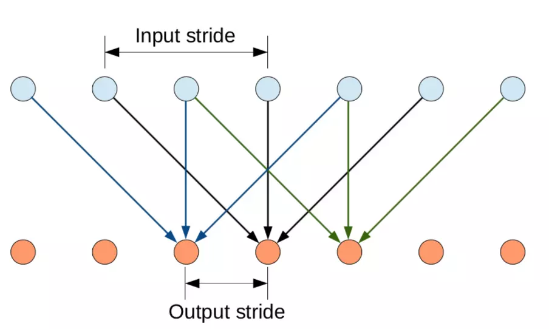

Input stride 也就是空洞因子或者膨胀因子，在同样的卷积核大小下，通过增加Input stride可以增大卷积核的感受野。更好的示意图：

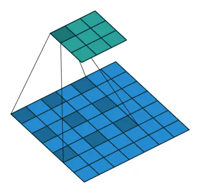

可以发现感受野从3变成 了5，近似的扩大了2倍，卷积核大小仍为3x3，Input stride为2，现在都叫dilate rate。

#### 理解空洞卷积

feature map变小主要是由于卷积层和池化层引起的，若另所有层的stride=1，输出feature map将会变大。
原始情况下Pooling layer stride=2，receptive field=4

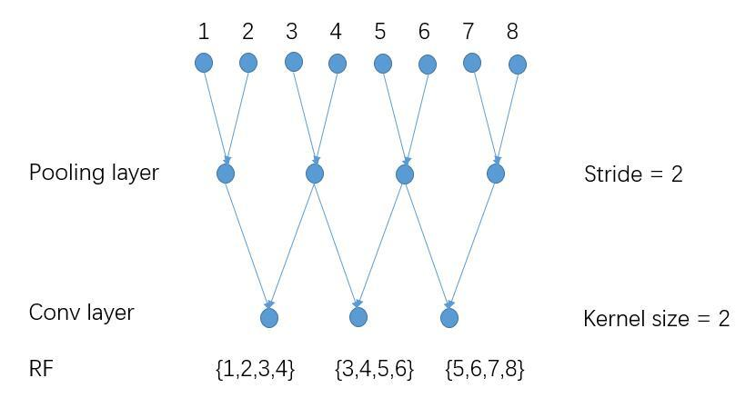

另Pooling layer stride=1，receptive field=3，输出更dense，但感受野变小。

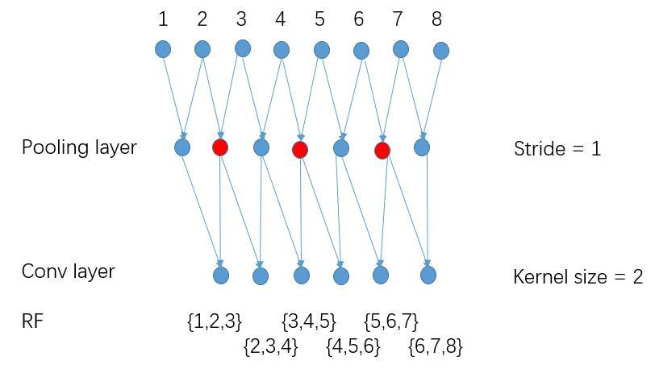

采用空洞卷积后，receptive field=4
跟第一张图相比，在蓝色节点的基础上多了红色节点，在保持感受野使输出更加dense。

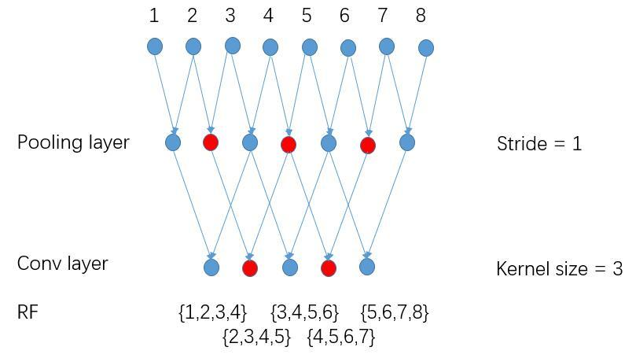

#### Finetune VGG-16

重温VGG-16结构图：

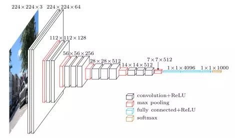

作者为了加载预先在ImageNet训练好的VGG-16模型，并保证图片仅缩放了8倍做了如下修改：

1. 把全连接层（fc6、fc7、fc8）改成卷积层（做分割嘛）
2. 把最后两个池化层（pool4、pool5）的步长2改成1（保证feature的分辨率）
3. 把最后三个卷积层（conv5_1、conv5_2、conv5_3）的dilate rate设置为2，且第一个全连接层的dilate rate设置为4（保持感受野）
4. 把最后一个全连接层fc8的通道数从1000改为21（分类数为21）

#### 加速训练

第一个全连接层fc6，通道数从4096变为1024，卷积核大小从7x7变为3x3，后续实验中发现此处的dilate rate为12时（LargeFOV），效果最好。

### 网络结构—CRF

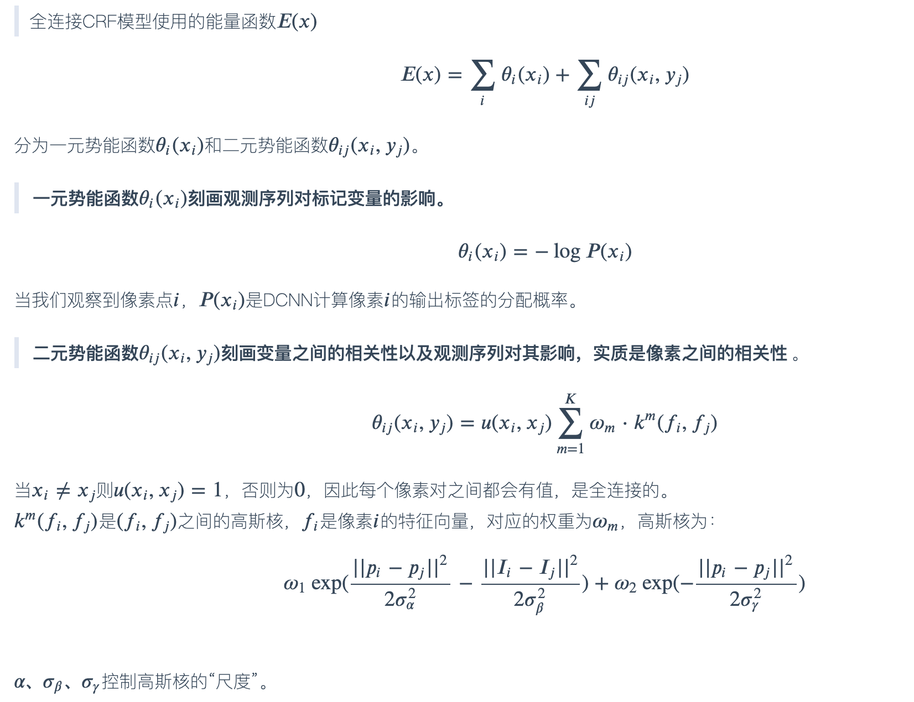

### DeepLabv2

DCNNs中语义分割存在三个挑战：
1. 连续下采用和重复池化，导致最后特征图分辨率低
2. 图像中存在多尺度的物体（和v1不同之处）
3. 空间不变性导致细节信息丢失

处理方案：
1. 移除部分池化操作，使用空洞卷积（后来都叫膨胀卷积）
2. 利用不同膨胀因子的空洞卷积融合多尺度信息—atrous spatial pyramid pooling(ASPP)（和v1不同之处）
3. Fully-connected Conditional Random Field(CRF)

### pipeline：

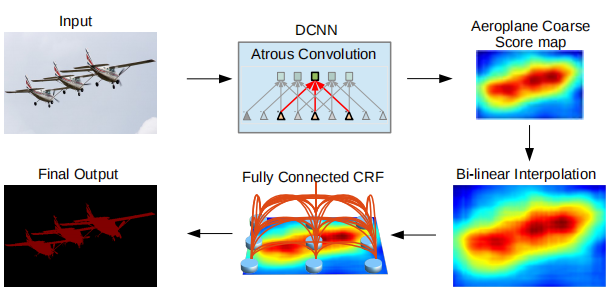

首先经过采用空洞卷积的DCNN如VGG-16或ResNet101得到粗略的分割结果，然后通过双线性插值将feature map恢复成原图分辨率，最后用全连接的CRF来精细化分割结果。

### 空洞卷积

### ASPP

并行采用多个采样率的空洞卷积提取特征，再将特征进行融合，该结构称为空洞空间金字塔池化（atrous spatial pyramid pooling）。

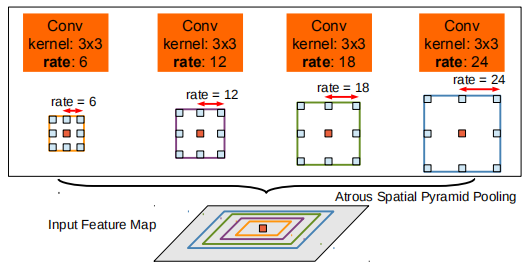

### 条件随机场

## DeepLabv3

本文主要工作
1. 探索更深结构下的空洞卷积探索（串行结构）
2. 优化atrous spatial pyramid pooling—ASPP（并行结构）

### 更深结构下的空洞卷积

#### 串联结构

把resnet最后一个block，下图中的Block4拷贝几份串联起来：

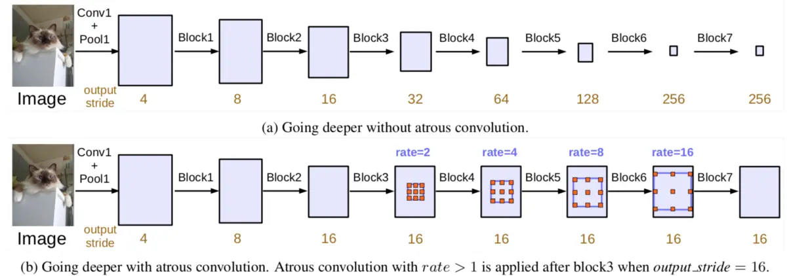

每个block的最后一个卷积stride都为2（除了最后一个block），连续的下采样保证获取更大范围的特征，但是这样不利于语义分割。使用不同膨胀率的空洞卷积保证了分辨率和大的感受野，如上图b所示。

### 优化Atrous Spatial Pyramid Pooling

通过实验发现，膨胀率越大，卷积核中的有效权重越少，当膨胀率足够大时，只有卷积核最中间的权重有效，即退化成了1x1卷积核，并不能获取到全局的context信息

为了解决这个问题，作者在最后一个特征上使用了全局平均池化（global everage pooling）（包含1x1卷积核，输出256个通道，正则化，通过bilinear上采样还原到对应尺度）

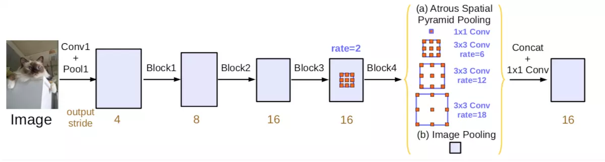

## V3+

### 主要工作：

1. 原DeepLabv3当作encoder，添加decoder得到新的模型（DeepLabv3+）。如下图所示，作者把spatial pyramid pooling module和Encoder-Decoder融合成一体：

2. 把Xception和Depthwise separable convolution应用到Atrous Spatial Pyramid Pooling和decoder中。

### 深度可分离卷积

depthwise separable convolution=depthwise convolution+pointwise convolution

- depthwise convolution是在每个通道上独自的进行空间卷积
- pointwise convolution是利用1x1卷积核组合前面depthwise convolution得到的特征
- tensorflow支持atrous版的depthwise convolution

### 网络整体结构

#### Encoder
Encoder就是原来的DeepLabv3，注意点有2点：
1. 输入尺寸与输出尺寸比（output stride = 16），最后一个stage的膨胀率rate为2
2. Atrous Spatial Pyramid Pooling module（ASPP）有四个不同的rate，额外一个全局平均池化

#### Decoder
明显看到先把encoder的结果上采样4倍，然后与resnet中下采样前的Conv2特征concat一起，再进行3x3的卷积，最后上采样4倍得到最终结果
需要注意点：
融合低层次信息前，先进行1x1的卷积，目的是降通道（例如有512个通道，而encoder结果只有256个通道）

### 主干网络

作者在MSRA基础上作了些修改:

- 更深的Xception结构，并不修改entry flow network结构
- 所有的max pooling结构被stride=2的深度可分离卷积代替
- 每个3x3的depthwise convolution都跟BN和Relu
  
改进后的结构如下

### 实验

1. decoder结构上的探索
   1. 训练时上采样输出结果比下采样真值提升1.2%
   2. 作者验证了U-Net和SegNet类似的解码结构在此网络上并没有多少提升

