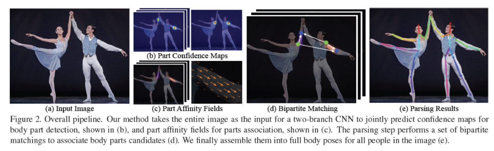
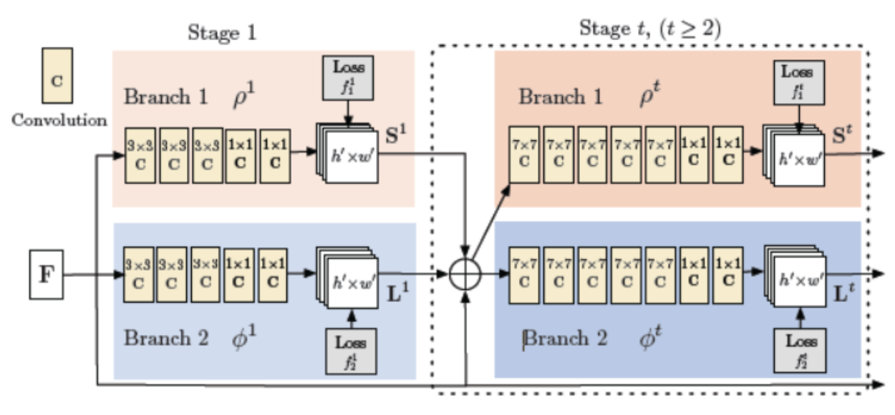
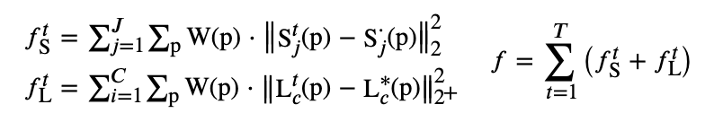
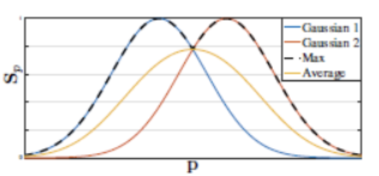
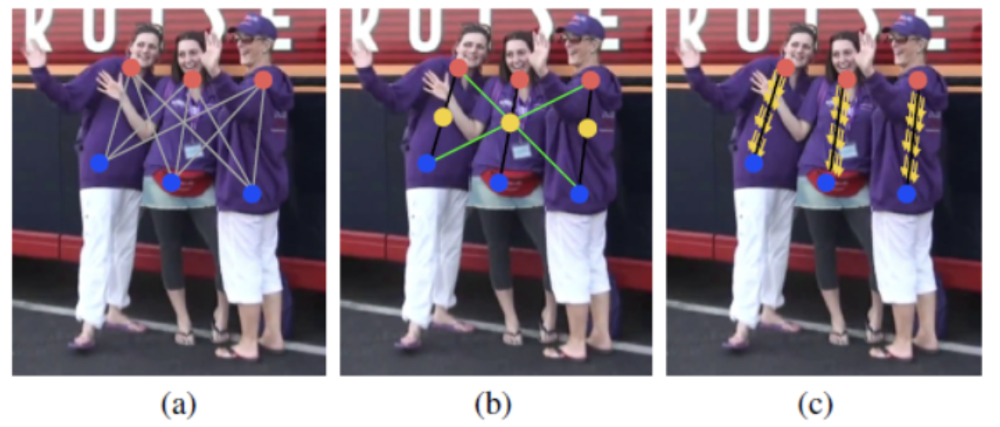
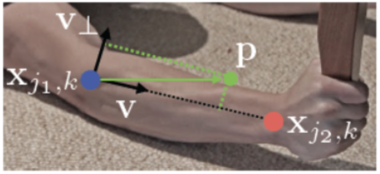
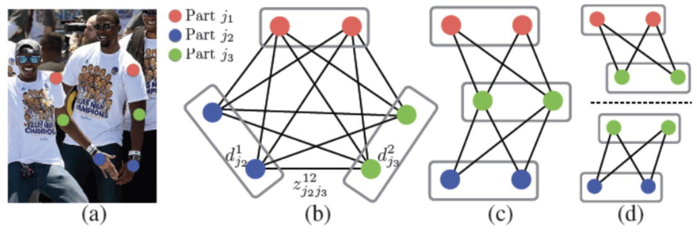

### Abstract

本文使用的是联合的多branch分支，一个分支负责关键点的检测，以及关键点的连接成骨架，再通过二分图匹配的匈牙利算法，这样的bottom-up的结构。

后面主要采用了PAF的方法以及组合数学中的K分图匹配方法，很优雅的解决了CPM中的多人肢干连接的问题。

后续就是CPM、HrNet，CenterNet、CornorNet、DensePose、MaskRcnn...

### 数据集

MPII 16点-单人/多人-大图，4W people
CoCo 18点-多人-大图小图，10W people
AIC  14点-多人-大图，38W people

### Introduction

pose estimation的挑战：
- 图像中的人数位置，他们可能出现在任何位置，且大小不一。
- 在相互接触，以及遮挡等不好的情况都会对关键点的检测造成困难
- 随着人数的数量增加，运行时间的复杂度，也会上升，使得实时的表示成为一个挑战

### Method

首先借鉴的CPM的方法，检测出人关键点的位置，得到检测结果是通过预测人体关键点的heatmap，这样就可以看到每个人体关键点上都有一个高斯的峰值，代表网络预测出这里是一个人体的关键点，同样对其他所有人的关键点进行同样的结果，在得到检测结果之后，对关键点加测结果进行连接，主要采用的就是PAF。

### Simultaneous Detection and Association

其中PAF是用来描述像素点在骨架中的走向，用𝐿(𝑝)来进行表示，关键点的相应用𝑆(𝑝)来进行表示。

首先网络通过VGG-19前10层进行初始化并微调，在经过pretrain-model进行骨架后，会有两个branch，来分别进行回归𝐿(𝑝以及𝑆(𝑝)。

在每一个stage都算一次loss之后，将L以及S以及原始的输入F进行concatenate，送入下一个stage再进行训练。其中训练的loss采用的是都是l2。

S和L的gt都是采用标注的关键点，如果某个关键点在标注中不存在，就不标注这个点。经过途中所示的网络，网络f分为上下两个分支，每个分支都是t个阶段进行不断的微调，且每个阶段都会将feature maps进行融合，其中𝜌𝜑表示的是网络。

其中上图是比较粗糙的输出结果。
主要的L2 loss为:

### Confidence Maps for Part Detection

对于部件的检测：

再给出标注数据计算GT $𝐒^∗$的时候，每个confidence map都是一个2D的表示，理想情况下：
- 当图像中值包含一个人时，如果一个关键点是可见的话，对应的confidence map中只会出现一个峰值.
- 当图像中有多个人时，对于每一个人k的每一个可见关键点j在对应的confidence map都会有一个峰值。
- 如上图所示，首先给出每一个人k的单个confidence maps，$𝑥_{𝑗,𝑘}∈ℝ2$表示图像中人k对应的位置j对应的GT position，其中x表示一个点坐标。$𝐒^∗_{𝑗,𝑘}(𝐩)$ = $exp(-\frac{||𝐩−𝐱_{𝑗,𝑘}||^2_2}{\rho^2})$,其中𝜎用来控制峰值在confidence map中的传播范围，
- 对应多个人的confidence map如下所示。这里用最大值能够更加准确的将同一个feature maps中confidence map的峰值进行保存起来。
- 网络在位置P的预测值对应的GT位置 计算是如上图所示，取最大值$𝐒^∗_{𝑗,𝑘}(𝐩) = max_𝑘(𝐒^∗_{𝑗,𝑘}(𝐩))$。在预测阶段网络通过NMS来获得最终的置信度。

### Part Affinity Fields for Part Association

提出了PAFs部件亲和场同时保持了肢体区域之间的位置关系跟方向关系，每种类型的肢体都会有连接其两个关联部位对应的亲和场。

### Multi-Person Parsing using PAFs

接下来就是最后将PAFs的结果进行解码了，我们对预测的置信图进行nms操作后，可以得到一组离散的候选身体部位，对于每一个部件存在多个候选，因为图像上有多个人的情况，从这些候选部件可以定义为一个很大的可能肢体结合，通过上面的积分公式，计算每一个候选肢体得到的分数。
在本文中，提出了greedy relaxation的方法来产生高质量的匹配：
1. 首先根据预测置信图得到离散的候选部件$D_j$={$𝐝_{𝑚𝑗}:𝑗∈{1…𝐽},𝑚∈{1…𝑁𝑗}$}，其中$𝑑_{𝑚𝑗}$代表身体部件j的第m个候选关键点的位置，$𝑁_𝑗$表示j的候选点的个数。
2. 我们的匹配目标是要求候选部位和统一个人的其他候选部件进行连接，首先定义变量$𝑧^{𝑚𝑛}_{𝑗_1𝑗_2}$∈{0,1}用来表示两个候选部件$𝐝^𝑚_{𝑗_1}$ 与 $𝐝^n_𝑝$之间是否有连接。所有候选部件的连线集合为
Z={$𝑧^{𝑚𝑛}_{𝑗_1𝑗_2}: for  𝑗_1,𝑗_2∈{1…𝐽},𝑚∈{1…𝑁_{𝑗1}},𝑛∈{1…𝑁_{𝑗2}}$}
3. 单独考虑肢体𝑐所对应的两个身体部件𝑗1和𝑗2，目的是找到总亲和值最高的图匹配方式.
4. 当考虑多人的全身姿态估计是，就是一个K分图匹配问题了, 人体个肢体独立优化配对，然后将享有相同身体部分的连接组装成人体的全身姿态

### openpose细节部分

1. VGG基础网络的输入输出:
论文中说vgg基础网络用到了前10层，但是看源码的话，他是用了12层的。12层的vgg输出维度为128

2. 后面stage中分支结构的输入输出:
首先，论文中很明确的将地一个stage和其他的分开来看的。
分支中输出维度38的是PAF，part affinity field
维度19的是身体部位的热图part heatmap

3. 输入图片的尺寸处理:训练时需要相同大小的图片才能组成一个batch，在openpose中有两种做法：
- 直接resize到指定大小的尺寸;
- 源码提供了一种稍微有特色的做法:
    1. 指定长和宽x，y。
    2. 将图片的长/宽和x/y比较，看是否大于1
    3. 选择长一些的边（长>x?,宽>y?)，固定长宽比缩放到给定尺寸
    4. 为另一条边加padding，两边加相同的padding
    5. resize到制定大小。

4. 怎么处理预测图尺寸和输入真实值尺寸不匹配的问题
- de-convolution到原来的大小
- 源码中指出的方法，因为是只有base net中有图片缩放的过程，在vgg结构中，有三次pooling过程，所以缩放比例是8，将resize后的mask掩码图片和PAF以及身体部位heatmap三者都缩放8倍。
因为本身有一个核函数处理过程，所以也不用特别要求达到像素级别的精度，反正缩放过程中最大值丢不了。
另外，因为这儿有8倍关系，所以resize的时候要选择一个合适的长与宽，实际上，源码中强制转成16的倍数。

5. 输出结果维度是38和19：
- coco的身体part有17个，openpose加了一个颈这个part所以有18个heatmap，再加一幅背景图片，身体部件的热点图应该是19个。
- 而这些点所连接的边，组成一个人体的骨骼图，一共有19条，但为什么是38个呢？openpose中的PAF需要表示大小和方向，所以源码中给出的是相应边向量在x和y上的分量，每条边都有，所以是38维。

参考：
https://www.cnblogs.com/zonechen/p/11900481.html