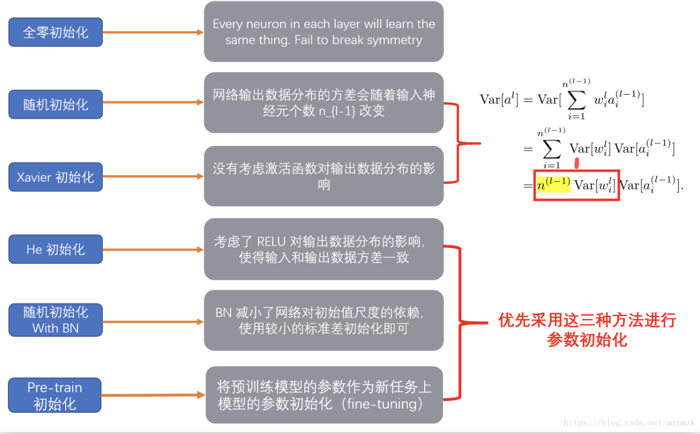

1. 将所有权重初始化为零

    会使模型相当于是一个线性模型，因为如果将权重初始化为零，那么损失函数对每个 w 的梯度都会是一样的，这样在接下来的迭代中，同一层内所有神经元的梯度相同，梯度更新也相同，所有的权重也都会具有相同的值，这样的神经网络和一个线性模型的效果差不多。（将 biases 设为零不会引起多大的麻烦，即使 bias 为 0，每个神经元的值也是不同的。）
2. 随机初始化

    将权重进行随机初始化，使其服从标准正态分布 （ np.random.randn(size_l, size_l-1)  ）在训练深度神经网络时可能会造成两个问题，梯度消失和梯度爆炸。

3. Xavier

    正向传播时，状态值的方差保持不变；反向传播时，关于激活值的梯度的方差保持不变。

    Xavier初始化可以帮助减少梯度弥散问题， 使得信号在神经网络中可以传递得更深。是最为常用的神经网络权重初始化方法。
    
    算法根据输入和输出神经元的数量自动决定初始化的范围: 定义参数所在的层的输入维度为n,输出维度为m,那么参数将从$[-\sqrt{\frac{6}{m+n}}, \sqrt{\frac{6}{m+n}}]$均匀分布中采样

4. MSRA

    上边所提的初始化方式为使每层方差一致，从而不会发生前向传播爆炸和反向传播梯度消失等问题。

    对于ReLU激活函数，其使一半数据变成0，初始时这一半的梯度为0，而tanh和sigmoid等的输出初始时梯度接近于1.因此使用ReLU的网络的参数方差可能会波动。

    提出使用Var(𝑊)=$\frac{2}{n_{in}}$放大一倍方差来保持方差的平稳。

    前向和后向推导的方差均控制在2𝑛,综合起来使用均值为0,方差为$[\sqrt{\frac{4}{n_{in}+n_{out}}}$的高斯分布.

5. He：
   正向传播时，状态值的方差保持不变；反向传播时，关于激活值的梯度的方差保持不变。

   - 适用于ReLU的初始化方法：
  
        $[0, \sqrt{\frac{2}{n}}]$

   - 适用于Leaky ReLU的初始化方法：

        $[0, \sqrt{\frac{2}{(1+\alpha ^2)n}}]$
        
        n = h * w * d

    
6. bias初始化
   
   通常初始化为0(若初始化为0.01等值,可能并不能得到好的提升,反而可能下降)

7. 总结：

     

参考：

https://www.cnblogs.com/makefile/p/init-weight.html

