### AdaBoost

集成学习按照个体学习器之间是否存在依赖关系可以分为两类，第一个是个体学习器之间存在强依赖关系，另一类是个体学习器之间不存在强依赖关系。前者的代表算法就是是boosting系列算法。在boosting系列算法中， Adaboost是最著名的算法之一。Adaboost既可以用作分类，也可以用作回归

### boosting算法的基本原理

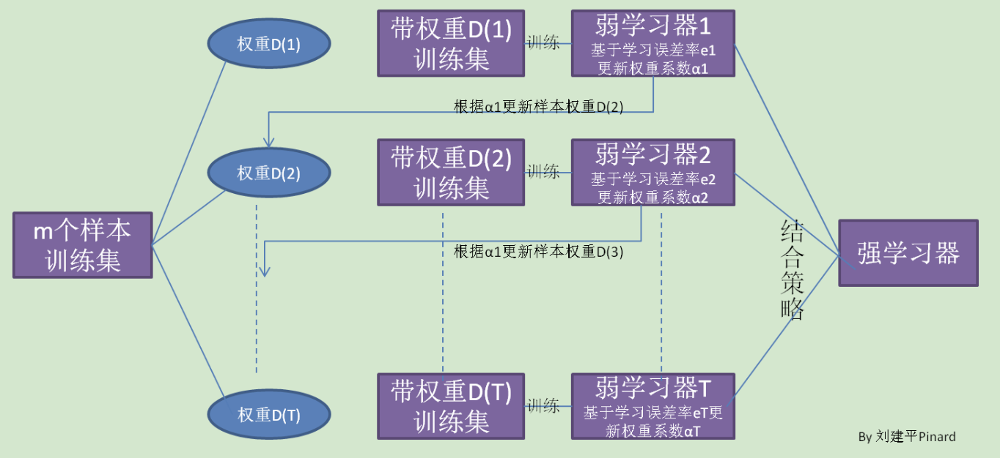

从图中可以看出，Boosting算法的工作机制是首先从训练集用初始权重训练出一个弱学习器1，根据弱学习的学习误差率表现来更新训练样本的权重，使得之前弱学习器1学习误差率高的训练样本点的权重变高，使得这些误差率高的点在后面的弱学习器2中得到更多的重视。然后基于调整权重后的训练集来训练弱学习器2.，如此重复进行，直到弱学习器数达到事先指定的数目T，最终将这T个弱学习器通过集合策略进行整合，得到最终的强学习器。　　

不过有几个具体的问题Boosting算法没有详细说明。

1. 如何计算学习误差率e?
2. 如何得到弱学习器权重系数𝛼?
3. 如何更新样本权重D?
4. 使用何种结合策略？

只要是boosting大家族的算法，都要解决这4个问题。那么Adaboost是怎么解决的呢？

### Adaboost算法的基本思路

这里讲解Adaboost是如何解决这4个问题的

假设我们的训练集样本是:

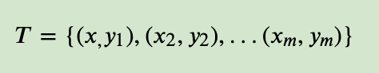
    
训练集的在第k个弱学习器的输出权重为

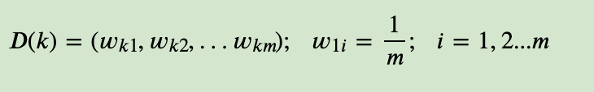

#### Adaboost分类问题

首先我们看看Adaboost的分类问题。

分类问题的误差率很好理解和计算。由于多元分类是二元分类的推广，这里假设我们是二元分类问题，输出为{-1，1}，则第k个弱分类器𝐺𝑘(𝑥)在训练集上的加权误差率为

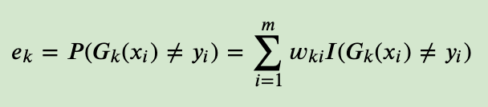

接着我们看弱学习器权重系数,对于二元分类问题，第k个弱分类器𝐺𝑘(𝑥)的权重系数为

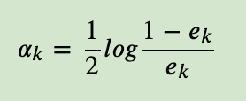

为什么这样计算弱学习器权重系数？从上式可以看出，如果分类误差率𝑒𝑘越大，则对应的弱分类器权重系数𝛼𝑘越小。也就是说，误差率小的弱分类器权重系数越大。具体为什么采用这个权重系数公式，我们在讲Adaboost的损失函数优化时再讲。

第三个问题，更新更新样本权重D。假设第k个弱分类器的样本集权重系数为𝐷(𝑘)=(𝑤𝑘1,𝑤𝑘2,...𝑤𝑘𝑚)，则对应的第k+1个弱分类器的样本集权重系数为

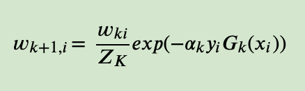

这里𝑍𝑘是规范化因子

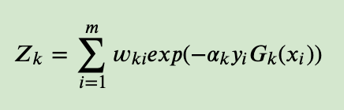

从𝑤𝑘+1,𝑖计算公式可以看出，如果第i个样本分类错误，则𝑦𝑖𝐺𝑘(𝑥𝑖)<0，导致样本的权重在第k+1个弱分类器中增大，如果分类正确，则权重在第k+1个弱分类器中减少.具体为什么采用样本权重更新公式，我们在讲Adaboost的损失函数优化时再讲。

最后一个问题是集合策略。Adaboost分类采用的是加权表决法，最终的强分类器为

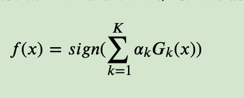

#### Adaboost回归问题

接着我们看看Adaboost的回归问题。由于Adaboost的回归问题有很多变种，这里我们以Adaboost R2算法为准。

我们先看看回归问题的误差率的问题，对于第k个弱学习器，计算他在训练集上的最大误差

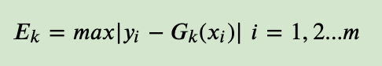

然后计算每个样本的相对误差

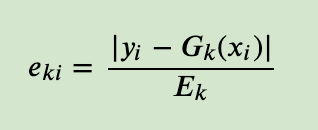

这里是误差损失为线性时的情况，如果我们用平方误差，则

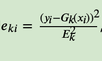

如果我们用的是指数误差，则

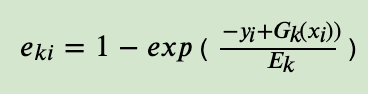

最终得到第k个弱学习器的 误差率

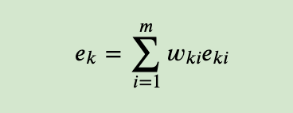

我们再来看看如何得到弱学习器权重系数𝛼。这里有：

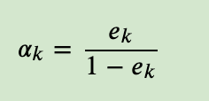

对于更新更新样本权重D，第k+1个弱学习器的样本集权重系数为

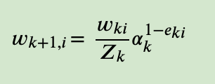

这里𝑍𝑘是规范化因子

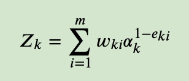

最后是结合策略，和分类问题稍有不同，采用的是对加权的弱学习器取权重中位数对应的弱学习器作为强学习器的方法，最终的强回归器为

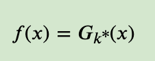

其中，𝐺𝑘∗(𝑥)是所有$𝑙𝑛\frac{1}{a_k}$,𝑘=1,2,....𝐾的中位数值对应序号𝑘∗对应的弱学习器。　

### AdaBoost分类问题的损失函数优化

Adaboost是模型为加法模型，学习算法为前向分步学习算法，损失函数为指数函数的分类问题。

模型为加法模型好理解，我们的最终的强分类器是若干个弱分类器加权平均而得到的。

前向分步学习算法也好理解，我们的算法是通过一轮轮的弱学习器学习，利用前一个强学习器的结果和当前弱学习器来更新当前的强学习器的模型。

也就是说，第k-1轮的强学习器为

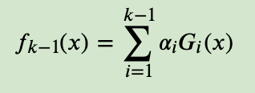

而第k轮的强学习器为

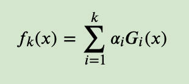

上两式一比较可以得到

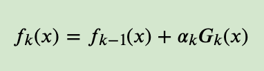

可见强学习器的确是通过前向分步学习算法一步步而得到的。

Adaboost损失函数为指数函数，即定义损失函数为

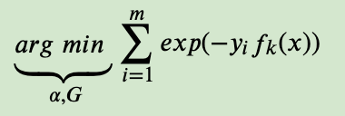

利用前向分步学习算法的关系可以得到损失函数为

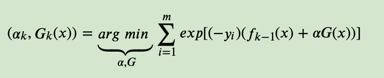

令

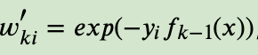

它的值不依赖于𝛼,𝐺,因此与最小化无关，仅仅依赖于𝑓𝑘−1(𝑥),随着每一轮迭代而改变。

将这个式子带入损失函数,损失函数转化为

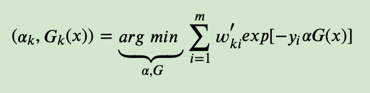

首先，我们求𝐺𝑘(𝑥).，可以得到

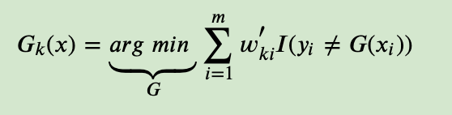

将𝐺𝑘(𝑥)带入损失函数，并对𝛼求导，使其等于0，则就得到了

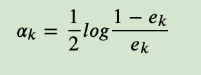

其中，𝑒𝑘即为我们前面的分类误差率。

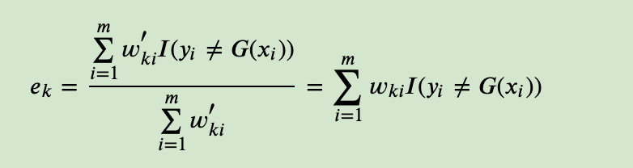

最后看样本权重的更新。利用𝑓𝑘(𝑥)=𝑓𝑘−1(𝑥)+𝛼𝑘𝐺𝑘(𝑥)和𝑤′𝑘𝑖=𝑒𝑥𝑝(−𝑦𝑖𝑓𝑘−1(𝑥))，即可得：

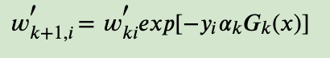

### AdaBoost二元分类问题算法流程

这里我们对AdaBoost二元分类问题算法流程做一个总结。

输入为样本集𝑇={(𝑥,𝑦1),(𝑥2,𝑦2),...(𝑥𝑚,𝑦𝑚)}，

输出为{-1, +1}，弱分类器算法, 弱分类器迭代次数K。

输出为最终的强分类器𝑓(𝑥)

1. 初始化样本集权重为
   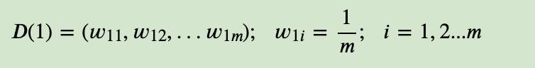
2. 对于k=1,2，...K:
   1. 使用具有权重𝐷𝑘的样本集来训练数据，得到弱分类器𝐺𝑘(𝑥)
   2. 计算𝐺𝑘(𝑥)的分类误差率
        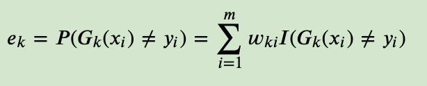
   3. 计算弱分类器的系数
        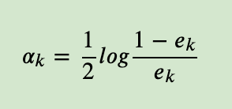
   4. 更新样本集的权重分布
        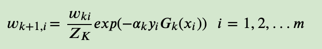
   5. 这里𝑍𝑘是规范化因子
        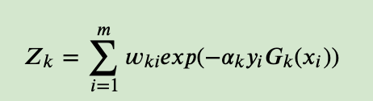
3. 构建最终分类器为：
    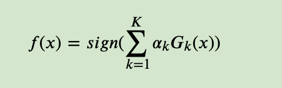

对于Adaboost多元分类算法，其实原理和二元分类类似，最主要区别在弱分类器的系数上。比如Adaboost SAMME算法，它的弱分类器的系数

其中R为类别数。从上式可以看出，如果是二元分类，R=2，则上式和我们的二元分类算法中的弱分类器的系数一致。

### Adaboost算法的正则化

为了防止Adaboost过拟合，我们通常也会加入正则化项，这个正则化项我们通常称为步长(learning rate)。定义为𝜈,对于前面的弱学习器的迭代

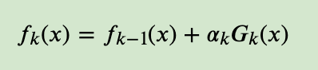

加上正则化：

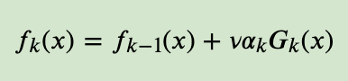

𝜈的取值范围为0<𝜈≤1。对于同样的训练集学习效果，较小的𝜈意味着我们需要更多的弱学习器的迭代次数。通常我们用步长和迭代最大次数一起来决定算法的拟合效果。

### Adaboost小结

到这里Adaboost就写完了，前面有一个没有提到，就是弱学习器的类型。理论上任何学习器都可以用于Adaboost.但一般来说，使用最广泛的Adaboost弱学习器是决策树和神经网络。对于决策树，Adaboost分类用了CART分类树，而Adaboost回归用了CART回归树。

这里对Adaboost算法的优缺点做一个总结。

Adaboost的主要优点有：
1. Adaboost作为分类器时，分类精度很高
2. 在Adaboost的框架下，可以使用各种回归分类模型来构建弱学习器，非常灵活。
3. 作为简单的二元分类器时，构造简单，结果可理解。
4. 不容易发生过拟合

Adaboost的主要缺点有：

1. 对异常样本敏感，异常样本在迭代中可能会获得较高的权重，影响最终的强学习器的预测准确性。

参考：
https://www.cnblogs.com/pinard/p/6133937.html

