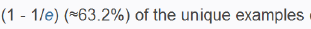
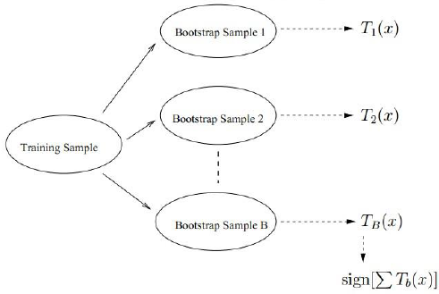
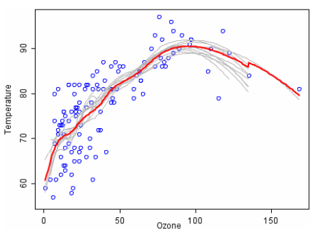
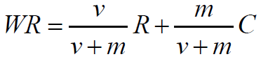

## Bagging

其实Bagging和随机森林的思想都是可以普适性的用在其他的分类器上的，思想其实都是可以通用的，只不过有的合适有的不合适而已，决策树就是一种比较合适用Bagging和随机森林来提升的分类器之一。

BootStrap Aggregation：从样本中重采样(有重复的)选出n个样本，在所有的属性上，对这n个样本建立分类器。

重复上述步骤m次，得到m个分类器，将所有数据放在这m个分类器上，最后根据这m个分类器的投票结果决定属于哪一类。

有论文证明，BootStrap 采样，大约会有63%是不重复的：

里边的具体证明咱就不管了，知道这么个事情就可以了。

这幅图是说明了Bagging的这个过程以及投票。

## 随机森林

随机森林在Bagging的基础上做了修改：

1. 从样本中用BootStrap 采样了n个样本。

2. 从所有属性中随机选择K个属性，选择最佳分割属性作为结点建立CART决策树。

3. 重复上边2步m次，即建立m棵CART决策树。

4. 这m棵CART树形成随机森林，通过投票表决结果属于哪一类。

我们介绍的是使用决策树作为基本分类器，当然也可以是别的分类器。

当然了，除了分类问题，回归问题也可以尝试使用：

显然红色曲线基本上优于每一条灰色的，其实红色曲线就是灰色曲线取平均得来的，这样的红色曲线是比较稳定的并且不容易过拟合。

### 最后是投票机制：

#### 简单投票机制：

1. 一票否决

2. 少数服从多数（可以加权）

3. 阈值表决

#### 贝叶斯投票机制：

假定有N个用户可以为X个电影投票(假设某位投票者不可对同一电影重复投票)，投票有1，2，3，4，5个档。

根据用户投票可以对电影排序：

本质是分类问题，对于某电影，有N个决策树，每棵树对电影有一个分类(1,2,3,4,5)，求这电影属于哪一类？（如果可以是小数，就变成了回归问题）

一种可能：

- WR：加权得分(weighted rating)
- R： 该电影的用户投票的平均得分(Rating)
- C： 所有电影的平均得分
- v： 该电影的投票人数(votes)
- m： 排名前250名电影的最低投票数

我们现在来分析一下这个公式，假设现在有一个电影，没人投票，那么也就是v = 0，那么也就是说该电影的得分就是所有电影的平均分。假设m这个超参数是0，那么也就是说最后的得分就是用户的投票啊。

还是很有道理的吧，还是很喜欢贝叶斯思维的。

