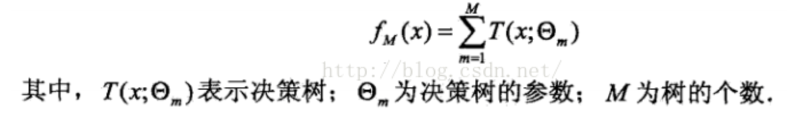
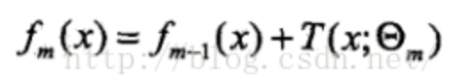
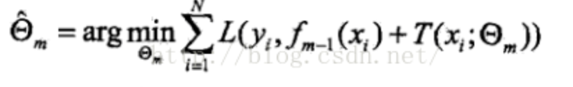
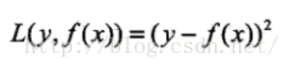
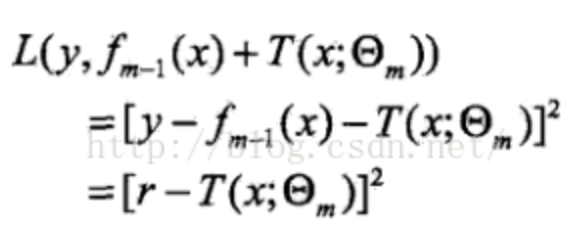

既然是基于残差的决策树，那么就有基于其他的决策树，后续还会介绍基于伪残差的决策树（GBDT），所谓残差就是样本x的标记值y与预测值的差值而已

提升树算法：

提升树是加法模型和前向分布算法的结合实现的，这个加法模型我们不妨用如下公式表达：

那么首先不出意外会要确定一个f0(x0)，这里不妨设定f0(x)=0，那么第m步的模型应该是：

其中fm-1(x)是当前的模型，fm(x)是下一个要算的，通过经验风险极小化求得下一棵决策树的Θm

当采用平方误差作为损失函数时，则有

将f(x)带入公式，此时的损失为：

其中r = y - fm-1(x)就是前边提到的残差，所以提升树实际是针对残差进行拟合的

具体算法如下：

