#### SVM

SVM可以分为三种：

- 线性可分支持向量机：硬间隔最大化 hard margin maximitation、硬间隔支持向量机
- 线性支持向量机：软间隔最大化 soft margin maximitation、软间隔支持向量机
- 非线性支持向量机：核函数 kernel function

我们都知道SVM其实就是找一个最优分割超平面将两个集合尽可能地分开：

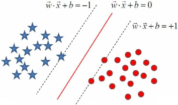

其中落在红色分割面两侧的虚线上的样本我们称之为支撑向量，是这几个向量将超平面支撑起来，如果超平面确定了，我们在虚线以外随意移动其他的样本，不会对超平面产生生任何影响，也就是说这个超平面是由少数的几个向量确定的，所以SVM又被称为稀疏的模型。

从下边这幅图中可以看得出，有n条直线可以将两边的集合完全分开，那么我们怎么找到这个能使两个集合尽量分开的超平面呢？

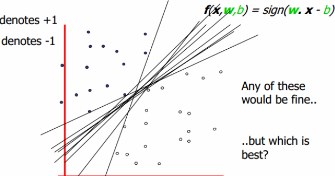

### 线性可分支持向量机

假设给定一个特征空间上的训练数据集：T = {(x1，y1)，(x2，y2) ... (xn，yn)}，其中：

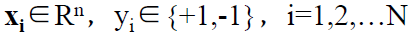

xi为第i个样本实例(如果n>1，x为向量)，yi为xi的类标记，当yi = +1时，称xi为正例；当yi = -1时，称xi为负例。

那么现在就来说说怎么找这个间隔最大化，首先看下面这幅图：

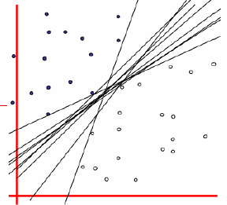

我们看得到图中有n条直线，m个样本点，我们先来取一条直线，假如是n1这条直线，那么我就可以求所有的m个样本点到这条直线的距离，记作n1：diatance11、distance12 ... distnce 1m，我们在这m个点到n1的距离中取一个最小距离，接着我们取第二条线，那么我们就可以求所有的m个样本点到这条直线的距离，记作n2：diatance21、distance22 ... distnce 2m，再从中选一个最小的距离，知道所有直线取完，那么我们会得到这么一个数据：

n1：diatance 11、distance 12 ... distnce 1m   取最小的一个距离

n2：diatance 21、distance 22 ... distnce 2m   取最小的一个距离

n3：diatance 31、distance 32 ... distnce 3m   取最小的一个距离

nn：diatance n1、distance n2 ... distnce nm  取最小的一个距离

那么最终会得到n个最小的距离，我们再从这n个最小距离中取一个最大的距离，这不就是最优的么！！！！！！

通过上边的想法，给定线性可分训练数据集，通过间隔最大化得到的分割超平面为:

相应的的分类决策函数(输出+-1)：

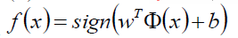

那么我们怎么来进行推导目标函数呢？

根据题设：

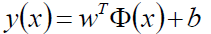

那么就有：

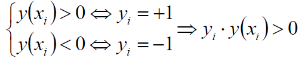

其中y(x)是我们的预测值，如果预测值>0，乘以标记值+1那么就>0；如果预测值为<0，乘以标记值-1那么就>0。

2x+3b+6=0和4x+6b+12=0其实时一条线，我们就通过w和b等比例缩放，改变点到直线的距离，另外除了一个||w||来做归一化，其实如果抛去yi不看的话，那其实不就是距离公式嘛：

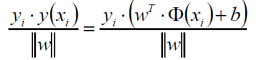

那么我们的目标函数就出来了：

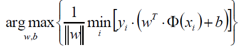

这个式子看起来好像挺复杂，其实仔细一看不就是上边我们推导的最小距离取最大的那个过程嘛。只不过这里把||w||放在了前边而已。

我们知道几何间距和函数间距其实是差了一个归一化：

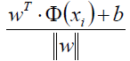

那么加上这么一个||w||有什么好处呢？好处就在于我们总能通过等比例缩放||w||的方法，使得两类点的函数值都满足|y|≥1

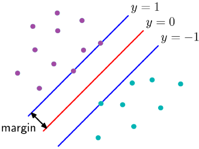

既然如此，那么就有了这个一个约束条件,因为我们最初的目的不就是要将所有样本点分开嘛，通过w缩放使得距离至少为1嘛:

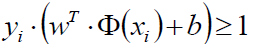

我们再来看原来的目标函数：

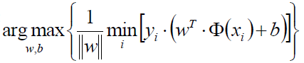

现在可以知道，y*y(x)≥1，那么取最小值不就是1嘛，那后边去的i个1嘛，那就统统的扔掉：

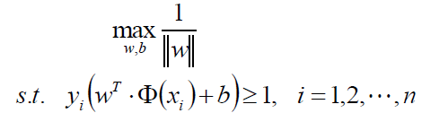

我们可以做如下的等价变换，将求最大变成求最小：

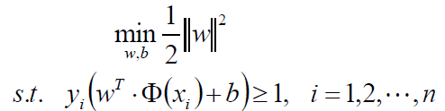

我们现在来看看这目标函数，既然是个二次的，那么就是一个凸的，约束条件也是线性的，那么就是一个凸优化问题，并且是一个满足KKT条件的，那么我们就可以大胆的使用拉格朗日乘子法：

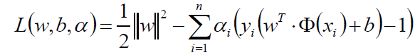

那么我们原函数的问题是一个极小极大问题：

那么原问题的对偶问题就是一个极大极小问题：

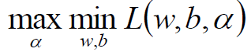

将拉格朗日函数L(w,b,α)分别对w、b求偏导，并令其为0可得：

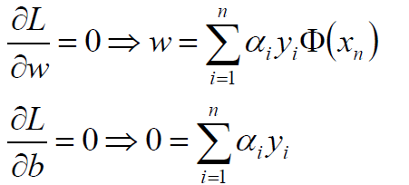

将w、b回代到拉格朗日函数中：

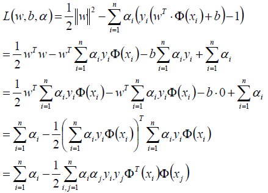

求得α*等于：

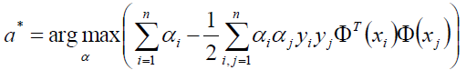

我们似乎还有一个条件没有用上呢：

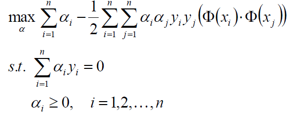

整理目标函数，添加条件：

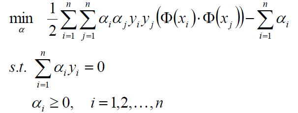

那么现在的问题就剩下了怎么求这个α了，其实有两种办法，一种是SMO，另外一种就是梯度下降。SMO我们将在后文中单独介绍。

### 线性支持向量机

实际情况中，如果都能像线性可分支持向量机所设想的那样自然是最好的，如果不是呢？

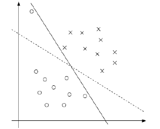

有两个问题：
- 第一，不一定分类完全正确的超平面就是最好的。
- 第二，样本数据本身线性不可分。

若数据线性不可分，则增加松弛因子ξ≥0，使得函数间隔加上松弛因子后大于等于1，这样的话约束条件变为：

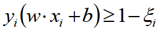

那么线性SVM的目标函数为：

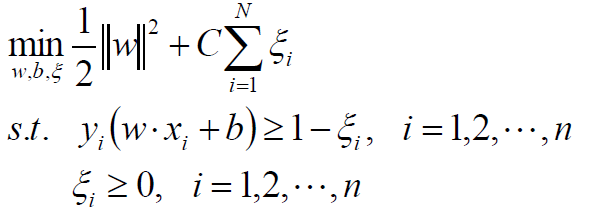

拉格朗日函数：

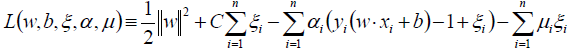

对w、b、ξ求偏导并为0：

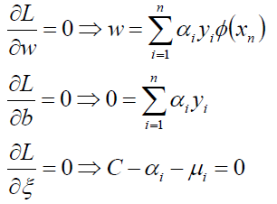

带回到拉格朗日函数：

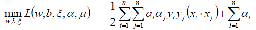

对上式关于α求极大：

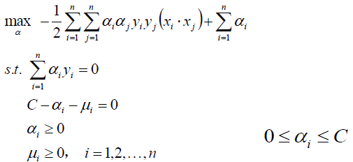

整理得：

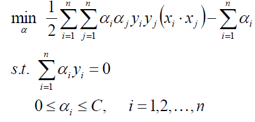

又回到求优化α得问题上，下一篇文章将会介绍SMO得办法求优化α，如果求得了α，带入得到w、b：

既然w、b都有了，那么分割超平面就有了：

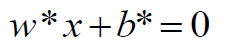

最终套进一个决策函数就完事了。

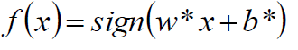

### 损失函数分析

那么SVM得损失怎么来看呢？

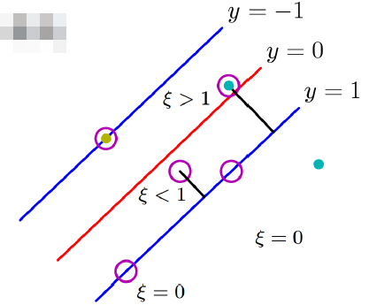

从图中可以清楚地看出，如果样本没有超过y=1或y=-1这两条线之间的话，那么是不惩罚的，如果进入分隔带就要惩罚了，惩罚的力度就是离y得距离，离得越远惩罚越大，也就是说某些点没有超过y=0，虽然分对了，但是任然要惩罚，超过了y=0自然是更要惩罚了，其中ξ就是惩罚力度，分对了并且在分隔带两侧不惩罚，分对了在分隔带以内惩罚0<ξ<1，分错了在分隔带另外一侧的话惩罚大于1。

我们可以从一幅图来形象得说明这个损失：

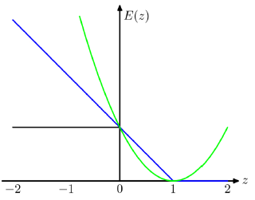

其中蓝色线就是SVM得损失：Hinge loss 或者叫铰链损失、合页损失。

黑色线是误分类率，绿色线是误差平方和。

### 非线性支持向量机

核函数：我们可以使用核函数，将原始输入空间映射到新的样本空间，从而使原来线性不可分得变成高维得线性可分。

核函数有很多种：

多项式核函数：

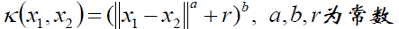

高斯核函数：

字符串核函数：如果两个字符串满足某条件得字串得余弦相似度。

虽然说有这么多种核函数，其实我就用过一种高斯核函数(RBF)

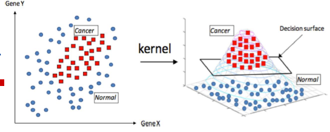

到此SVM就介绍完了，说一下在使用sklearn包的时候几个超参数得作用吧：

C：如果C趋近于无穷大，那么就退化为线性可分得SVM，C越大，分隔带就越窄，泛化能力就越差，C越小，分隔带就越宽，泛化能力越好。

γ：在RBF中，γ是控制每个样本x峰得能力，γ越大，泛化能力就越差，x对应的峰就高瘦，其实就是影响样本的作用范围，γ其实还影响了支持向量的个数，个数多训练速度会慢。

σ：也是影响x得作用范围，如果小的话x得峰就会高瘦，作用范围也小。

