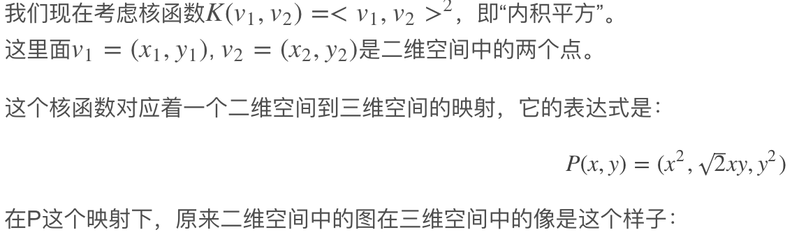
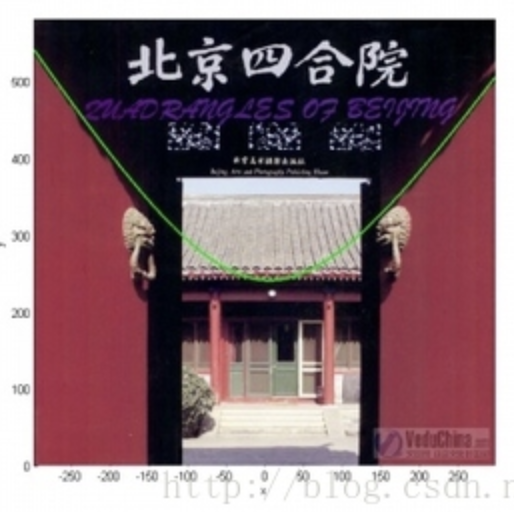
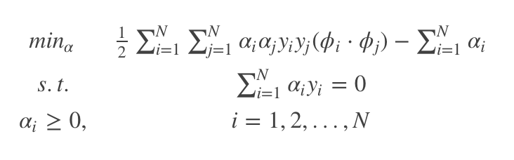
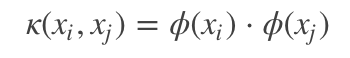
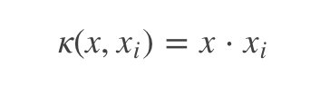
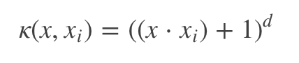
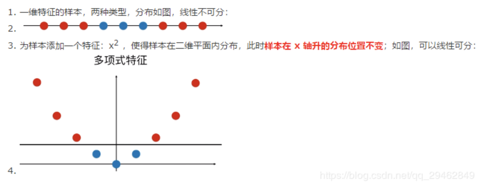
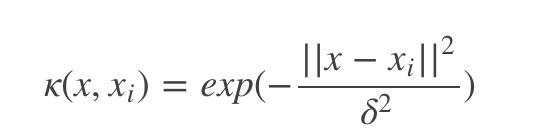
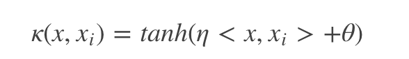

### 核函数把低维空间映射到高维空间

下面这张图位于第一、二象限内。我们关注红色的门，以及“北京四合院”这几个字下面的紫色的字母。我们把红色的门上的点看成是“+”数据，紫色字母上的点看成是“-”数据，它们的横、纵坐标是两个特征。显然，在这个二维空间内，“+”“-”两类数据不是线性可分的。

前后轴为x轴，左右轴为y轴，上下轴为z轴）
注意到绿色的平面可以完美地分割红色和紫色，也就是说，两类数据在三维空间中变成线性可分的了。
而三维中的这个判决边界，再映射回二维空间中是这样的：

这是一条双曲线，它不是线性的。

如上面的例子所说，核函数的作用就是隐含着一个从低维空间到高维空间的映射，而这个映射可以把低维空间中线性不可分的两类点变成线性可分的。当然，我举的这个具体例子强烈地依赖于数据在原始空间中的位置。事实中使用的核函数往往比这个例子复杂得多。它们对应的映射并不一定能够显式地表达出来；它们映射到的高维空间的维数也比我举的例子（三维）高得多，甚至是无穷维的。这样，就可以期待原来并不线性可分的两类点变成线性可分的了。

SVM核函数的选择对于其性能的表现有至关重要的作用，尤其是针对那些线性不可分的数据，因此核函数的选择在SVM算法中就显得至关重要。对于核技巧我们知道，其目的是希望通过将输入空间内线性不可分的数据映射到一个高纬的特征空间内使得数据在特征空间内是可分的，我们定义这种映射为ϕ(x)，那么我们就可以把求解约束最优化问题变为

但是由于从输入空间到特征空间的这种映射会使得维度发生爆炸式的增长，因此上述约束问题中内积ϕi⋅ϕj的运算会非常的大以至于无法承受，因此通常我们会构造一个核函数

从而避免了在特征空间内的运算，只需要在输入空间内就可以进行特征空间的内积运算。通过上面的描述我们知道要想构造核函数κ，我们首先要确定输入空间到特征空间的映射，但是如果想要知道输入空间到映射空间的映射，我们需要明确输入空间内数据的分布情况，但大多数情况下，我们并不知道自己所处理的数据的具体分布，故一般很难构造出完全符合输入空间的核函数，因此我们常用如下几种常用的核函数来代替自己构造核函数：

### 常见的核函数

#### 线性核函数

线性核，主要用于线性可分的情况，我们可以看到特征空间到输入空间的维度是一样的，其参数少速度快，对于线性可分数据，其分类效果很理想，因此我们通常首先尝试用线性核函数来做分类，看看效果如何，如果不行再换别的

优点：
- 方案首选，奥卡姆剃刀定律
- 简单，可以求解较快一个QP问题
- 可解释性强：可以轻易知道哪些feature是重要的

限制：只能解决线性可分问题

#### 多项式核函数

多项式核函数可以实现将低维的输入空间映射到高纬的特征空间，但是多项式核函数的参数多，当多项式的阶数比较高的时候，核矩阵的元素值将趋于无穷大或者无穷小，计算复杂度会大到无法计算。

优点：
- 可解决非线性问题
- 可通过主观设置幂数来实现总结的预判
  
缺点：
- 对于大数量级的幂数，不太适用
- 比较多的参数要选择

#### 高斯（RBF）核函数

高斯径向基函数是一种局部性强的核函数，其可以将一个样本映射到一个更高维的空间内，该核函数是应用最广的一个，无论大样本还是小样本都有比较好的性能，而且其相对于多项式核函数参数要少，因此大多数情况下在不知道用什么核函数的时候，优先使用高斯核函数。

优点：
- 可以映射到无限维
- 决策边界更为多样
- 只有一个参数，相比多项式核容易选择
  
缺点：
- 可解释性差(无限多维的转换，无法算w)
- 计算速度比较慢(解一个对偶问题)
- 容易过拟合(参数选不好时容易overfitting)

#### sigmoid核函数

采用sigmoid核函数，支持向量机实现的就是一种多层神经网络。

### 选用标准
- 如果特征的数量大到和样本数量差不多，则选用LR或者线性核的SVM；
- 如果特征的数量小，样本的数量正常，则选用SVM+高斯核函数；
- 如果特征的数量小，而样本的数量很大，则需要手工添加一些特征从而变成第一种情况。

### SVM的优缺点

1. SVM算法对大规模训练样本难以实施
   
    1. SVM的空间消耗主要是存储训练样本和核矩阵，由于SVM是借助二次规划来求解支持向量，而求解二次规划将涉及m阶矩阵的计算（m为样本的个数），当m数目很大时该矩阵的存储和计算将耗费大量的机器内存和运算时间。针对以上问题的主要改进有SMO算法、PCGC、CSVM以及SOR算法。
    2. 如果数据量很大，SVM的训练时间就会比较长，如垃圾邮件的分类检测，没有使用SVM分类器，而是使用了简单的naive bayes分类器，或者是使用逻辑回归模型分类。

2. 用SVM解决多分类问题存在困难
    1. 经典的支持向量机算法只给出了二类分类的算法，而在数据挖掘的实际应用中，一般要解决多类的分类问题。可以通过多个二类支持向量机的组合来解决。主要有一对多组合模式、一对一组合模式和SVM决策树；
    2. 再就是通过构造多个分类器的组合来解决。主要原理是克服SVM固有的缺点，结合其他算法的优势，解决多类问题的分类精度。如：与粗集理论结合，形成一种优势互补的多类问题的组合分类器。

3. 对缺失数据敏感，对参数和核函数的选择敏感
    1. 支持向量机性能的优劣主要取决于核函数的选取,所以对于一个实际问题而言,如何根据实际的数据模型选择合适的核函数从而构造SVM算法。目前比较成熟的核函数及其参数的选择都是人为的,根据经验来选取的,带有一定的随意性.
    2. 在不同的问题领域,核函数应当具有不同的形式和参数,所以在选取时候应该将领域知识引入进来,但是目前还没有好的方法来解决核函数的选取问题。