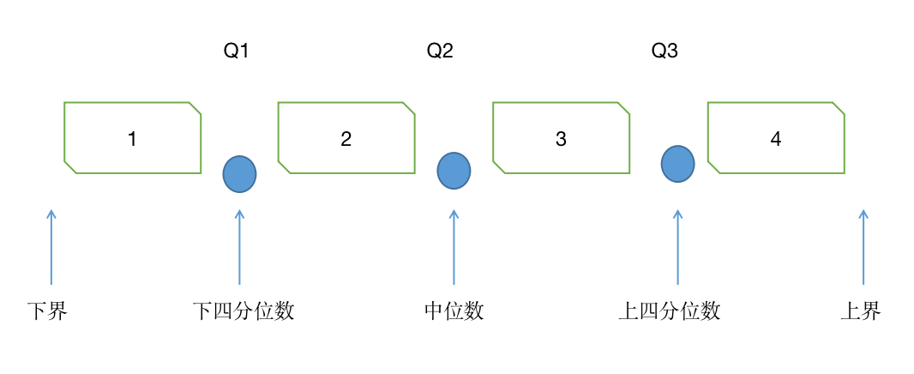

## 数据预处理

### 数据标准化
好处：
- 加速收敛
- 提升精度

1. min_max标准化

    x' = (x - xmin) / (xmax - xmin)

2. Z-score标准化

    x' = (x - $\mu$) / $\rho$

3. 小数定标标准化：
   
   通过移动小数点的位置进行数据标准化，小数点移动的位数取决于原始数据中的最大绝对值

   x' = x / 10j

4. 均值归一化法：

    x' = (x - ${\mu}$) / (xmax - xmin)

5. 向量归一化：

    通过用原始数据中的每个值除以所有数据之和

    x' = x / $\displaystyle \sum^{n}_{i = 1}{x_i}$
6. 指数转换：
   1. lg函数

        x' = lg(x) / lg(xmax)

   2. softmax函数

        x' = $e^x / \displaystyle \sum^{n}_{i = 1}{e^{x_i}}$
   3. sigmoid函数

        x' = $1 / (1 + e^{-x})$

### 数据离散化

1. 等宽分组

    (1, 7, 12, 22, 30, 34, 38, 46)分三组，每组宽度相等，即为最大值减最小值除以组数

    to

    (1, 16], (16, 31], (31, 46]

    对离群值敏感，各个区间数据不均匀

2. 等频分组
   
   一组数据N个数，分成3组，每组N/3个数

   会将相同的数分到不同组

3. 单变量分组：

    每个数一组，相同的数放到一组

4. 基于信息熵：

    1. 信息量：
    
        信息是用来消除随机不确定性的东西，衡量信息量的大小就看这个信息消除不确定性的程度

        信息量的大小和事件发生的概率成反比，信息量可表示为：

        l(x) = $-log_2 P(x)$

        信息量度量的是一件事发生所带来的信息

    2. 熵：

        熵是在结果出来之前，对可能产生的信息量的期望，考虑该随机变量的所有可能取值，即所有可能发生事件所带来的信息量期望

        E(x) = -$\displaystyle \sum^{n}_{i = 1}P(x_i)log_2 P(x_i)$

        总熵E是所有事件的熵的加权平均

        E = $\displaystyle \sum^{n}_{i = 1}w_iE_x$

        具体做法：

        1. 对属性A的所有值从小到大排序
        2. 将A划分为两个区间S1， S2，使得使得划分后数据集的熵S最小
        3. 当划分后的熵大于设置的阈值且小于数据分组个数时，递归对S1，S2拆分 

### 采样

1. 随机抽样：
   1. 有放回
   2. 无放回

2. 分层抽样
   1. 等个数抽样
   2. 等比例抽样
   
3. 系统抽样：排序，将数据分成等长n部分，第一部分随机抽取第K个数据，以此等间距l从每部分抽取一条
4. 渐进采样：比如用渐进采样学习一个线性回归模型，尽管预测模型的准确率会随着样本通联变大而变大，但在某一点处，会逐渐减小。

### 数据降维

- 线性降维：PCA、LDA
- 非线性降维：基于核函数的KPCA、KICA、KDA和基于特征值的ISOMAP、LLE、LE、LPP、LTSA、MVU

1. PCA：
   
   1. 对特征进行标准化
   2. 计算协方差矩阵
   3. 计算协方差矩阵的特征值和特征向量
   4. 选择最大的K个特征值对应的特征向量，得到特征向量矩阵
   5. 将数据变换到K维，得到新数据集

### 数据清理
1. 不合格数据修正
2. 缺失值填充

    1. 忽略数据
    2. 人工填写
    3. 全局固定值填充
    4. 使用属性的中心度量，如均值、中位数
    5. 给定元组的中位数或属性
    6. 使用回归、决策树等推理

3. 噪声点处理（同下）
4. 离群点处理
    
    检测方法：

    1. 正态分布检测
    2. tukey‘s test：基于四分位数计算出数据集中的最小估计值和最大估计值，超过最小最大即为异常值

        

        最小估计值为Q1-k(Q3-Q1),最大估计值为Q3+k(Q3-Q1)

        当k=1.5时，异常值为中度异常
        当k=3时，异常值重度异常

    3. 基于模型检测
   
        基于聚类、基于回归、基于临近度/距离/相似度、基于密度的异常点检测

### 相似度计算

