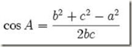
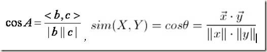
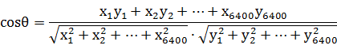

### 余弦距离

余弦距离，也称为余弦相似度，是用向量空间中两个向量夹角的余弦值作为衡量两个个体间差异的大小的度量。

向量，是多维空间中有方向的线段，如果两个向量的方向一致，即夹角接近零，那么这两个向量就相近。而要确定两个向量方向是否一致，这就要用到余弦定理计算向量的夹角。

余弦定理描述了三角形中任何一个夹角和三个边的关系。给定三角形的三条边，可以使用余弦定理求出三角形各个角的角度。假定三角形的三条边为a，b和c，对应的三个角为A，B和C，那么角A的余弦为：

如果将三角形的两边b和c看成是两个向量，则上述公式等价于：

其中分母表示两个向量b和c的长度，分子表示两个向量的内积。

举一个具体的例子，假如新闻X和新闻Y对应向量分别是：

x1, x2, ..., x6400和

y1, y2, ..., y6400

则，它们之间的余弦距离可以用它们之间夹角的余弦值来表示：

当两条新闻向量夹角余弦等于1时，这两条新闻完全重复（用这个办法可以删除爬虫所收集网页中的重复网页）；当夹角的余弦值接近于1时，两条新闻相似（可以用作文本分类）；夹角的余弦越小，两条新闻越不相关。

### 余弦距离和欧氏距离的对比

从上图可以看出，余弦距离使用两个向量夹角的余弦值作为衡量两个个体间差异的大小。相比欧氏距离，余弦距离更加注重两个向量在方向上的差异。借助三维坐标系来看下欧氏距离和余弦距离的区别：

从上图可以看出，欧氏距离衡量的是空间各点的绝对距离，跟各个点所在的位置坐标直接相关；而余弦距离衡量的是空间向量的夹角，更加体现在方向上的差异，而不是位置.

如果保持A点位置不变，B点朝原方向远离坐标轴原点，那么这个时候余弦距离是保持不变的（因为夹角没有发生变化），而A、B两点的距离显然在发生改变，这就是欧氏距离和余弦距离之间的不同之处。

欧氏距离和余弦距离各自有不同的计算方式和衡量特征，因此它们适用于不同的数据分析模型：

欧氏距离能够体现个体数值特征的绝对差异，所以更多的用于需要从维度的数值大小中体现差异的分析，如使用用户行为指标分析用户价值的相似度或差异。

余弦距离更多的是从方向上区分差异，而对绝对的数值不敏感，更多的用于使用用户对内容评分来区分兴趣的相似度和差异，同时修正了用户间可能存在的度量标准不统一的问题（因为余弦距离对绝对数值不敏感）。

余弦距离在给文本分类的词袋模型中使用，例如给一篇文章一共出现过6000个词，则用一个6000维度的向量X表示这篇文章，每个维度代表各个字出现的数目；另外一篇文章也恰好只出现过这6000字，用向量Y表示该文章，则这两篇文章相似度可以用余弦距离来测量。

优点：余弦距离根据向量方向来判断向量相似度，与向量各个维度的相对大小有关，不受各个维度直接数值影响。

### 归一化

一般来说，为了比较的方便，都会对得到的结果进行归一化处理：

- 在欧氏距离公式中，取值范围会很大，一般通过如下方式归一化：

sim = 1 / (1 + dist(X,Y))

- 因为余弦值的范围是 [-1,+1] ，相似度计算时一般需要把值归一化到 [0,1]，一般通过如下方式：

　　sim = 0.5 + 0.5 * cosθ

经过归一化处理以后，相似度全部落在了0和1之间，值越大，相似度越高