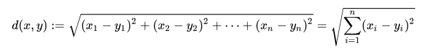

### 欧式距离
在数学中，欧几里得距离或欧几里得度量是欧几里得空间中两点间“普通”（即直线）距离。使用这个距离，欧氏空间成为度量空间。相关联的范数称为欧几里得范数。较早的文献称之为毕达哥拉斯度量



代码示例：

```python 
import numpy as np

def edclidean_distance(x1, x2):

    # 方法一
    distance = np.sqrt(np.sum(np.square(x1 - x2)))
    # 方法二
    distance = np.linalg.norm(x1 - x2)

```

