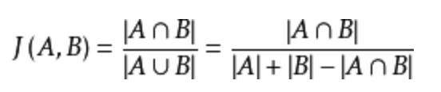
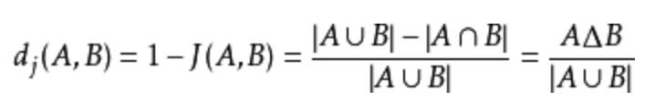

## 狭义Jaccard（杰卡德）系数

### Jaccard（杰卡德）系数
主要用于计算样本间的相似度。Jaccard系数的计算方式为：样本交集个数和样本并集个数的比值，用J(A,B)表示。公式为：

jaccard系数相反的即为jaccard距离，用两个集合中不同元素所占元素的比例来衡量两个样本之间的相似度，公式为：
 

### Jaccard系数主要的应用的场景有
- 过滤相似度很高的新闻，或者网页去重
- 考试防作弊系统
- 论文查重系统

### 缺点
 - 元素的取值只能是0或者1，无法利用更丰富的信息

举个栗子:

集合A = {a, b, c, d}

集合B = {c, d, e, f}

A∩B = {c, d}

A∪B = {a, b, c, d, e, f}

交集中有2个元素，并集中有6个元素，因此：

杰卡德系数为：J(A,B) = 2/6 = 1/3

杰卡德距离为：1 - J(A,B) = 2/3

## 广义Jaccard（杰卡德）系数

广义Jaccard相似度，元素的取值可以是实数。又称为Tanimoto系数，用EJ来表示，计算方式如下：

EJ(x, y) = (x * y) / (||x|| * ||x|| + ||y|| * ||y|| - x * y)

### 优点

元素的取值可以是实数