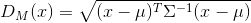
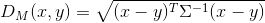
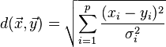
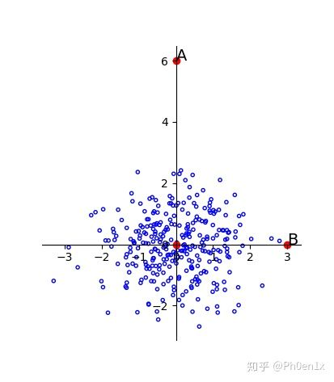
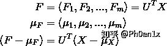
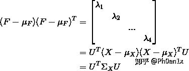
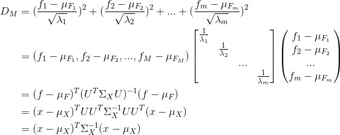

### 马氏距离(Mahalanobis Distance)
是度量学习中一种常用的距离指标，同欧氏距离、曼哈顿距离、汉明距离等一样被用作评定数据之间的相似度指标。但却可以应对高维线性分布的数据中各维度间非独立同分布的问题。

### 什么是马氏距离

表示数据的协方差距离。它是一种有效的计算两个未知样本集的相似度的方法。与欧氏距离不同的是它考虑到各种特性之间的联系

马氏距离是一种距离的度量，可以看作是欧氏距离的一种修正，修正了欧式距离中各个维度尺度不一致且相关的问题。

- 单个数据点的马氏距离，即独立于测量尺度

- 也可以定义为两个服从同一分布并且其协方差矩阵为Σ的随机变量x，y的差距

其中Σ是多维随机变量的协方差矩阵，μ为样本均值，如果协方差矩阵是单位向量，也就是各维度独立同分布，马氏距离就变成了欧氏距离，其中σi是xi的标准差。

马氏距离解决的问题就是上篇欧式距离中存在的问题

###  马氏距离的几何意义

只需要将变量按照主成分进行旋转，让维度间相互独立，然后进行标准化，让维度同分布就OK了

由主成分分析可知，由于主成分就是特征向量方向，每个方向的方差就是对应的特征值，所以只需要按照特征向量的方向旋转，然后缩放特征值倍就可以了，可以得到以下的结果：

离群点就被成功分离，这时候的欧式距离就是马氏距离。

马氏距离的推导

首先要对数据点进行旋转，旋转至主成分，维度间线性无关，假设新的坐标为

又变换后维度间线性无关且每个维度自己的方差为特征值，所以满足：

马氏距离是旋转变换缩放之后的欧式距离，所以马氏距离的计算公式为：

马氏距离的问题：

1. 协方差矩阵必须满秩
   
    里面有求逆矩阵的过程，不满秩不行，要求数据要有原维度个特征值，如果没有可以考虑先进行PCA，这种情况下PCA不会损失信息
2. 不能处理非线性流形(manifold)上的问题
   
    只对线性空间有效，如果要处理流形，只能在局部定义，可以用来建立KNN图

参考博客

http://weirping.coding.me/blog/Mahalanobis-distance.html