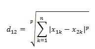
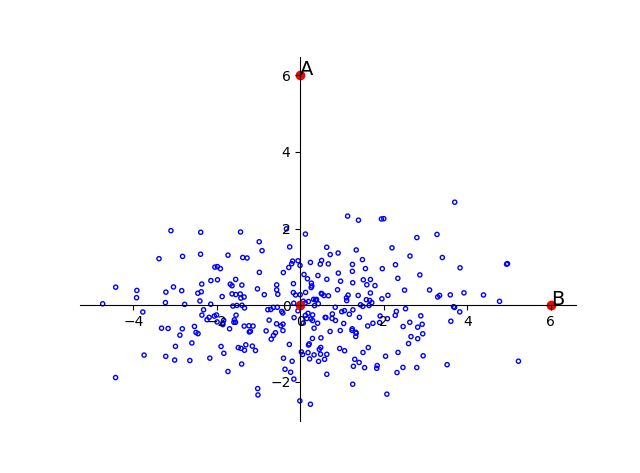
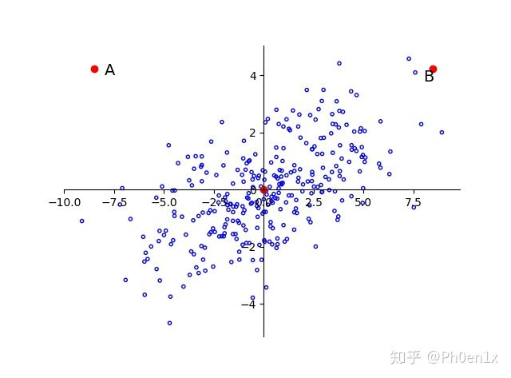

闵氏距离不是一种距离，而是一组距离的定义。

1. 闵氏距离的定义:
    两个n维变量a(x11, x12, …, x1n)与b(x21, x22, …, x2n)间的闵可夫斯基距离定义为：

    

    其中p是一个参数

    当p=1的时候，就是曼哈顿距离

    当p=2的时候，就是欧式距离

    当p趋于∞的时候，就是切比雪夫距离

2. 闵氏距离缺点：

    - 数据维度高的时候，将各个分量的量纲(scale)，也就是“单位”当作相同的看待了。

    - 没有考虑各个分量的分布（期望，方差等)可能是不同的。
    
    - 如果维度间不独立同分布，样本点一定与欧氏距离近的样本点同类的概率更大吗？

    举例来说：
    二维样本(身高,体重)，其中身高范围是150~190，体重范围是50~60，有三个样本：a(180,50)，b(190,50)，c(180,60)。
    那么a与b之间的闵氏距离（无论是曼哈顿距离、欧氏距离或切比雪夫距离）等于a与c之间的闵氏距离，但是身高的10cm真的等价于体重的10kg么？

    再举一个例子：
    计算向量(0,0)、(1,0)、(0,2)两两间的闵氏距离（以变参数为2的欧氏距离为例）

    X = [0 0 ; 1 0 ; 0 2] 

    D = pdist(X,'minkowski',2) 

    结果：
    D = 1.0000   2.0000    2.2361

    D = pdist(X, 'minkowski', 1)
    
    D = 1     2     3
    
    再举一个例子：

    现在有两个类别，统一单位，第一个类别均值为0，方差为0.1，第二个类别均值为5，方差为5。那么一个值为2的点属于第一类的概率大还是第二类的概率大？距离上说应该是第一类，但是直觉上显然是第二类，因为第一类不太可能到达2这个位置。

    

    再举一个例子：

    可以看到样本基本服从f(x) = x的线性分布，A与B相对于原点的距离依旧相等，显然A更像是一个离群点
    

