## 相关系数( Correlation coefficient ) ：

考察两个事物（在数据里我们称之为变量）之间的相关程度。

如果有两个变量：x,y, 最终计算出的相关系数的含义可以有如下理解：

- 当x的值增大（减小），y值增大（减小），两个变量为正相关，相关系数在0.00与1.00之间。

- 当相关系数为0时，x和y两变量无关系。

- 当x的值增大（减小），y值减小（增大），两个变量为负相关，相关系数在-1.00与0.00之间。

## 相关系数与相关距离定义

- 相关系数数学公式：

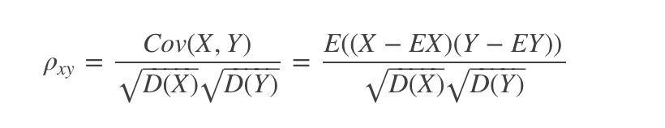

其中，E为数学期望或均值，D为方差，$\sqrt{D}$为标准差，Cov(X,Y)为协方差，而两个变量之间的协方差和标准差的商则称为随机变量X与Y的相关系数$ρ_{xy}$。

相关距离数学公式：

$D_{xy}=1−ρ_{xy}$

- 相关系数含义

相关系数的取值范围[−1,1]，相关系数的绝对值越大，相关性越强，相关系数越接近于1或-1，相关度越强，相关系数越接近于0，相关度越弱。通常情况下通过以下取值范围判断变量的相关强度：

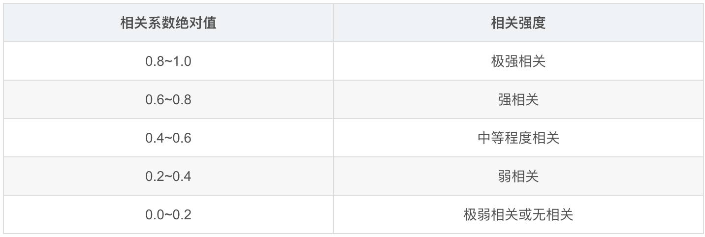

## 什么是皮尔逊相关

皮尔森相关系数（Pearson correlation coefficient）也称皮尔森积矩相关系数(Pearson product-moment correlation coefficient) ，是一种线性相关系数。皮尔森相关系数是用来反映两个变量线性相关程度的统计量。相关系数用r表示，其中n为样本量，分别为两个变量的观测值和均值。r描述的是两个变量间线性相关强弱的程度。r的绝对值越大表明相关性越强。

## 皮尔逊公式推导

两个变量之间的皮尔逊相关系数定义为两个变量之间的协方差和标准差的商。

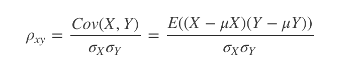

又因为

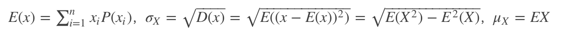

### 推导1：
定义了总体相关系数，常用希腊小写字母ρ作为符号代表。估算样本的协方差和标准差，可得到皮尔逊相关系数，常用英文小写字母r代表：

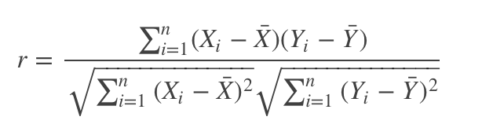

### 推导2：
r 亦可由(Xi,Yi)样本点的标准分数均值估计，样本方差， 令样本标准差和总体标准差相同S=σ得到与上式等价的表达式：

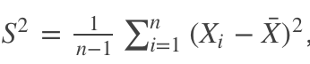

### 推导3：

由E((X−EX)(Y−EY))=E(XY)−E(X)E(Y)，故相关系数也可以表示成：

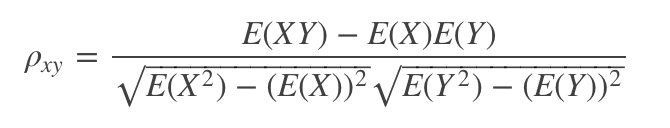

对于样本皮尔逊相关系数：

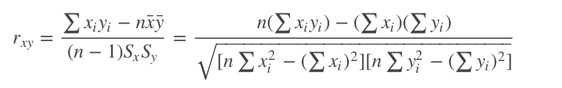

此公式也是统计学常用计算相关性公式之一。

### 推导4：

有关信号处理的皮尔逊相关性会出现这样一个式子，Pearson的相关系数测量了时域的线性相关。在两个信号之间x(t)和y(t)在零延迟。对于零均值，单位方差信号定义为:

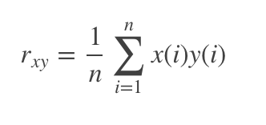

按照高中数学水平来理解, 它很简单, 可以看做将两组数据首先做Z分数处理之后, 然后两组数据的乘积和除以样本数，Z分数一般代表正态分布中, 数据偏离中心点的距离.等于变量减掉平均数再除以标准差.(就是高考的标准分类似的处理) ;

其中总体Z分数：
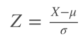

样本Z分数：
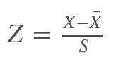

最终：

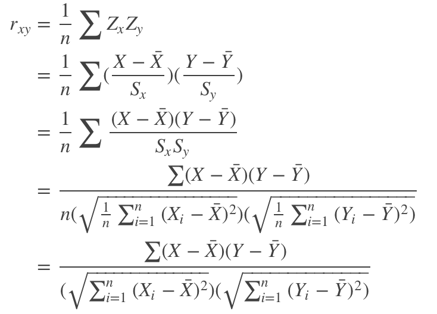

### 总结：
上述推导的四个皮尔逊公式是等价的，可自行选择使用！

## 皮尔逊相关系数的适用范围

当两个变量的标准差都不为零时，相关系数才有定义，皮尔逊相关系数适用于：

- 两个变量之间是线性关系，都是连续数据。
- 两个变量的总体是正态分布，或接近正态的单峰分布。
- 两个变量的观测值是成对的，每对观测值之间相互独立。