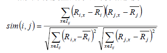
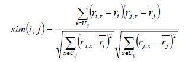
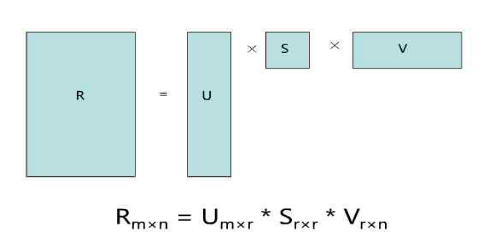
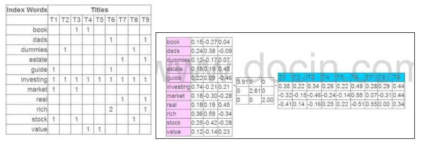

## Collaborative Filtering

CF算法的原理是汇总所有<user,item>的行为对, 利用集体智慧做推荐。其原理很像朋友推荐, 比如通过对用户喜欢的item进行分析, 发现用户A和用户B很像(他们都喜欢差不多的东西), 用户B喜欢了某个item, 而用户A没有喜欢, 那么就把这个item推荐给用户A。(User-Based CF)

当然, 还有另外一个维度的协同推荐。即对比所有数据, 发现itemA和itemB很像(他们被差不多的人喜欢), 那么就把用户A喜欢的所有item, 将这些item类似的item列表拉出来, 作为被推荐候选推荐给用户A。(Item-Based CF)

如上说的都是个性化推荐, 如果是相关推荐, 就直接拿Item-Based CF的中间结果就好啦。

#### 优点:
- 能起到意想不到的推荐效果, 经常能推荐出来一些惊喜结果
- 进行有效的长尾item
- 只依赖用户行为, 不需要对内容进行深入了解, 使用范围广

#### 缺点:
- 一开始需要大量的<user,item>行为数据, 即需要大量冷启动数据
- 很难给出合理的推荐解释

### 原理

协同过滤算法具体实现的时候, 又分为典型的两类:

#### 1.基于领域的协同过滤算法

这类算法的主要思想是利用<user,item>的打分矩阵, 利用统计信息计算用户和用户, item和item之间的相似度。然后再利用相似度排序, 最终得出推荐结果。

常见的算法原理如下:

1. User-Based CF
   
   先看公式:

    

    该公式要计算用户i和用户j之间的相似度, I(ij)是代表用户i和用户j共同评价过的物品, R(i,x)代表用户i对物品x的评分, R(i)头上有一杠的代表用户i所有评分的平均分, 之所以要减去平均分是因为有的用户打分严有的松, 归一化用户打分避免相互影响。

    该公式没有考虑到热门商品可能会被很多用户所喜欢, 所以还可以优化加一下权重, 这儿就不演示公式了。

    在实际生产环境中, 经常用到另外一个类似的算法Slope One, 该公式是计算评分偏差, 即将共同评价过的物品, 将各自的打分相减再求平均。

2. Item-Based CF
   
   先看公式:

   

   该公式跟User-Based CF是类似的, 就不再重复解释了。

这类算法会面临两个典型的问题:

- 矩阵稀疏问题
- 计算资源有限导致的扩展性问题

基于此, 专家学者们又提出了系列基于模型的协同过滤算法。

#### 2.基于模型的协同过滤算法

基于模型的研究就多了, 常见的有:

- 基于矩阵分解和潜在语义的
- 基于贝叶斯网络的
- 基于SVM的

这儿只简单介绍一下基于矩阵分解的潜在语义模型的推荐算法。该算法首先将稀疏矩阵用均值填满, 然后利用矩阵分解将其分解为两个矩阵相乘, 如下图:

看一个实际的例子:

这个例子中, 原始矩阵中包含了网页的Title和切词后的term之间关系,可以类比为推荐系统中的评分。

然后用SVD做矩阵分解之后, 针对每个term会对应一个3维向量, 针对每个Title也会对应一个3维向量。

那么接下来可以做的事情就很多了, 

- 如果要计算term和title的相似度, 只需要将这两个3为向量做内积得到的分值即可;
- 还可以将term和title都投影到这3维空间中, 然后利用各种聚类算法, 将用户和item, item和item, 用户和用户的分类都给求出来。

该算法的核心是在于做矩阵分解, 在矩阵大了的情况下计算量是非常夸张的, 在实际生产环境中会常用梯度递归下降方法来求得一个近似解。

#### 3.组合推荐技术

其实从实践中来看, 没有哪种推荐技术敢说自己没有弊端, 往往一个好的推荐系统也不是只用一种推荐技术就解决问题, 往往都是相互结合来弥补彼此的不足, 常见的组合方式如下:

- 混合推荐技术: 同时使用多种推荐技术再加权取最优;
- 切换推荐技术: 根据用户场景使用不同的推荐技术;
- 特征组合推荐技术: 将一种推荐技术的输出作为特征放到另一个推荐技术当中;
- 层叠推荐技术: 一个推荐模块过程中从另一个推荐模块中获取结果用于自己产出结果;

### Item-CF和User-CF选择

1. user和item数量分布以及变化频率

    1. 如果user数量远远大于item数量, 采用Item-CF效果会更好, 因为同一个item对应的打分会比较多, 而且计算量会相对较少
    2. 如果item数量远远大于user数量, 则采用User-CF效果会更好, 原因同上
    3. 在实际生产环境中, 有可能因为用户无登陆, 而cookie信息又极不稳定, 导致只能使用item-cf
    4. 如果用户行为变化频率很慢(比如小说), 用User-CF结果会比较稳定
    5. 如果用户行为变化频率很快(比如新闻, 音乐, 电影等), 用Item-CF结果会比较稳定
2. 相关和惊喜的权衡
    1. item-based出的更偏相关结果, 出的可能都是看起来比较类似的结果
    2. user-based出的更有可能有惊喜, 因为看的是人与人的相似性, 推出来的结果可能更有惊喜
3. 数据更新频率和时效性要求
    1. 对于item更新时效性较高的产品, 比如新闻, 就无法直接采用item-based的CF, 因为CF是需要批量计算的, 在计算结果出来之前新的item是无法被推荐出来的, 导致数据时效性偏低;
    2. 但是可以采用user-cf, 再记录一个在线的用户item行为对, 就可以根据用户最近类似的用户的行为进行时效性item推荐;
    3. 对于像影视, 音乐之类的还是可以采用item-cf的;

参考： 

https://www.cnblogs.com/xuanku/p/recsys.html

