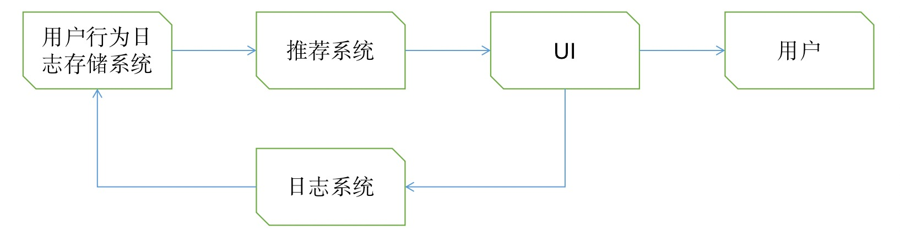
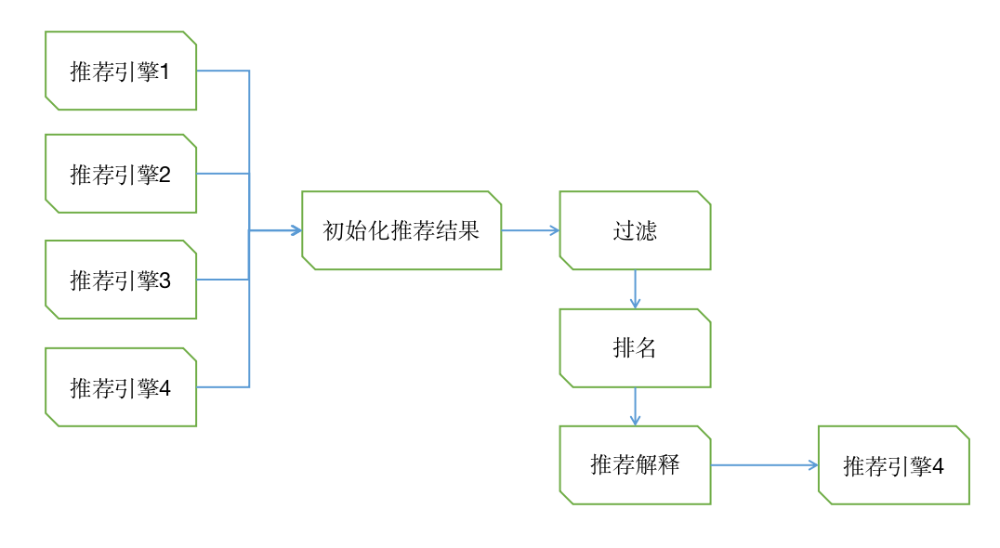
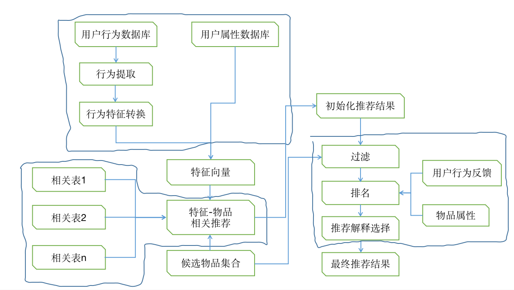

### 7.1 外围架构

推荐系统要发挥强大作用，除了推荐系统本身，主要还以来两个条件
- 界面展示
- 用户行为数据

推荐系统界面：

-   通过一定方式展示物品、包括标题、缩略图、介绍
-   很多推荐界面包含了推荐理由，以增加用户的信任度
-   推荐系统还需要提供一些按钮对推荐结果进行反馈

#### 数据收集与存储

需要实时存储的数据存储在数据库和缓存中，而大规模的非实时地存取数据存取在分布式文件系统（如HDFS）中

### 7.2 推荐洗哦太难过架构

推荐系统的核心人任务可以被拆解成两部分：
- 如何为给定用户生成特征
- 如何让根据特征找到物品

用户特征重力十分繁多，主要分为如下几类：
- 人口统计学特征
- 用户行为特征
- 用户话题特征：根据用户历史行为利用话题模型，将电视剧电影聚合成不同的话题，并计算出每个用户对什么话题感兴趣

推荐系统的推荐任务也有很多：
  - 将新加入的物品推荐给用户
  - 将商业上需要宣传的物品推荐给用户
  - 给用户推荐不同的种类的物品，比如图书、服装
  - 给用户混合推荐，有时候需要将图书和音像制品一起推荐
  - 对于不同的产品推荐不同新颖度的物品
  - 考虑推荐上下文
  - ...

推荐系统将需要由多个推荐引擎组成，每个推荐引擎负责一类特征和一种任务，而推荐系统的任务只是将推荐引擎的结果按照一定权重和优先级合并、排序然后返回

如上图，有两个好处：
- 方便的增加/删除引擎，控制不同引擎推荐结果的影响
- 可以实现推荐引擎级别的用户反馈：利用用户对不同推荐的偏好，动态调整推荐引擎权重

### 7.3 推荐引擎的架构

推荐引擎架构主要包括3部分：

- A部分负责从数据库或者缓存中拿到用户的行为数据，通过分析不同的行为，生成当前用户的特征向量
- B部分负责将用户的特征向量通过特征-物品向光矩阵转化为初始化推荐物品列表
- C部分负责对推荐列表进行过滤、排名等处理，从而生成推荐结果

#### 生成用户特征向量

用户特征包括两钟：
- 用户的注册信息提取
- 用户的行为计算

一个特征向量由特征及特征的权重组成：
- 用户行为的种类：一般某特征用户付出的代价越大，对应的特征权重就越大
- 用户行为差产生时间：时间越近越重要
- 行为次数：次数越多，权重越高
- 物品的热门程度：越热门，权重越低

#### 特征-物品相关推荐

一个推荐引擎的可以在配置文件中配置很多相关表以及他们的权重，而在线服务在启动的时候会将这些相关表按照配置的权重相加，将最终表存在内存中，而在给用户推荐时，使用的是已经加权后的

候选物品集合：

候选物品集合的目的是保证推荐结果只包含候选物品。他的应用场合一般是产品需求希望某些类型的电视剧推荐给用户，比如有些产品要求给用户推荐最近一周加入的新物品，那么候选物品就包括最近一周加入的新物品。

#### 过滤模块

一般来讲会过滤掉以下物品
- 已经产生过行为的物品
- 候选物品以外的物品：比如产品需求、用户设置的价格区间
- 某些质量很差的物品：比如评分低于2分

#### 排名模块

经过过滤的推荐结果直接展示给用户一般也没有问题，但如果对他们进行一些排名，则会更好的提升用户体验

1. 新颖度排名：
   
   $p_{ui}$ = ${\displaystyle \sum w_{ji} \cdot r_{uj}}$

   其中j就是关联用户和推荐物品的特征，$p_{ui}$最终的大小取决于$w_{ji}$和$r_{uj}$，因此都需要考虑进来

   
   通常热门物品和热门物品相似度大，如果用户对一个热门物品j产生了很多行为，就会有很大的$r_{uj}$，因此和这个热门物品相似的其他热门物品就会很靠前，因此需要对$r_{uj}$降权

   $r_{uj}$ = $\frac{r_{uj}}{\log(1 + \alpha \cdot popularity(j))}$

   从前面可以知道，热门物品之间更容易相似，冷门物品之间更容易相似。
   基于此，可以假设用户对热门物品j有过行为，那么与j相似的且比j相似的物品用户比较大概率也知道，因此可以降低这种商品的权重。

   $w_{ji}$ = $\frac{w_{ji}}{\log(1 + \alpha \cdot popularity(i))}$(popularity(i)>popularity(j))
   
2. 多样性
   
   - 将推荐结果按照某种物品的内容属性分成几类，然后在每个类中都选择该类排名最高的物品组合成最终的推荐列表
   - 让推荐结果来自不同的特征，具有不同的推荐理由

3. 时间多样性

    - 首先要保证推荐系统的实时性，在用户有新行为时实时调整推荐结果以满足用户最近的需求
    - 要在用户没有新的行为时，也要保证推荐结果每天都有变化
       
       1. 记录用户每天登陆推荐系统看到的结果
       2. 将这些结果发回日志系统，这种数据不需要实时，只要保证小于一天的延时即可
       3. 在用户登录时拿到用户昨天以及之前的结果列表，从当前结果中将用户已经看到的结果降权

4. 用户反馈
   用户反馈模块主要通过分析用户之前和推荐结果的交互日志，预测用户会对什么样的推荐结果感兴趣

   在推荐系统中，可以以下特征预测用户会不会点击物品：

   - 用户u相关的特征，比如年龄、性别、活跃度、之前有没有点击行为
   - 物品i的特征
   - 物品i在推荐列表重的位置
   - 用户之前是否点击过和推荐物品i具有同样推荐解释的其他推荐结果
   - 用户之前是否点击过和推荐物品i来自同样推荐引擎的其他推荐结果

