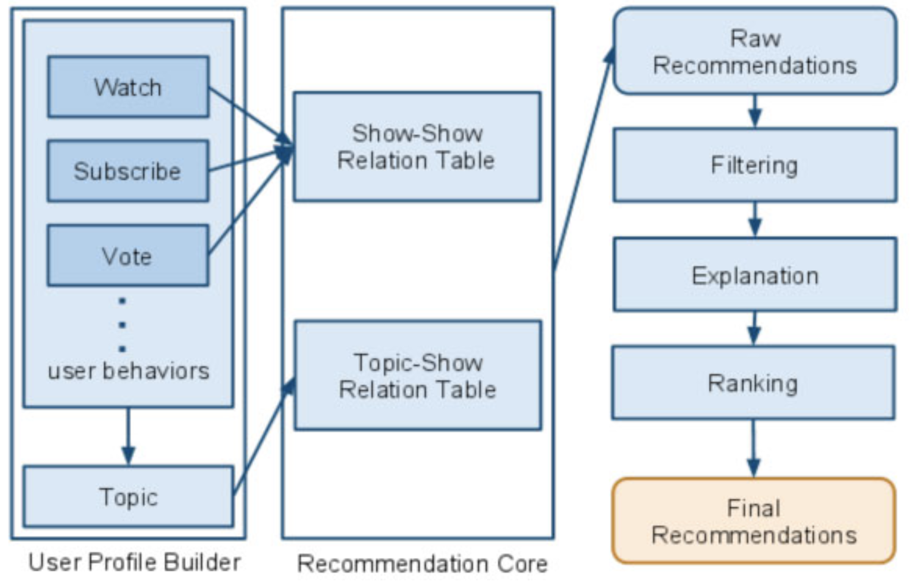
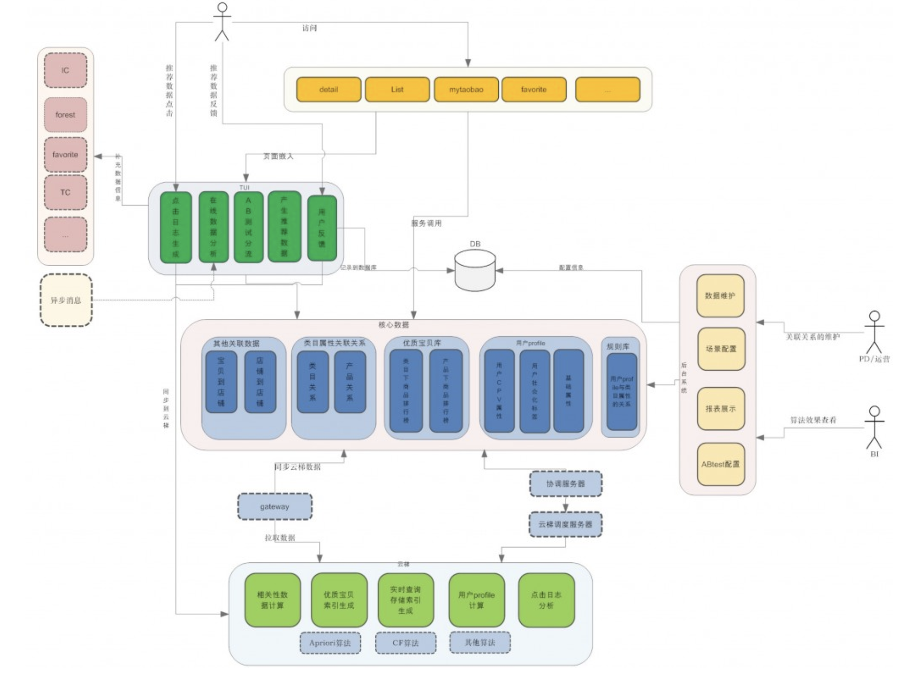
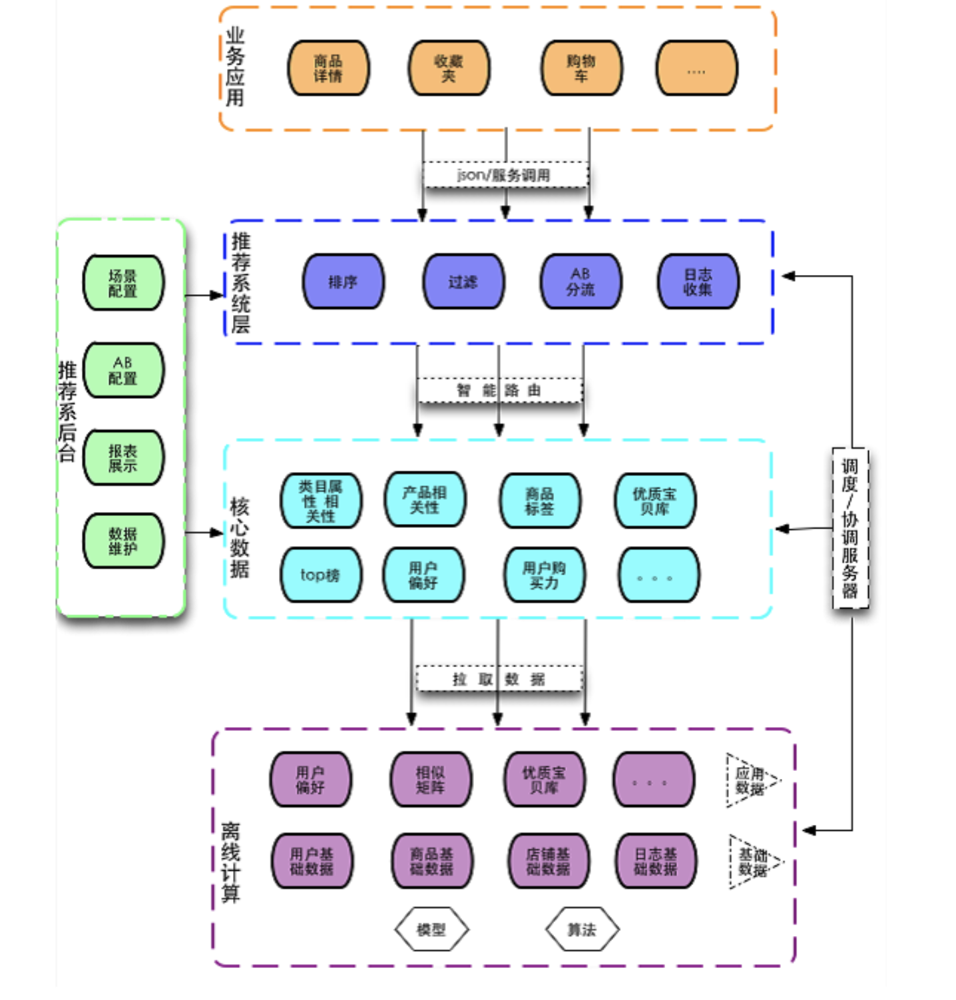
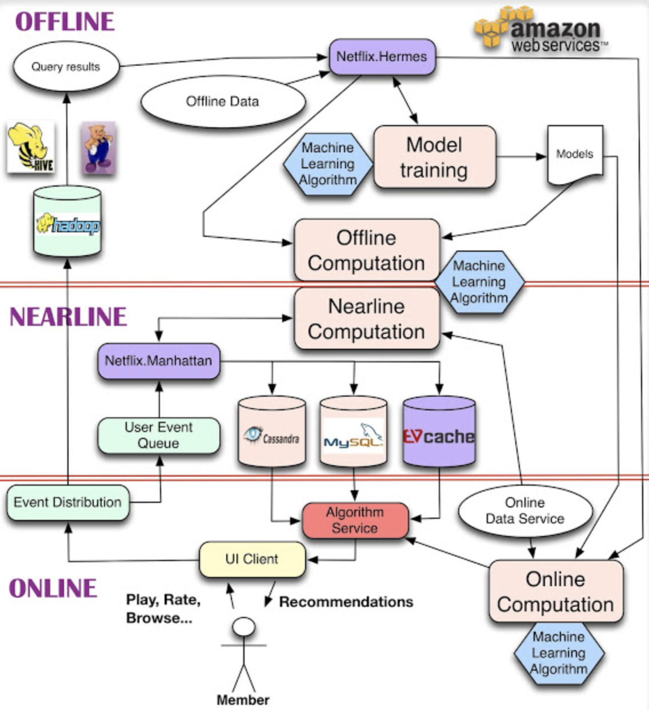
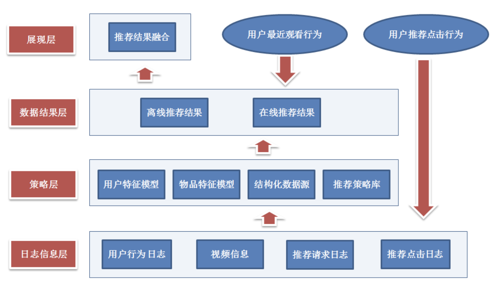
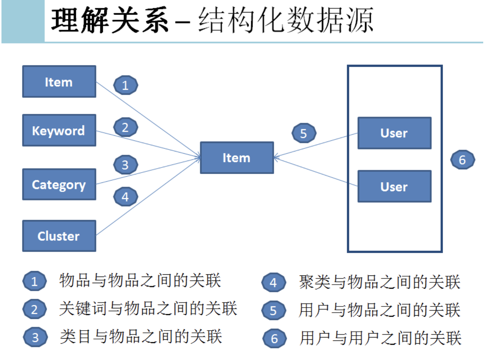
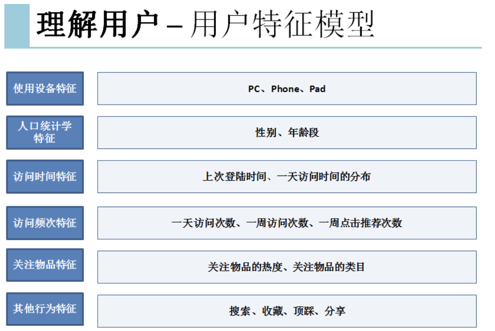
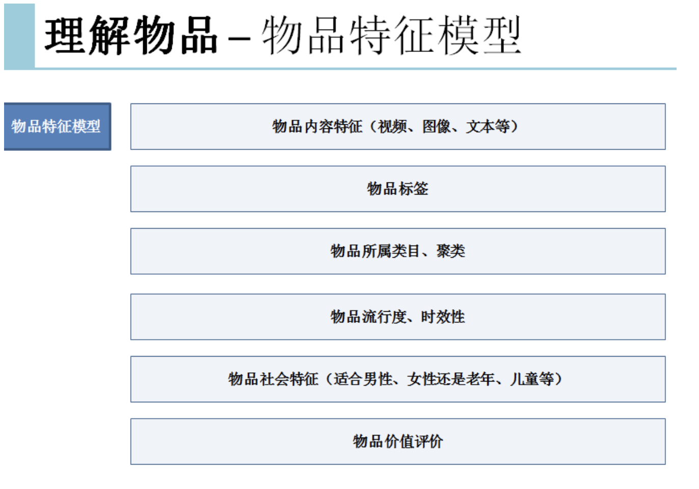
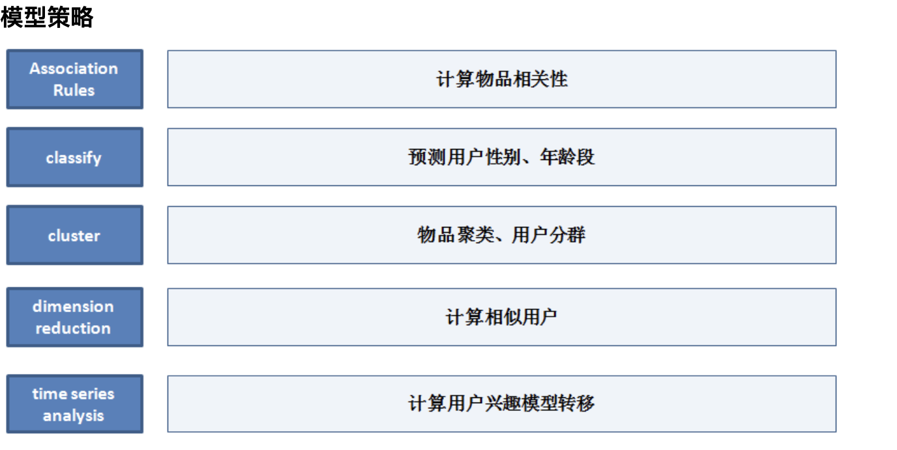
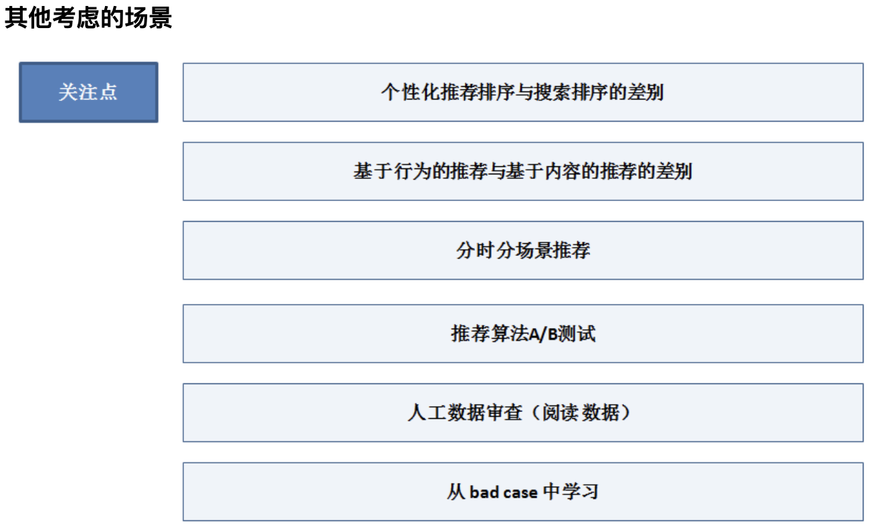

### hulu推荐系统架构

hulu离线部分我猜想也是通过分布式计算或者不同的计算方式将算法产生的数据存储进入一种介质中，供推荐系统在线部分调用。系统的整个流程是这样的，首先获取用户的行为，包括(watch、subscribe、vote)，这样行为会到后台获取show-show对应的推荐数据。同时这些行为也会产生对应的topic，系统也会根据topic到后台获取topic-show对应的推荐数据。两种数据进行混合，然后经过fliter、explanation、ranking这一系列过程，最后生成用户看到的推荐数据。

### 淘宝推荐系统详细版

### 淘宝推荐系统简单版

总结：淘宝的推荐系统，描述了推荐引擎搭建的整体架构，包括离线的分布式计算和存储、监控、数据统计和分析、实验平台等。给我们搭建推荐引擎提供了很好的建议。整体流程大致这样。

- 通过后台的分布式计算，将算法产生的算法结果数据存储进入一种介质中，首推hbase。
- 然后，通过一种叫做云梯的机制将算法结果推入中间层介质中，供推荐系统在线部分调用。
- 在线部分提供引擎和实验分流，用户的行为将存储进入hadoop中，数据统计分析平台由hive来搭建，主要用来分析和统计hadoop中的用户行为log。

这张图不仅讲了，推荐系统的架构流程，也讲了跟这个平台有关系的人，是怎么介入的，我觉得提供的信息可很好的参考。

### Netflix的推荐系统

总结：netflix的推荐系统，描述了推荐引擎搭建的整体架构，采用了三种计算方式的结合。整体流程：用户通过UI产生事件跟行为，然后分发给离线（我理解的是按天存储）、近线存储（不提供历史，存储当天用户实时行为。不知道理解是否有误），离线的计算利用离线的数据建好模型供实时调用，近线的计算利用用户的实时行为计算得出规则供实时调用，最后在线的计算通过前两种方式来得到最终的推荐结果，关键问题，就是如何以无缝方式结合、管理在线和离线计算过程，当然找到这些要求之间恰当的平衡并不容易，需要深思熟虑的需求分析，细心的技术选择，战略性的推荐算法分解，最终才能为客户达成最佳的结果。

### 优酷的推荐系统

上图来至easyhadoop举办的技术沙龙中优酷数据挖掘工程师的演讲，有关详细信息请移步 http://virtual.51cto.com/exp/Hadoop_20130330/index.html#top。作者在演讲中讲的一些"干货"跟推荐议题是很有价值的，下图简单描述。
模型前数据准备(理解数据源，用户，物品)

