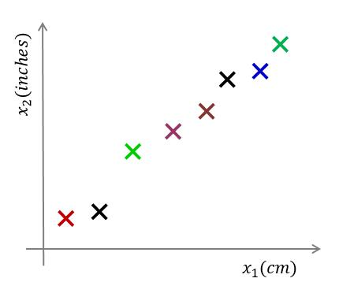
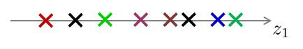
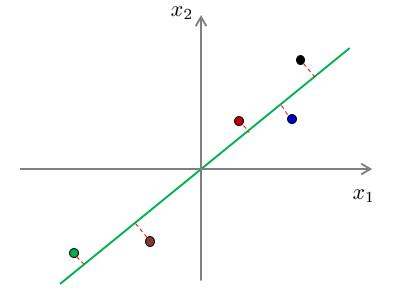
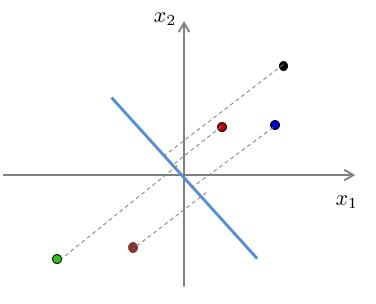
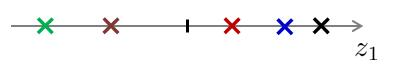
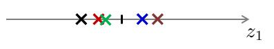

## 1. 数据降维

在实际生产生活中，我们所获得的数据集在特征上往往具有很高的维度，对高维度的数据进行处理时消耗的时间很大，并且过多的特征变量也会妨碍查找规律的建立。如何在最大程度上保留数据集的信息量的前提下进行数据维度的降低，是我们需要解决的问题。
### 对数据进行降维有以下优点：
- 使得数据集更易使用
- 降低很多算法的计算开销
- 去除噪声
- 使得结果易懂

降维技术作为数据预处理的一部分，即可使用在监督学习中也能够使用在非监督学习中。而降维技术主要有以下几种：主成分分析(Principal Component Analysis，PCA)、因子分析(Factor Analysis)，以及独立成分分析(Independent Component Analysis, ICA)

## 2. 主成分分析(PCA)

我们利用一个例子来理解PCA如何进行降维的。
参考下图，对于样本数据 D={x(1),x(2),...,x(m)}，其中 x(i)=[x(i)1,x(i)2]T

我们需要将上图的样本数据由二维降至一维。即 x(i)→z(i),i=1,2,...,m，如下图：

一般来说，这些样本点在坐标图中任意一条向量上都可以投影成一维的，那么我们如何选择最佳投影向量呢？在第1节中我们提到，需要在最大程度上保留数据集的信息量的前提下进行数据维度的降低，因此我们需要有优化目标来对图中的向量进行选择。

### 而PCA的优化目标就是：

- 对于2维降到 1维：找到一个投影方向，使得投影误差和最小。
- 对于n维降到k维：找到 k个向量定义的 k维投影平面，使得投影误差和最小。

那么投影误差又是什么呢？投影误差即为，每一个样本点到投影向量或者投影平面的距离。而投影误差和即为所有样本点到投影向量或投影平面的距离的和。

为什么要将“投影误差和最小”最为优化目标呢？
我们以以下例子进行解释。下面两幅图展示了两种不同投影向量：

我们能够和清楚地看到，对于第一种向量的投影误差和一定比第二种的投影误差和要小。

对应以上两幅图的投影结果：

假设对于原样本中，位于第一象限的三个样本点属于类别“A”，位于第三象限的两个样本点属于类别“B”。经过投影后，我们可以看出，对于第一种降维，在降维后仍旧保持了位于原点右侧的三个样本属于类别“A”，位于原点左侧的两个样本属于类别“B”。而对于第二种投影，明显可以看出，已经不能够分辨出样本的类别了。换句话说，第二种投影方式丢失了一些信息。

因此，“投影误差和最小”便成为我们所需要优化的目标。

### 那么如何寻找投影误差最小的方向呢？
找到方差最大的方向即可。

方差最大与投影误差最小这两个优化目标其实本质上是一样的，具体可参考周志华著《机器学习》一书，书中证明了最大可分性（误差最大）与最近重构性（投影和最小）两种优化等价。

## 3. PCA算法思路与要点
### 3.1 PCA算法思路
PCA的算法思路主要是：数据从原来的坐标系转换到新的坐标系，由数据本身决定。转换坐标系时，以方差最大的方向作为坐标轴方向，因为数据的最大方差给出了数据的最重要的信息。

第一个新坐标轴选择的是原始数据中方差最大的方向，第二个新坐标轴选择的是与第一个新坐标轴正交且方差次大的方向。重复该过程，重复次数为原始数据的特征维数。

通过这种方式获得的新的坐标系，我们发现，大部分方差都包含在前面几个坐标轴中，后面的坐标轴所含的方差几乎为0。于是，我们可以忽略余下的坐标轴，只保留前面的几个含有绝大部分方差的坐标轴。

事实上，这样也就相当于只保留包含绝大部分方差的维度特征，而忽略包含方差几乎为0的特征维度，也就实现了对数据特征的降维处理。

### 3.2 PCA算法要点

根据以上PCA算法思路的描述，我们大概可以看出，对于PCA算法，其要点主要是如何找到方差最大的方向。

#### （1）协方差矩阵
- （1.1）特征 Xi与特征Xj的协方差(Covariance)：

可以看出，当 Xi=Xj时，协方差即为方差

- （1.2）对于一个只有两个特征的样本来说，其协方差矩阵为：
当特征数为 n时，协方差矩阵为 n×n维的矩阵，且对角线为各特征的方差值。

#### （2）特征向量与特征值
对于矩阵 A，若满足 Aζ=λζ，则称 ζ是矩阵 A的特征向量，而 λ
则是矩阵 A的特征值。将特征值按照从大到小的顺序进行排序，选择前 k
个特征值所对应的特征向量即为所求投影向量。

对于特征值与特征向量的求解，主要是：特征值分解（当 A为方阵时），奇异值SVD分解（当A不为方阵时）

## 4. PCA算法过程

## 5. PCA算法分析

- 优点：使得数据更易使用，并且可以去除数据中的噪声，使得其他机器学习任务更加精确。该算法往往作为预处理步骤，在数据应用到其他算法之前清洗数据。
- 缺点：数据维度降低并不代表特征的减少，因为降维仍旧保留了较大的信息量，对结果过拟合问题并没有帮助。不能将降维算法当做解决过拟合问题方法。如果原始数据特征维度并不是很大，也并不需要进行降维。

关于PCA详细推导，可参考：
https://blog.csdn.net/zhongkejingwang/article/details/42264479