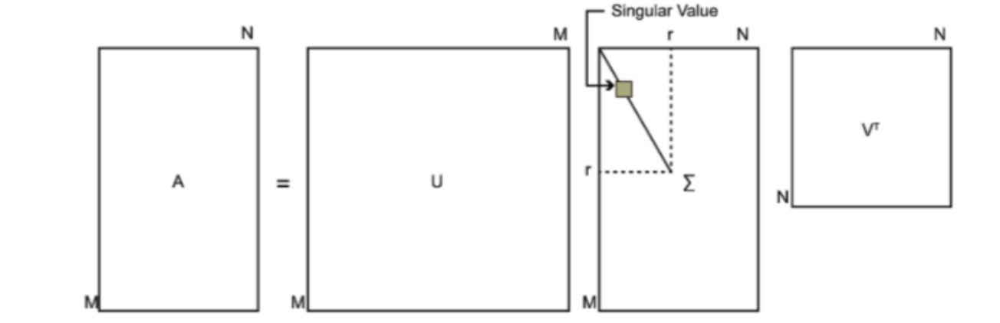
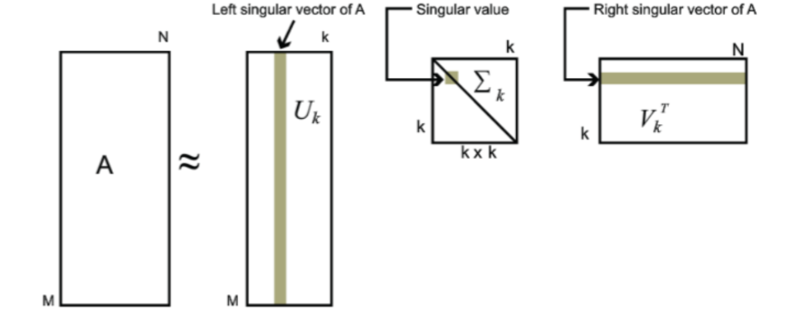

### 回顾特征值和特征向量

我们首先回顾下特征值和特征向量的定义如下：

𝐴𝑥=𝜆𝑥

其中A是一个𝑛×𝑛的实对称矩阵，𝑥是一个𝑛维向量，则我们说𝜆是矩阵A的一个特征值，而𝑥是矩阵A的特征值𝜆所对应的特征向量。

求出特征值和特征向量有什么好处呢？ 就是我们可以将矩阵A特征分解。如果我们求出了矩阵A的𝑛个特征值$𝜆_1≤𝜆_2≤...≤𝜆_𝑛$,以及这𝑛个特征值所对应的特征向量${𝑤_1,𝑤_2,...𝑤_𝑛}$，，如果这𝑛个特征向量线性无关，那么矩阵A就可以用下式的特征分解表示：

$𝐴=𝑊Σ𝑊^{−1}$

其中W是这𝑛个特征向量所张成的𝑛×𝑛维矩阵，而Σ为这n个特征值为主对角线的𝑛×𝑛维矩阵。

一般我们会把W的这𝑛个特征向量标准化，即满足$||𝑤𝑖||_2=1$, 或者说$𝑤^𝑇_𝑖𝑤_𝑖=I$，此时W的𝑛个特征向量为标准正交基，满足$𝑊𝑇𝑊=𝐼$，即$𝑊^𝑇=𝑊^{−1}$, 也就是说W为酉矩阵。

这样我们的特征分解表达式可以写成:

$𝐴=𝑊Σ𝑊^𝑇$

注意到要进行特征分解，矩阵A必须为方阵。那么如果A不是方阵，即行和列不相同时，我们还可以对矩阵进行分解吗？答案是可以，此时我们的SVD登场了。

### SVD

SVD也是对矩阵进行分解，但是和特征分解不同，SVD并不要求要分解的矩阵为方阵。假设我们的矩阵A是一个𝑚×𝑛的矩阵，那么我们定义矩阵A的SVD为：

$𝐴=𝑈Σ𝑉^𝑇$

其中U是一个𝑚×𝑚的矩阵，Σ是一个𝑚×𝑛的矩阵，除了主对角线上的元素以外全为0，主对角线上的每个元素都称为奇异值，V是一个𝑛×𝑛的矩阵。U和V都是酉矩阵，即满足$𝑈^𝑇𝑈=𝐼$,$𝑉^𝑇𝑉=𝐼$。下图可以很形象的看出上面SVD的定义：

那么我们如何求出SVD分解后的𝑈,Σ,𝑉这三个矩阵呢？

如果我们将A的转置和A做矩阵乘法，那么会得到𝑛×𝑛的一个方阵$𝐴^𝑇𝐴$。既然$𝐴^𝑇𝐴$是方阵，那么我们就可以进行特征分解，得到的特征值和特征向量满足下式：

$(A^TA)v_i=\lambda_iv_i$

这样我们就可以得到矩阵$𝐴^𝑇𝐴$的n个特征值和对应的n个特征向量𝑣了。将𝐴𝑇𝐴的所有特征向量张成一个𝑛×𝑛的矩阵V，就是我们SVD公式里面的V矩阵了。一般我们将V中的每个特征向量叫做A的右奇异向量

如果我们将A和A的转置做矩阵乘法，那么会得到𝑚×𝑚的一个方阵$𝐴𝐴^𝑇$。既然$𝐴𝐴^𝑇$是方阵，那么我们就可以进行特征分解，得到的特征值和特征向量满足下式：

$(𝐴𝐴^𝑇)𝑢𝑖=\lambda_𝑖𝑢_𝑖$

这样我们就可以得到矩阵$𝐴𝐴^𝑇$的m个特征值和对应的m个特征向量𝑢了。将$𝐴𝐴^𝑇$的所有特征向量张成一个𝑚×𝑚的矩阵U，就是我们SVD公式里面的U矩阵了。一般我们将U中的每个特征向量叫做A的左奇异向量。

U和V我们都求出来了，现在就剩下奇异值矩阵Σ没有求出了。由于Σ除了对角线上是奇异值其他位置都是0，那我们只需要求出每个奇异值𝜎就可以了。

我们注意到:

$𝐴=𝑈Σ𝑉^𝑇⇒𝐴𝑉=𝑈Σ𝑉^𝑇𝑉⇒𝐴𝑉=𝑈Σ⇒𝐴𝑣_𝑖=\rho_𝑖𝑢_𝑖⇒\rho_𝑖=𝐴𝑣_𝑖/𝑢_𝑖$

这样我们可以求出我们的每个奇异值，进而求出奇异值矩阵Σ。

上面还有一个问题没有讲，就是我们说$𝐴^𝑇𝐴$的特征向量组成的就是我们SVD中的V矩阵，而𝐴𝐴^𝑇的特征向量组成的就是我们SVD中的U矩阵，这有什么根据吗？这个其实很容易证明，我们以V矩阵的证明为例。

$𝐴=𝑈Σ𝑉^𝑇⇒𝐴^𝑇=𝑉Σ^𝑇𝑈^𝑇⇒𝐴^𝑇𝐴=𝑉Σ^𝑇𝑈^𝑇𝑈Σ𝑉^𝑇=𝑉Σ^2𝑉^𝑇$

上式证明使用了:

可以看出$𝐴^𝑇𝐴$的特征向量组成的的确就是我们SVD中的V矩阵。类似的方法可以得到$𝐴𝐴𝑇^$的特征向量组成的就是我们SVD中的U矩阵。

进一步我们还可以看出我们的特征值矩阵等于奇异值矩阵的平方，也就是说特征值和奇异值满足如下关系：

$\rho_𝑖=\sqrt{\lambda_i}$

这样也就是说，我们可以不用$\rho_𝑖=𝐴𝑣_𝑖/𝑢_𝑖$来计算奇异值，也可以通过求出$𝐴^𝑇𝐴$的特征值取平方根来求奇异值。

### SVD的一些性质　

上面几节我们对SVD的定义和计算做了详细的描述，似乎看不出我们费这么大的力气做SVD有什么好处。那么SVD有什么重要的性质值得我们注意呢？

对于奇异值,它跟我们特征分解中的特征值类似，在奇异值矩阵中也是按照从大到小排列，而且奇异值的减少特别的快，在很多情况下，前10%甚至1%的奇异值的和就占了全部的奇异值之和的99%以上的比例。也就是说，我们也可以用最大的k个的奇异值和对应的左右奇异向量来近似描述矩阵。也就是说：

$𝐴_{𝑚×𝑛}=𝑈_{𝑚×𝑚}Σ_{𝑚×𝑛}𝑉^𝑇_{𝑛×𝑛}≈𝑈_{𝑚×𝑘}Σ_{𝑘×𝑘}𝑉^𝑇_{𝑘×𝑛}$

其中k要比n小很多，也就是一个大的矩阵A可以用三个小的矩阵$𝑈_{𝑚×𝑘}$,$Σ_{𝑘×𝑘}$,$𝑉^𝑇_{𝑘×𝑛}$来表示。如下图所示，现在我们的矩阵A只需要灰色的部分的三个小矩阵就可以近似描述了。

由于这个重要的性质，SVD可以用于PCA降维，来做数据压缩和去噪。也可以用于推荐算法，将用户和喜好对应的矩阵做特征分解，进而得到隐含的用户需求来做推荐。同时也可以用于NLP中的算法，比如潜在语义索引（LSI）。下面我们就对SVD用于PCA降维做一个介绍。

### SVD用于PCA

在主成分分析（PCA）原理总结中，我们讲到要用PCA降维，需要找到样本协方差矩阵$𝑋^𝑇𝑋$的最大的d个特征向量，然后用这最大的d个特征向量张成的矩阵来做低维投影降维。可以看出，在这个过程中需要先求出协方差矩阵$𝑋^𝑇𝑋$，当样本数多样本特征数也多的时候，这个计算量是很大的。

注意到我们的SVD也可以得到协方差矩阵$𝑋^𝑇𝑋$最大的d个特征向量张成的矩阵，但是SVD有个好处，有一些SVD的实现算法可以不求先求出协方差矩阵$𝑋^𝑇𝑋$，也能求出我们的右奇异矩阵𝑉。也就是说，我们的PCA算法可以不用做特征分解，而是做SVD来完成。这个方法在样本量很大的时候很有效。实际上，scikit-learn的PCA算法的背后真正的实现就是用的SVD，而不是我们我们认为的暴力特征分解。

另一方面，注意到PCA仅仅使用了我们SVD的右奇异矩阵，没有使用左奇异矩阵，那么左奇异矩阵有什么用呢？

假设我们的样本是𝑚×𝑛的矩阵X，如果我们通过SVD找到了矩阵$𝑋𝑋^𝑇$最大的d个特征向量张成的𝑚×𝑑维矩阵U，则我们如果进行如下处理：

$𝑋^′_{𝑑×𝑛}=𝑈^𝑇_{𝑑×𝑚}𝑋_{𝑚×𝑛}$

可以得到一个𝑑×𝑛的矩阵X‘,这个矩阵和我们原来的𝑚×𝑛维样本矩阵X相比，行数从m减到了d，可见对行数进行了压缩。也就是说，左奇异矩阵可以用于行数的压缩。相对的，右奇异矩阵可以用于列数即特征维度的压缩，也就是我们的PCA降维。

参考：  
https://www.cnblogs.com/pinard/p/6251584.html
