## SVD在推荐系统中的应用详解以及算法推导

假设存在以下user和item的数据矩阵：

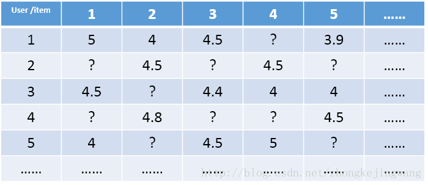

这是一个极其稀疏的矩阵，这里把这个评分矩阵记为R，其中的元素表示user对item的打分，“？”表示未知的，也就是要你去预测的，现在问题来了：如何去预测未知的评分值呢？上一篇文章用SVD证明了对任意一个矩阵A，都有它的满秩分解：

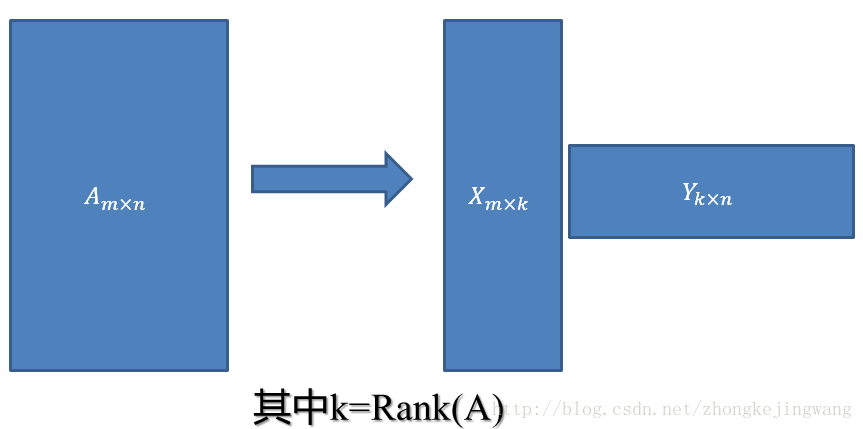

那么刚才的评分矩阵R也存在这样一个分解，所以可以用两个矩阵P和Q的乘积来表示评分矩阵R：

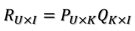

上图中的U表示用户数，I表示商品数。然后就是利用R中的已知评分训练P和Q使得P和Q相乘的结果最好地拟合已知的评分，那么未知的评分也就可以用P的某一行乘上Q的某一列得到了：

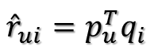

这是预测用户u对商品i的评分，它等于P矩阵的第u行乘上Q矩阵的第i列。这个是最基本的SVD算法，那么如何通过已知评分训练得到P和Q的具体数值呢？

假设已知的评分为：

rui

则真实值与预测值的误差为：

eui = rui - $\hat{r}$ui

继而可以计算出总的误差平方和：

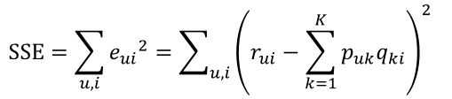

只要通过训练把SSE降到最小那么P、Q就能最好地拟合R了。那又如何使SSE降到最小呢？下面介绍一个常用的局部优化算法。

### 梯度下降法

为了说明梯度下降法，我找了一张PPT：

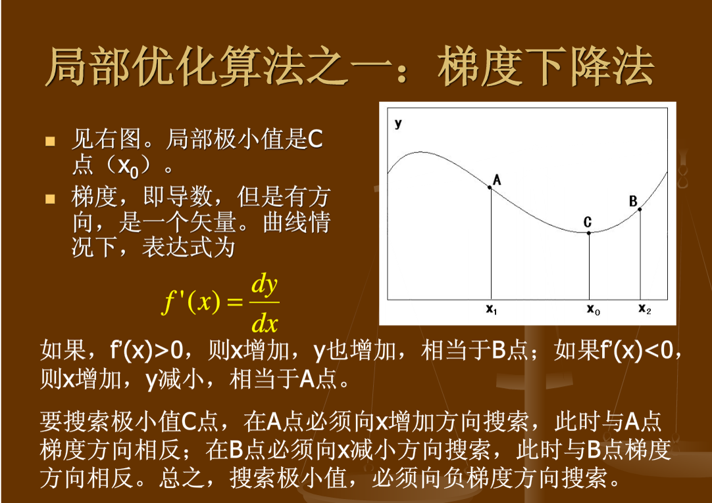

也就是说如果要最小化目标函数，必须往其负梯度方向搜索。这就是梯度下降法，注意它是一个局部优化算法，也就是说有可能落到局部最优解而不是全局最优解。

### Basic SVD

利用梯度下降法可以求得SSE在Puk变量（也就是P矩阵的第u行第k列的值）处的梯度：

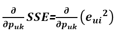

利用求导链式法则，e^2先对e求导再乘以e对Puk的求导：

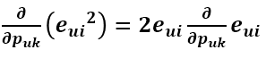

由于

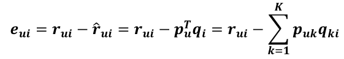

所以

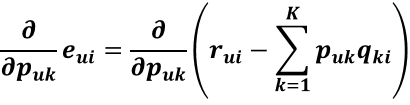

上式中括号里的那一坨式子如果展开来看的话，其与Puk有关的项只有PukQki，其他的无关项对Puk的求导均等于0

所以求导结果为：

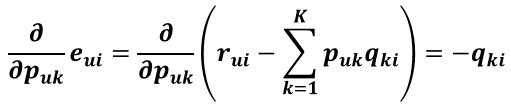

所以

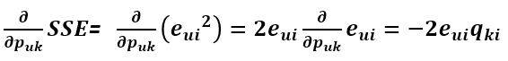

为了让式子更简洁，令

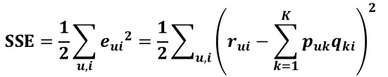

这样做对结果没有影响，只是为了把求导结果前的2去掉，更好看点。得到

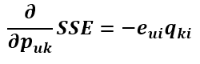

现在得到了目标函数在Puk处的梯度了，那么按照梯度下降法，将Puk往负梯度方向变化：

令更新的步长（也就是学习速率）为 η

则Puk的更新式为

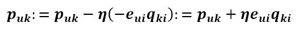

同样的方式可得到Qik的更新式为

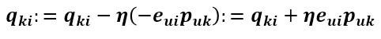

得到了更新的式子，现在开始来讨论这个更新要怎么进行。有两种选择：
- 1、计算完所有已知评分的预测误差后再对P、Q进行更新。
- 2、每计算完一个eui后立即对Pu和qi进行更新。
  
这两种方式都有名称，分别叫：
- 1、批梯度下降。
- 2、随机梯度下降。
 
两者的区别就是批梯度下降在下一轮迭代才能使用本次迭代的更新值，随机梯度下降本次迭代中当前样本使用的值可能就是上一个样本更新的值。

由于随机性可以带来很多好处，比如有利于避免局部最优解，所以现在大多倾向于使用随机梯度下降进行更新。

### RSVD-1

上面就是基本的SVD算法，但是，问题来了，上面的训练是针对已知评分数据的，过分地拟合这部分数据有可能导致模型的测试效果很差，在测试集上面表现很糟糕。这就是过拟合问题，关于过拟合与欠拟合可以看一下这张图

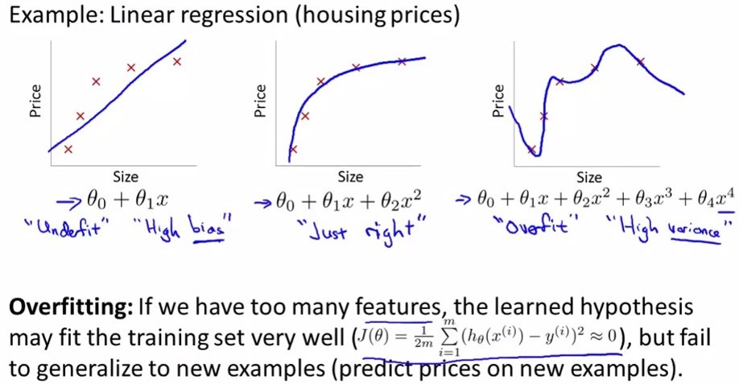

第一个是欠拟合，第二个刚好，第三个过拟合。那么如何避免过拟合呢？

那就是在目标函数中加入正则化参数（加入惩罚项），对于目标函数来说，P矩阵和Q矩阵中的所有值都是变量，这些变量在不知道哪个变量会带来过拟合的情况下，对所有变量都进行惩罚：

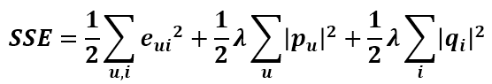

这时候目标函数对Puk的导数就发生变化了，现在就来求加入惩罚项后的导数。

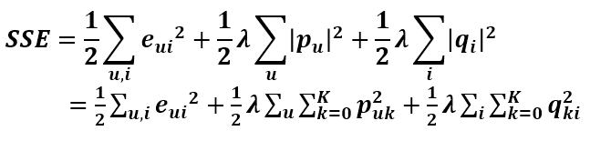

括号里第一项对Puk的求导前面已经求过了，第二项对Puk的求导很容易求得，第三项与Puk无关，导数为0，所以

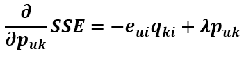

同理可得SSE对qik的导数为

将这两个变量往负梯度方向变化，则更新式为

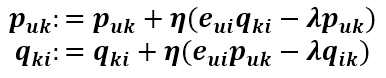

这就是正则化后的SVD，也叫RSVD。

### RSVD-2

关于SVD算法的变种太多了，叫法也不统一，在预测式子上加点参数又会出来一个名称。由于用户对商品的打分不仅取决于用户和商品间的某种关系，还取决于用户和商品独有的性质，Koren将SVD的预测公式改成这样

第一项为总的平均分，bu为用户u的属性值，bi为商品i的属性值，加入的这两个变量在SSE式子中同样需要惩罚，那么SSE就变成了下面这样：

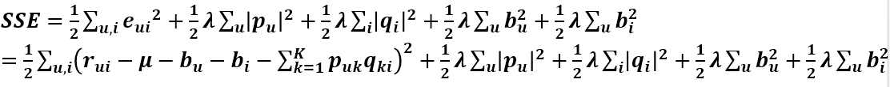

由上式可以看出SSE对Puk和qik的导数都没有变化，但此时多了bu和bi变量，同样要求出其更新式。首先求SSE对bu的导数，只有第一项和第四项和bu有关，第一项对bu的求导和之前的求导类似，用链式法则即可求得，第四项直接求导即可，最后可得偏导数为

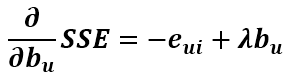

同理可得对bi的导数为

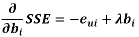

所以往其负梯度方向变化得到其更新式为

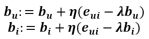

这就是修改后的SVD（RSVD）。

### ASVD

全称叫Asymmetric-SVD，即非对称SVD，其预测式子为

