现在我们有一些关于房价的数据，根据房屋得大小居室来预测价钱：

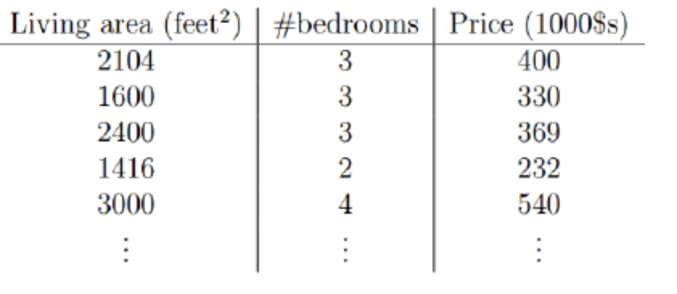

那么我们可以将第一个特征Living area看作x1，可以讲第二个特征bedrooms看作x2，Price为h(x)，我们可以公式化得写成：

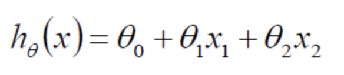

其中讲x0设为0，则可以写成统一的式子：

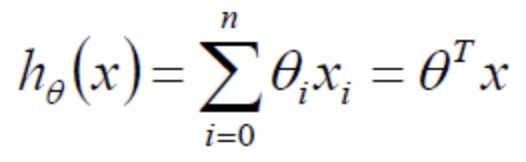

我们先直观的看一看模型得图：

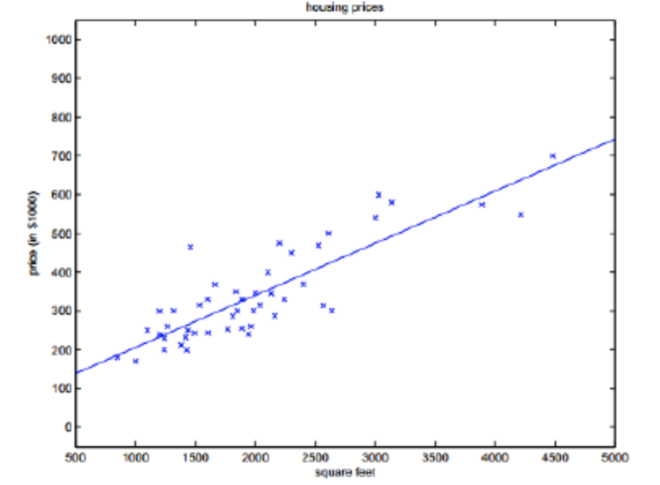

看的出来大多数得预测值与实际值还是有一定得差距，我们用ε表示，那么可以有以下等式：

这个ε我们可以这么来解释，认为它是独立分布的，服从均值为0，方差为某个定值得高斯分布，之所以这么说是因为ε是有众多得原因导致得，比方说学区、朝向、交通、格局等等众多原因相互作用的一个残差，因此根据中心极限定理，认为是服从高斯分布的，既然是服从高斯分布，可以如下表示：

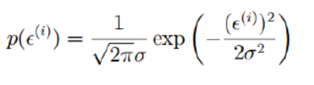

我们将ε代入：

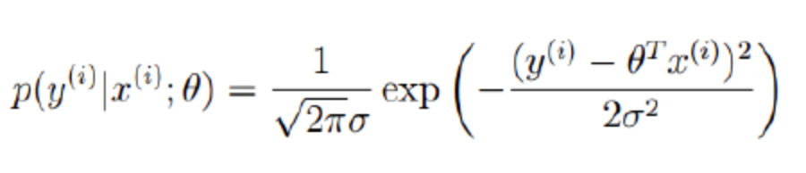

我们可以将这个式子作为似然函数：

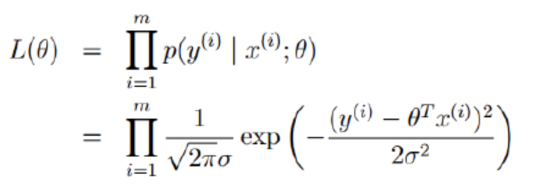

接着我们对似然函数取对数，得到对数似然：

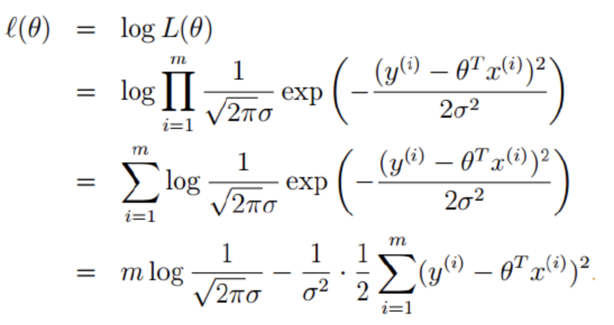

变换过程很简单我就不说了，其中m是样本数量，π、σ也是定值，所以我们直接化简为：

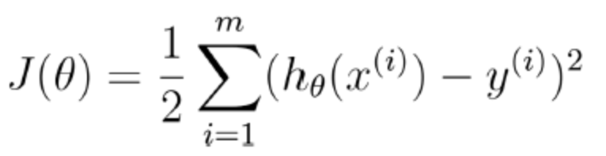

我们的目标就是求J(θ)最小，这个也是著名的最小二乘的目标函数，我们可以变换一下：

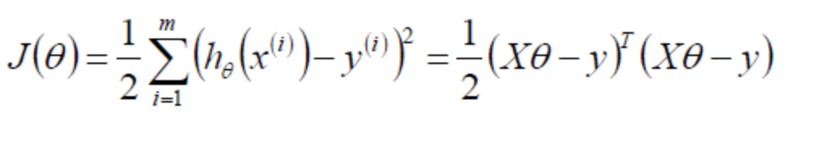

对θ求偏导得到梯度：

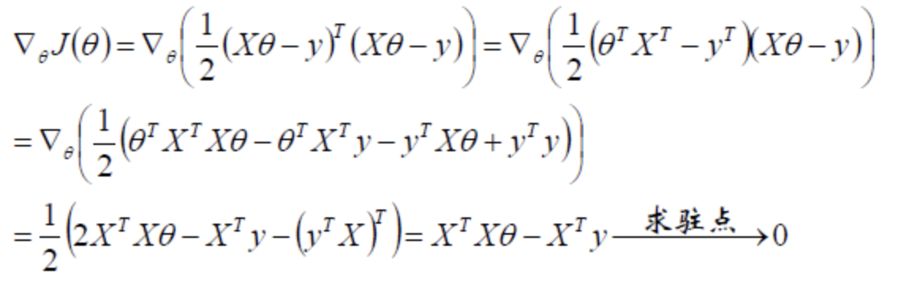

可以得到参数的解析式：

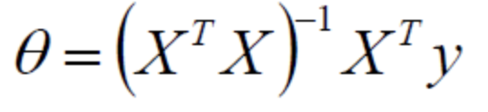

当然了，如果XTX不可逆或者防止过拟合，可以加入λ扰动：

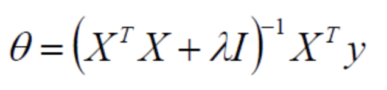

其实加入λ并不是不可解释的，其实是计算得来的，首先说如果XTX不可逆，加入λ即为正定矩阵：

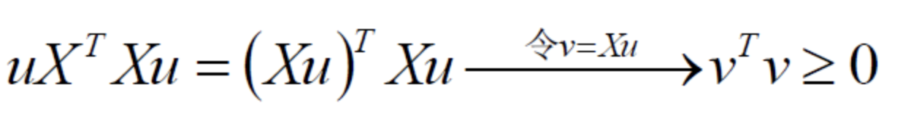

那么对于任意的λ>0，XTX加上λ就一定为正定，从而可逆，这样公式就是有意义的，那么对于第二个作用：加入λ可以防止过拟合我们可以这么解释，在目标函数后边加个惩罚项：

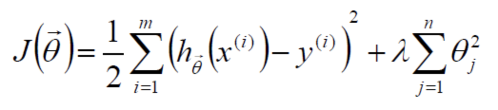

然后将这个目标函数重新按照之前的办法求导，即可得到前边我们得到的目标函数。

其中的这个λ是个超参数，我们如果偷懒的话可以设置一个小的值，比如0.1、0.01，其实正统的办法我们应该使用交叉验证来做。交叉验证的具体步骤就不介绍了，比较简单。

当然了，如果特征规模很大，超过了1000维，那么矩阵的逆是不方便求的，因此我们可以使用梯度下降算法来做。

### 梯度下降算法

(1):  初始化θ(随机初始化)

(2):  沿着负梯度方向迭代，更新后的θ使得J(θ)更小：

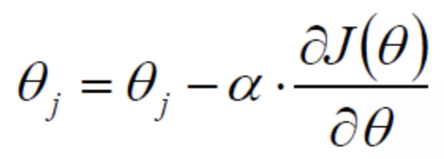

其中α是步长、学习率，超参数，可以指定一个较小的步长，也可以使用折半查找、回溯、拟牛顿来求一个动态的α(后续会介绍)。

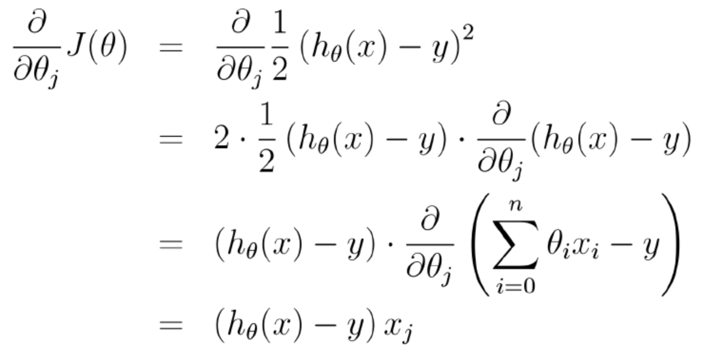

Andrew NG的machine learning的课件中这么描述更新步骤：

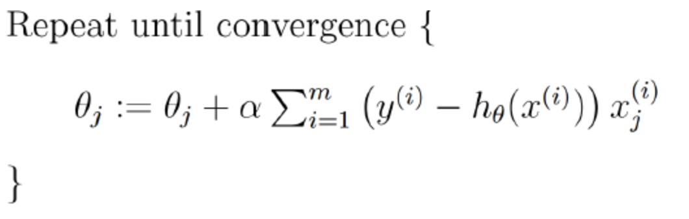

其中有个∑从i到m加和，也就是说每更新一次，都是拿全部的训练样本来做一次梯度下降，叫做批量梯度下降，这样的话其实效率比较低，我们可以使用下边的方法做：

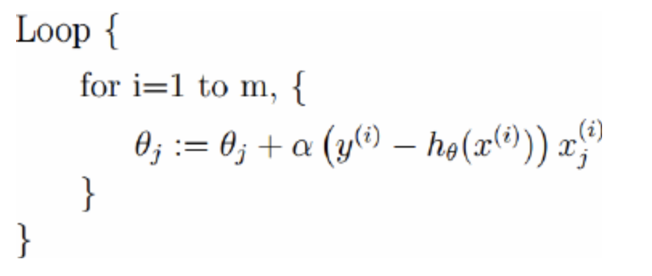

这种方法每次是拿一个样本来迭代一次梯度，效率会比较高，这种方式叫做随机梯度下降。

当然了，还可以采用一种折中的办法：每次拿到若干个样本的平均梯度作为更新方向，这就是mini-batch梯度下降算法，CNN中就是采用这种方式来做的。

