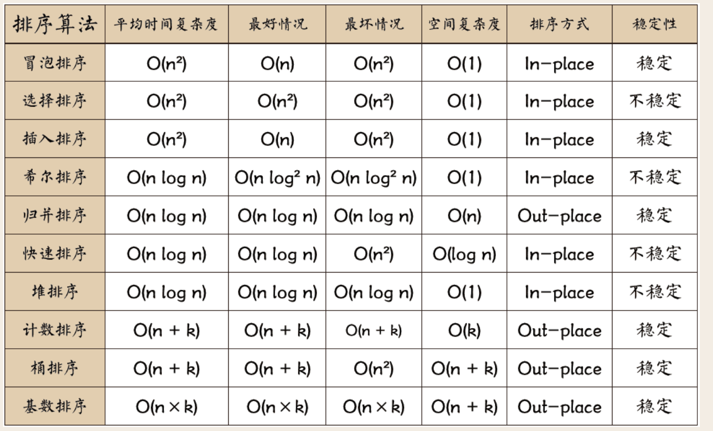

排序算法可以分为内部排序和外部排序，内部排序是数据记录在内存中进行排序，而外部排序是因排序的数据很大，一次不能容纳全部的排序记录，在排序过程中需要访问外存。

常见的内部排序算法有：插入排序、希尔排序、选择排序、冒泡排序、归并排序、快速排序、堆排序、基数排序等。用一张图概括：



关于时间复杂度：
1. 平方阶 (O(n2)) 排序 各类简单排序：直接插入、直接选择和冒泡排序。
2. 线性对数阶 (O(nlog2n)) 排序 快速排序、堆排序和归并排序。
3. O(n1+§)) 排序，§ 是介于 0 和 1 之间的常数。 希尔排序。
4. 线性阶 (O(n)) 排序 基数排序，此外还有桶、箱排序。

关于稳定性：

- 稳定的排序算法：冒泡排序、插入排序、归并排序和基数排序。
- 不是稳定的排序算法：选择排序、快速排序、希尔排序、堆排序。

### 冒泡排序

冒泡排序（Bubble Sort）也是一种简单直观的排序算法。它重复地走访过要排序的数列，一次比较两个元素，如果他们的顺序错误就把他们交换过来。走访数列的工作是重复地进行直到没有再需要交换，也就是说该数列已经排序完成。这个算法的名字由来是因为越小的元素会经由交换慢慢“浮”到数列的顶端。

作为最简单的排序算法之一，冒泡排序给我的感觉就像 Abandon 在单词书里出现的感觉一样，每次都在第一页第一位，所以最熟悉。冒泡排序还有一种优化算法，就是立一个 flag，当在一趟序列遍历中元素没有发生交换，则证明该序列已经有序。但这种改进对于提升性能来说并没有什么太大作用。

#### 算法步骤

1. 比较相邻的元素。如果第一个比第二个大，就交换他们两个。
2. 对每一对相邻元素作同样的工作，从开始第一对到结尾的最后一对。这步做完后，最后的元素会是最大的数。
3. 针对所有的元素重复以上的步骤，除了最后一个。
4. 持续每次对越来越少的元素重复上面的步骤，直到没有任何一对数字需要比较。


```python
def bubble_sort(arr):
    for i in range(1, len(arr)):
        for j in range(len(arr)-1):
            if arr[j] > arr[j+1]:
                # arr[j], arr[j + 1] = arr[j + 1], arr[j]
                tmp = arr[j]
                arr[j] = arr[j+1]
                arr[j+1] = tmp

    return arr
```

### 选择排序

选择排序是一种简单直观的排序算法，无论什么数据进去都是 O(n²) 的时间复杂度。所以用到它的时候，数据规模越小越好。唯一的好处可能就是不占用额外的内存空间了吧。

1. 算法步骤
2. 首先在未排序序列中找到最小（大）元素，存放到排序序列的起始位置
3. 再从剩余未排序元素中继续寻找最小（大）元素，然后放到已排序序列的末尾。

重复第二步，直到所有元素均排序完毕。


```python
def select_sort(arr):
    for i in range(len(arr)-1):
        min_inedx = i
        for j in range(i+1, len(arr)):
            if arr[j] < arr[min_inedx]:
                min_inedx = j
        if i != min_inedx:
            arr[i], arr[minIndex] = arr[minIndex], arr[i]

    return arr

```

### 插入排序

插入排序的代码实现虽然没有冒泡排序和选择排序那么简单粗暴，但它的原理应该是最容易理解的了，因为只要打过扑克牌的人都应该能够秒懂。

插入排序是一种最简单直观的排序算法，它的工作原理是通过构建有序序列，对于未排序数据，在已排序序列中从后向前扫描，找到相应位置并插入。

插入排序和冒泡排序一样，也有一种优化算法，叫做拆半插入。

#### 算法步骤

1. 将第一待排序序列第一个元素看做一个有序序列，把第二个元素到最后一个元素当成是未排序序列。
2. 从头到尾依次扫描未排序序列，将扫描到的每个元素插入有序序列的适当位置。（如果待插入的元素与有序序列中的某个元素相等，则将待插入元素插入到相等元素的后面。）


```python
def insert_sort(arr):
    for i in range(len(arr)):
        pre_index = i - 1
        current = arr[i]
        while pre_index >= 0 and current < arr[pre_index]:
            arr[pre_index+1] = arr[pre_index]
            pre_index -= 1
        arr[pre_index+1] = current
    return arr
```

### 快速排序

快速排序是由东尼·霍尔所发展的一种排序算法。在平均状况下，排序 n 个项目要 Ο(nlogn) 次比较。在最坏状况下则需要 Ο(n2) 次比较，但这种状况并不常见。事实上，快速排序通常明显比其他 Ο(nlogn) 算法更快，因为它的内部循环（inner loop）可以在大部分的架构上很有效率地被实现出来。

快速排序使用分治法（Divide and conquer）策略来把一个串行（list）分为两个子串行（sub-lists）。

快速排序又是一种分而治之思想在排序算法上的典型应用。本质上来看，快速排序应该算是在冒泡排序基础上的递归分治法。

快速排序的名字起的是简单粗暴，因为一听到这个名字你就知道它存在的意义，就是快，而且效率高！它是处理大数据最快的排序算法之一了。虽然 Worst Case 的时间复杂度达到了 O(n²)，但是人家就是优秀，在大多数情况下都比平均时间复杂度为 O(n logn) 的排序算法表现要更好，可是这是为什么呢，我也不知道。好在我的强迫症又犯了，查了 N 多资料终于在《算法艺术与信息学竞赛》上找到了满意的答案：

快速排序的最坏运行情况是 O(n²)，比如说顺序数列的快排。但它的平摊期望时间是 O(nlogn)，且 O(nlogn) 记号中隐含的常数因子很小，比复杂度稳定等于 O(nlogn) 的归并排序要小很多。所以，对绝大多数顺序性较弱的随机数列而言，快速排序总是优于归并排序。

#### 算法步骤

1. 从数列中挑出一个元素，称为 “基准”（pivot）;
2. 重新排序数列，所有元素比基准值小的摆放在基准前面，所有元素比基准值大的摆在基准的后面（相同的数可以到任一边）。在这个分区退出之后，该基准就处于数列的中间位置。这个称为分区（partition）操作；
3. 递归地（recursive）把小于基准值元素的子数列和大于基准值元素的子数列排序；

```python
def quick_sort(arr):
    if arr == []:
        return []
    else:
        first_num = arr[0]
        less = quick_sort([a for a in arr[1:] if a < first_num])
        more = quick_sort([b for b in arr[1:] if b >= first_num])

        return less + first_num + more

```

### 希尔排序

希尔排序，也称递减增量排序算法，是插入排序的一种更高效的改进版本。但希尔排序是非稳定排序算法。

希尔排序是基于插入排序的以下两点性质而提出改进方法的：
1. 插入排序在对几乎已经排好序的数据操作时，效率高，即可以达到线性排序的效率；
2. 但插入排序一般来说是低效的，因为插入排序每次只能将数据移动一位；

希尔排序是把记录按下标的一定增量分组，对每组使用直接插入排序算法排序；随着增量逐渐减少，每组包含的关键词越来越多，当增量减至1时，整个文件恰被分成一组，算法便终止

```python
def shell_sort(arr):
    gap = len(len(arr))
    while gap > 1:
        gap = gap // 2
        for i in range(gap, len(arr)):
            for j in range(i % gap, i, gap):
                if arr[j] > arr[i]:
                    arr[i], arr[j] = arr[j], arr[i]

    return arr
```

